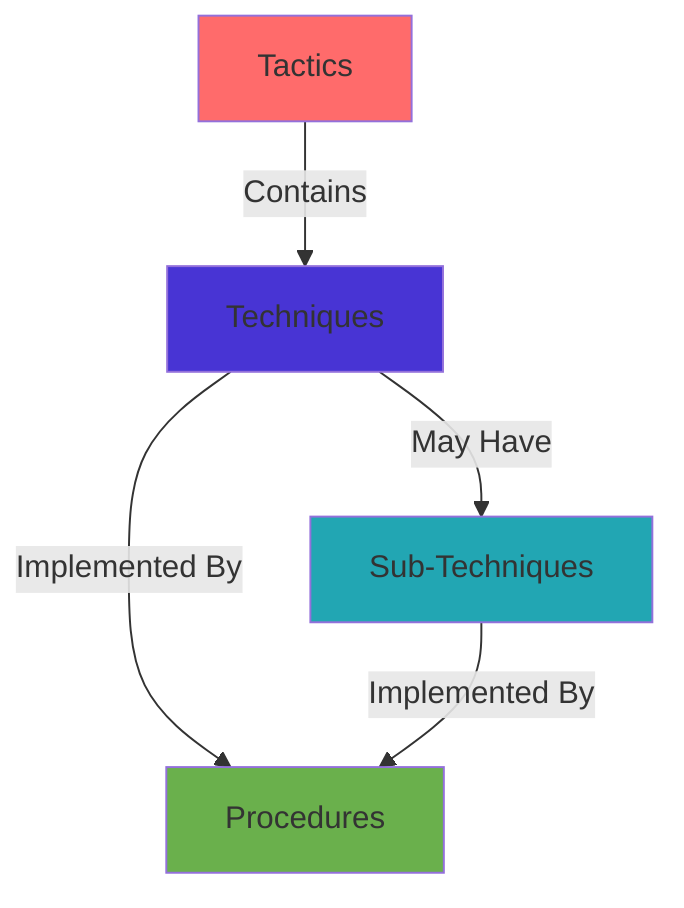

# 🎭 MITRE ATT&CK Framework

> **Globally-accessible knowledge base of adversary tactics and techniques**  
> Navigate the complete hierarchy: **Tactics → Techniques → Sub-Techniques → Procedures**

---

## 📊 Framework Statistics

```dataview
TABLE WITHOUT ID
  ("**Tactics**") as "Category",
  length(file.lists.tactics) as "Count"
FROM "tactics"
WHERE type = "tactic"
```

### Coverage Summary
- **Tactics**: 14 phases of the attack lifecycle
- **Techniques**: 337 methods for achieving tactical goals
- **Sub-Techniques**: Detailed variations of techniques
- **Procedures**: 2,198 documented implementations

---

## 🔄 The Attack Lifecycle Hierarchy



### Understanding the Hierarchy

1. **🎯 Tactics** - *"The Why"*
   - High-level objectives of an attack (e.g., "Gain Access", "Move Laterally")
   - 14 tactics covering the entire attack chain

2. **🔧 Techniques** - *"The How"*
   - Specific methods to achieve tactical goals
   - Each technique belongs to one or more tactics
   - 337 techniques documented

3. **📝 Sub-Techniques** - *"The Details"*
   - Detailed variations or implementations of techniques
   - Provide platform-specific or context-specific guidance
   - Nested under parent techniques

4. **⚙️ Procedures** - *"The Implementation"*
   - Real-world examples with commands and steps
   - Link back to techniques or sub-techniques
   - 2,198 tested procedures in this vault

---

## 🗺️ The 14 Tactics

### Pre-Attack Preparation

#### 🔵 [[tactics/Reconnaissance|Reconnaissance]] (TA0043)
Gathering information to plan future operations.

```dataview
TABLE WITHOUT ID
  file.link as "Technique",
  length(procedures) as "Procedures"
FROM "techniques"
WHERE type = "technique" AND contains(string(tactics), "Reconnaissance")
SORT file.name ASC
LIMIT 5
```

[View all Reconnaissance techniques →](tactics/Reconnaissance.md)

---

#### 🟣 [[tactics/Resource Development|Resource Development]] (TA0042)
Establishing resources to support operations.

```dataview
TABLE WITHOUT ID
  file.link as "Technique",
  length(procedures) as "Procedures"
FROM "techniques"
WHERE type = "technique" AND contains(string(tactics), "Resource Development")
SORT file.name ASC
LIMIT 5
```

[View all Resource Development techniques →](tactics/Resource%20Development.md)

---

### Initial Compromise

#### 🔴 [[tactics/Initial Access|Initial Access]] (TA0001)
Trying to get into your network.

```dataview
TABLE WITHOUT ID
  file.link as "Technique",
  length(procedures) as "Procedures"
FROM "techniques"
WHERE type = "technique" AND contains(string(tactics), "Initial Access")
SORT length(procedures) DESC
LIMIT 5
```

[View all Initial Access techniques →](tactics/Initial%20Access.md)

---

#### 🟠 [[tactics/Execution|Execution]] (TA0002)
Trying to run malicious code.

```dataview
TABLE WITHOUT ID
  file.link as "Technique",
  length(procedures) as "Procedures"
FROM "techniques"
WHERE type = "technique" AND contains(string(tactics), "Execution")
SORT length(procedures) DESC
LIMIT 5
```

[View all Execution techniques →](tactics/Execution.md)

---

### Establishing Foothold

#### 🟡 [[tactics/Persistence|Persistence]] (TA0003)
Trying to maintain their foothold.

```dataview
TABLE WITHOUT ID
  file.link as "Technique",
  length(procedures) as "Procedures"
FROM "techniques"
WHERE type = "technique" AND contains(string(tactics), "Persistence")
SORT length(procedures) DESC
LIMIT 5
```

[View all Persistence techniques →](tactics/Persistence.md)

---

#### 🟢 [[tactics/Privilege Escalation|Privilege Escalation]] (TA0004)
Trying to gain higher-level permissions.

```dataview
TABLE WITHOUT ID
  file.link as "Technique",
  length(procedures) as "Procedures"
FROM "techniques"
WHERE type = "technique" AND contains(string(tactics), "Privilege Escalation")
SORT length(procedures) DESC
LIMIT 5
```

[View all Privilege Escalation techniques →](tactics/Privilege%20Escalation.md)

---

#### 🔵 [[tactics/Defense Evasion|Defense Evasion]] (TA0005)
Trying to avoid being detected.

```dataview
TABLE WITHOUT ID
  file.link as "Technique",
  length(procedures) as "Procedures"
FROM "techniques"
WHERE type = "technique" AND contains(string(tactics), "Defense Evasion")
SORT length(procedures) DESC
LIMIT 5
```

[View all Defense Evasion techniques →](tactics/Defense%20Evasion.md)

---

### Credential & Discovery

#### 🟣 [[tactics/Credential Access|Credential Access]] (TA0006)
Stealing account names and passwords.

```dataview
TABLE WITHOUT ID
  file.link as "Technique",
  length(procedures) as "Procedures"
FROM "techniques"
WHERE type = "technique" AND contains(string(tactics), "Credential Access")
SORT length(procedures) DESC
LIMIT 5
```

[View all Credential Access techniques →](tactics/Credential%20Access.md)

---

#### 🟤 [[tactics/Discovery|Discovery]] (TA0007)
Trying to figure out your environment.

```dataview
TABLE WITHOUT ID
  file.link as "Technique",
  length(procedures) as "Procedures"
FROM "techniques"
WHERE type = "technique" AND contains(string(tactics), "Discovery")
SORT length(procedures) DESC
LIMIT 5
```

[View all Discovery techniques →](tactics/Discovery.md)

---

### Lateral Movement & Collection

#### ⚫ [[tactics/Lateral Movement|Lateral Movement]] (TA0008)
Moving through your environment.

```dataview
TABLE WITHOUT ID
  file.link as "Technique",
  length(procedures) as "Procedures"
FROM "techniques"
WHERE type = "technique" AND contains(string(tactics), "Lateral Movement")
SORT length(procedures) DESC
LIMIT 5
```

[View all Lateral Movement techniques →](tactics/Lateral%20Movement.md)

---

#### 🔴 [[tactics/Collection|Collection]] (TA0009)
Gathering data of interest.

```dataview
TABLE WITHOUT ID
  file.link as "Technique",
  length(procedures) as "Procedures"
FROM "techniques"
WHERE type = "technique" AND contains(string(tactics), "Collection")
SORT length(procedures) DESC
LIMIT 5
```

[View all Collection techniques →](tactics/Collection.md)

---

### Command & Exfiltration

#### 🟠 [[tactics/Command and Control|Command and Control]] (TA0011)
Communicating with compromised systems.

```dataview
TABLE WITHOUT ID
  file.link as "Technique",
  length(procedures) as "Procedures"
FROM "techniques"
WHERE type = "technique" AND contains(string(tactics), "Command and Control")
SORT length(procedures) DESC
LIMIT 5
```

[View all C2 techniques →](tactics/Command%20and%20Control.md)

---

#### 🟡 [[tactics/Exfiltration|Exfiltration]] (TA0010)
Stealing data.

```dataview
TABLE WITHOUT ID
  file.link as "Technique",
  length(procedures) as "Procedures"
FROM "techniques"
WHERE type = "technique" AND contains(string(tactics), "Exfiltration")
SORT length(procedures) DESC
LIMIT 5
```

[View all Exfiltration techniques →](tactics/Exfiltration.md)

---

### Final Impact

#### 🟢 [[tactics/Impact|Impact]] (TA0040)
Manipulate, interrupt, or destroy systems and data.

```dataview
TABLE WITHOUT ID
  file.link as "Technique",
  length(procedures) as "Procedures"
FROM "techniques"
WHERE type = "technique" AND contains(string(tactics), "Impact")
SORT length(procedures) DESC
LIMIT 5
```

[View all Impact techniques →](tactics/Impact.md)

---

## 🔍 Browse by Entity Type

### By Techniques
```dataview
TABLE WITHOUT ID
  file.link as "Technique",
  tactics as "Tactics",
  length(procedures) as "Procedures"
FROM "techniques"
WHERE type = "technique"
SORT length(procedures) DESC
LIMIT 20
```

### By Sub-Techniques
```dataview
TABLE WITHOUT ID
  file.link as "Sub-Technique",
  length(procedures) as "Procedures"
FROM "sub-techniques"
WHERE type = "sub-technique"
SORT length(procedures) DESC
LIMIT 15
```

---

## 📈 Coverage Analysis

### Most Documented Tactics
```dataview
TABLE WITHOUT ID
  file.link as "Tactic",
  length(techniques) as "Techniques",
  length(procedures) as "Procedures"
FROM "tactics"
WHERE type = "tactic"
SORT length(procedures) DESC
```

### Techniques Needing More Procedures
```dataview
TABLE WITHOUT ID
  file.link as "Technique",
  tactics as "Tactic",
  length(procedures) as "Procedures"
FROM "techniques"
WHERE type = "technique" AND length(procedures) < 5
SORT length(procedures) ASC
LIMIT 15
```

---

## 🎯 Navigation Paths

### Start by Use Case

**🔴 Red Team Planning**
1. Browse [[tactics/Initial Access]] for entry points
2. Plan persistence with [[tactics/Persistence]]
3. Escalate with [[tactics/Privilege Escalation]]
4. Move laterally via [[tactics/Lateral Movement]]

**🔵 Blue Team Detection**
1. Understand [[tactics/Defense Evasion]] to build detections
2. Monitor [[tactics/Credential Access]] for theft indicators
3. Detect [[tactics/Exfiltration]] to prevent data loss
4. Analyze [[tactics/Discovery]] for reconnaissance signs

**🟣 Threat Hunting**
1. Study [[tactics/Execution]] methods attackers use
2. Hunt for [[tactics/Persistence]] mechanisms
3. Look for [[tactics/Command and Control]] beacons
4. Investigate [[tactics/Collection]] activities

---

## 🔗 Related Resources

### Internal Links
- [[Dashboard|← Back to Dashboard]]
- [[Platforms/README|Browse by Platform →]]
- [[Tools-Index|Browse by Tools →]]
- [[Queries/procedures-by-tactic|Query Procedures by Tactic →]]

### External Resources
- [MITRE ATT&CK Website](https://attack.mitre.org/)
- [ATT&CK Navigator](https://mitre-attack.github.io/attack-navigator/)
- [Atomic Red Team](https://github.com/redcanaryco/atomic-red-team)
- [MITRE D3FEND](https://d3fend.mitre.org/)

---

## 💡 Usage Tips

### Finding the Right Technique
1. **Know your objective** - Start with the tactic
2. **Browse techniques** - Find methods that match your goal
3. **Check procedures** - See real implementations
4. **Review sub-techniques** - Get platform-specific details

### Building Attack Chains
1. Start with [[tactics/Reconnaissance]] or [[tactics/Initial Access]]
2. Chain through [[tactics/Execution]] → [[tactics/Persistence]]
3. Continue with [[tactics/Privilege Escalation]] → [[tactics/Lateral Movement]]
4. End with [[tactics/Collection]] → [[tactics/Exfiltration]]

### Understanding Relationships
- Use **Graph View** (`Cmd/Ctrl + G`) to visualize connections
- Follow **wiki-links** to navigate the hierarchy
- Check **frontmatter** for tactic/technique IDs
- Use **Dataview queries** for dynamic filtering

---

*Last updated: 2025-01-22*  
*Tactics: 14 | Techniques: 337 | Procedures: 2,198*
