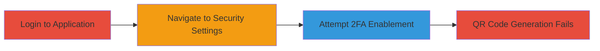

# 2FA Activation Failure Due to Deprecated Google Chart API

Multi-stage procedure demonstrating the failure to activate two-factor authentication on app.pullrequest.com due to reliance on a deprecated Google Chart API for QR code generation. This vulnerability prevents users from enabling 2FA, exposing accounts to unauthorized access risks.

## Chain Metrics Dashboard

| Metric | Value |
|--------|-------|
| Chain Status | Unverified |
| Total Steps | 3 |
| Execution Time | ~2 minutes |
| Skill Level | Beginner |
| Complexity | Low |
| Impact Level | High |

## Attack Flow Visualization

## Prerequisites & Requirements

### Required Tools

- Web browser (e.g., Chrome, Firefox)

### Target Environment

- Web platform: https://app.pullrequest.com/
- Valid user credentials for the application

### Initial Access Requirements

- Active account on PullRequest.com
- Network access to the login page

## Detailed Attack Procedures

### Step 1: Log into the Application
procedure: [[procedures/Verify-2FA-Activation-Failure]]

**Objective**: Gain access to the user dashboard to reach security settings.

**Instructions**: Open a web browser and navigate to the login page. Enter valid credentials to authenticate.

**Expected Output**: Successful login redirecting to the main dashboard.

**Success Indicators**:
- Dashboard loads without errors
- User profile is accessible

### Step 2: Navigate to User Settings
procedure: [[procedures/Verify-2FA-Activation-Failure]]

**Objective**: Access the security configuration section for 2FA setup.

**Instructions**: From the dashboard, locate and click on 'User Settings', then proceed to 'Security' and select 'Two-Factor Authentication'.

**Expected Output**: Security settings page displays, including the 2FA enablement option.

**Success Indicators**:
- 2FA section is visible
- Enable button is present

### Step 3: Attempt to Enable 2FA
procedure: [[procedures/Verify-2FA-Activation-Failure]]

**Objective**: Trigger the 2FA setup process to observe the QR code generation failure.

**Instructions**: Click the 'Enable Two-Factor Authentication' button. The system attempts to generate a QR code for authenticator app setup, but fails due to the deprecated Google Chart API.

**Expected Output**: Error or blank space where the QR code should appear; no QR image is generated.

**Success Indicators**:
- QR code fails to load
- Setup process cannot complete

## Attack Chain Summary

### Key Achievements

1. Confirmed inability to enable 2FA for any user
2. Identified root cause as deprecated API dependency
3. Highlighted increased risk of account compromise without 2FA

## Technique & Tactic Coverage

### MITRE ATT&CK Techniques

### MITRE ATT&CK Tactics

*Last updated: 2023-10-01T00:00:00Z*
