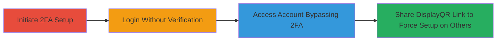

---
tags:
  - 2fa-bypass
  - auth-bypass
  - improper-authentication
  - algolia
type: attack_chain
tools: []
tactics:
  - '[[Initial Access]]'
verified: false
platforms:
  - Web
submitted: true
complexity: medium
created_at: '2023-10-01T00:00:00Z'
procedures:
  - '[[procedures/Algolia-2FA-Activation-Bypass]]'
  - '[[procedures/Unauthorized-2FA-Initiation-via-DisplayQR]]'
step_count: 4
techniques:
  - '[[Valid Accounts]]'
  - '[[Exploit Public-Facing Application]]'
updated_at: '2025-12-14T17:31:30.652Z'
description: >-
  Multi-stage attack exploiting flaws in Algolia's 2FA activation flow to bypass
  authentication and forcibly initiate 2FA on other users' accounts.
skill_level: intermediate
impact_level: high
id: 5324d530-be5f-4e6d-9e64-579f2d1c3932
validated: true
mitre_tactics:
  - '[[Initial Access]]'
mitre_techniques:
  - '[[Valid Accounts]]'
  - '[[Exploit Public-Facing Application]]'
---
# 2FA Authentication Bypass via Incomplete Setup and Unauthorized Initiation in Algolia

Multi-stage attack chain demonstrating a complete attack workflow exploiting Algolia's flawed 2FA activation process, allowing attackers to bypass two-factor authentication and potentially disrupt other users' accounts.

## Chain Metrics Dashboard

| Metric | Value |
|--------|-------|
| Chain Status | Unverified |
| Total Steps | 4 |
| Execution Time | ~5 minutes |
| Skill Level | Intermediate |
| Complexity | Medium |
| Impact Level | High |

## Attack Flow Visualization

## Prerequisites & Requirements

### Required Tools

- Web browser (e.g., Chrome or Firefox)

### Target Environment

- Algolia web application
- Access to a user account with valid credentials
- No special services or ports required beyond standard HTTPS (443)

### Initial Access Requirements

- Valid username and password for the target Algolia account
- Network access to https://www.algolia.com
- No prior elevated access needed

## Detailed Attack Procedures

### Step 1: Initiate 2FA Setup
procedure: [[procedures/Algolia-2FA-Activation-Bypass]]

**Objective**: Start the 2FA activation process without completing verification, tricking the system into marking 2FA as enabled.

**Instructions**: Log in to the Algolia dashboard, navigate to account settings, and select the 2FA activation option. This generates a QR code and setup interface, but do not scan or enter the verification code. The system updates the account status to show 2FA as enabled in the UI.

**Expected Output**: QR code displayed, and account settings indicate 2FA is active despite no verification.

**Success Indicators**:
- 2FA setup interface appears without requiring code entry
- UI shows 2FA enabled status

### Step 2: Log In to the Account
procedure: [[procedures/Algolia-2FA-Activation-Bypass]]

**Objective**: Attempt login using only standard credentials to confirm the bypass.

**Instructions**: Log out of the current session, then log back in using the username and password. The login process should proceed without prompting for a 2FA code.

**Expected Output**: Successful login to the dashboard without any 2FA challenge.

**Success Indicators**:
- No 2FA prompt during login
- Full access to account features granted

### Step 3: Access the Account Without 2FA Verification
procedure: [[procedures/Algolia-2FA-Activation-Bypass]]

**Objective**: Verify full unauthorized access to sensitive account data and functions.

**Instructions**: Once logged in, navigate to protected areas such as API keys, user data, or search indices. Perform actions that would normally require 2FA confirmation.

**Expected Output**: Unrestricted access to account resources, with UI still showing 2FA as enabled.

**Success Indicators**:
- Ability to view/edit sensitive data
- No interruptions from 2FA requirements

### Step 4: Send the 2FA QR Code Display Link to Another User
procedure: [[procedures/Unauthorized-2FA-Initiation-via-DisplayQR]]

**Objective**: Forcibly initiate 2FA setup on a target user's account without their consent by sharing the vulnerable endpoint.

**Instructions**: During the 2FA setup (from Step 1), copy the URL for the QR code display: https://www.algolia.com/users/displayqr. Share this link with the intended victim via email, chat, or other means. When the victim accesses the link, it triggers 2FA setup initiation on their account without authentication.

**Expected Output**: Victim's account enters 2FA setup mode, potentially causing confusion or lockout if not completed.

**Success Indicators**:
- Victim reports unexpected 2FA prompt or setup initiation
- Account status changes to pending 2FA without user action

## Attack Chain Summary

### Key Achievements

1. Bypassed 2FA protection using only primary credentials, enabling unauthorized account access.
2. Exposed sensitive account data without multi-factor verification.
3. Enabled account disruption for other users via unauthenticated endpoint access.

## Technique & Tactic Coverage

### MITRE ATT&CK Techniques

- [[Valid Accounts]] Valid Accounts
- [[Exploit Public-Facing Application]] Exploit Public-Facing Application

### MITRE ATT&CK Tactics

- [[Initial Access]] Initial Access

---

*Last updated: 2023-10-01T00:00:00Z*
