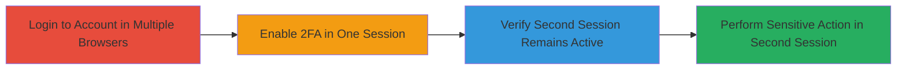

# 2FA Bypass Through Persistent Sessions on SideFX

Multi-stage attack chain demonstrating a complete attack workflow.

## Chain Metrics Dashboard

| Metric | Value |
|--------|-------|
| Chain Status | Unverified |
| Total Steps | 4 |
| Execution Time | ~5 minutes |
| Skill Level | Low |
| Complexity | Low |
| Impact Level | High |

## Attack Flow Visualization

## Prerequisites & Requirements

### Required Tools

- None (standard web browsers such as Chrome and Firefox)

### Target Environment

- Web platform
- Target URL: https://sidefx.com
- Required services/ports: HTTPS (443)
- Network access requirements: Direct internet access to the target site

### Initial Access Requirements

- Valid credentials (username and password) for a SideFX account
- Network position: Any external user with internet access
- Prior access needed: Ability to log in to the account

## Detailed Attack Procedures

### Step 1: Login to the Same Account in Two Different Browsers
procedure: [[procedures/Bypass-2FA-via-Persistent-Sessions]]

**Objective**: Establish two concurrent active sessions to simulate multi-device access.

**Instructions**: Open two separate browser instances. In each, navigate to https://sidefx.com and log in using the same valid credentials.

**Expected Output**: Successful authentication in both browsers, granting access to the user dashboard or profile without errors.

**Success Indicators**:
- User profile or dashboard loads in both browsers.
- No authentication prompts after initial login.

### Step 2: Enable 2FA on the First Browser
procedure: [[procedures/Bypass-2FA-via-Persistent-Sessions]]

**Objective**: Activate 2FA on the account to set up the vulnerable condition.

**Instructions**: In the first browser, navigate to https://sidefx.com/profile. Locate the 2FA settings, initiate the enablement process (e.g., scan QR code with an authenticator app or enter backup codes), and complete all required steps.

**Expected Output**: Confirmation message stating '2FA activated' on the profile page.

**Success Indicators**:
- 2FA setup completes without errors.
- Future logins (in new sessions) require 2FA code.

### Step 3: Verify Session Persistence in the Second Browser
procedure: [[procedures/Bypass-2FA-via-Persistent-Sessions]]

**Objective**: Confirm that enabling 2FA does not terminate or challenge the existing second session.

**Instructions**: In the second browser, reload the current page (e.g., dashboard) or navigate to another protected area like the profile.

**Expected Output**: The page reloads successfully without any logout, 2FA prompt, or session expiration.

**Success Indicators**:
- Full access to account features remains available.
- No re-authentication is demanded.

### Step 4: Change Password in the Second Browser
procedure: [[procedures/Bypass-2FA-via-Persistent-Sessions]]

**Objective**: Execute a sensitive action to exploit the persistent session and bypass 2FA.

**Instructions**: In the second browser, go to https://sidefx.com/profile, select the password change option, enter a new password, and submit the form without providing any 2FA code.

**Expected Output**: The password change is accepted and confirmed, updating the account password immediately.

**Success Indicators**:
- New password is set successfully.
- Account control is demonstrated without 2FA interference.

## Attack Chain Summary

### Key Achievements

1. Multi-session login established without detection.
2. 2FA enabled, but existing sessions remain vulnerable.
3. Session persistence verified post-2FA activation.
4. Sensitive action (password change) completed, enabling potential account takeover.

## Technique & Tactic Coverage

### MITRE ATT&CK Techniques

- [[Valid Accounts]] Valid Accounts

### MITRE ATT&CK Tactics

- [[Initial Access]] Initial Access

---

*Last updated: 2024-10-04T00:00:00Z*
