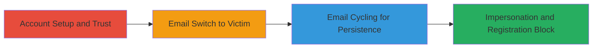

# 2FA Bypass via Email Change Cycling Leading to User Impersonation

Multi-stage attack chain demonstrating a complete authentication bypass workflow on Drugs.com, allowing indefinite user impersonation without 2FA enforcement.

## Chain Metrics Dashboard

| Metric | Value |
|--------|-------|
| Chain Status | Unverified |
| Total Steps | 4 |
| Execution Time | ~10 minutes |
| Skill Level | Intermediate |
| Complexity | Medium |
| Impact Level | High |

## Attack Flow Visualization

## Prerequisites & Requirements

### Required Tools

- Web browser (e.g., Chrome with developer tools for session inspection)

### Target Environment

- Web platform: Drugs.com account management at https://www.drugs.com/account/
- Required services/ports: HTTPS (443)
- Network access requirements: Internet access to Drugs.com

### Initial Access Requirements

- No prior credentials needed; attacker uses own email
- Attacker must control an email address for initial setup
- Victim's email address known (no password required)

## Detailed Attack Procedures

### Step 1: Account Setup
procedure: [[procedures/Create-Attacker-Account-with-Device-Trust]]

**Objective**: Establish a trusted session on the attacker's account to bypass future 2FA prompts.

**Instructions**: Navigate to the registration page and complete account creation with OTP verification, then enable device trust.

**Expected Output**: Active account with a 1-month device trust session.

**Success Indicators**:
- Account dashboard accessible without 2FA
- Device trust confirmation message displayed

### Step 2: Initial Impersonation
procedure: [[procedures/Change-Email-to-Victim-for-Impersonation]]

**Objective**: Switch the account email to the victim's, inheriting the trusted session for unauthorized access.

**Instructions**: Access account details and update the email field to the victim's address; no 2FA is prompted due to persistent session.

**Expected Output**: Account now associated with victim's email; login succeeds without OTP.

**Success Indicators**:
- Email change confirmation without verification
- Logout and relogin using victim's email bypasses 2FA

### Step 3: Maintain Access
procedure: [[procedures/Cycle-Email-Changes-for-Indefinite-Access]]

**Objective**: Cycle email changes back and forth to re-extend device trust indefinitely, preventing session expiration.

**Instructions**: Revert email to attacker's, re-verify with OTP and trust device, then switch back to victim's email.

**Expected Output**: Perpetual trusted session tied to victim's email.

**Success Indicators**:
- Repeated email changes without session invalidation
- No 2FA prompts after each cycle

### Step 4: Impact Realization
procedure: [[procedures/Block-Victim-Email-Registration]]

**Objective**: Demonstrate denial of service for the victim by squatting their email, preventing legitimate signup.

**Instructions**: From the victim's perspective, attempt registration; the system reports the email as already in use.

**Expected Output**: Registration error: "Email already in use."

**Success Indicators**:
- Victim unable to create account
- Attacker retains full control and impersonation capability

## Attack Chain Summary

### Key Achievements

1. Bypassed 2FA entirely through session persistence across email changes
2. Enabled indefinite impersonation of any user without password knowledge
3. Caused account squatting, blocking legitimate users and eroding platform trust

## Technique & Tactic Coverage

### MITRE ATT&CK Techniques

- [[Valid Accounts]] Valid Accounts
- [[Exploit Public-Facing Application]] Exploit Public-Facing Application

### MITRE ATT&CK Tactics

- [[Initial Access]] Initial Access

---

*Last updated: 2024-01-01T00:00:00Z*
