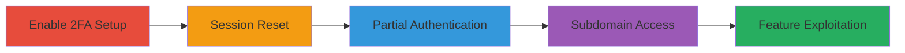

---
tags:
  - 2fa-bypass
  - auth-bypass
  - steam-auth
  - web-vuln
type: attack_chain
tools: []
tactics:
  - '[[Initial Access]]'
verified: false
platforms:
  - Web
submitted: true
complexity: low
created_at: '2023-10-01T00:00:00Z'
procedures:
  - '[[procedures/Login-with-Steam-Account-and-Enable-2FA]]'
  - '[[procedures/Logout-Account-and-Clear-Browser-Cookies]]'
  - '[[procedures/Perform-Partial-Login-Skipping-2FA]]'
  - '[[procedures/Navigate-to-3d-cs-money-Subdomain]]'
  - '[[procedures/Upload-or-View-Custom-Backgrounds-as-Prime-Subscriber]]'
step_count: 5
techniques:
  - '[[Valid Accounts]]'
  - '[[Exploit Public-Facing Application]]'
updated_at: '2025-12-14T05:32:10.090Z'
description: >-
  This attack chain exploits an improper authentication mechanism in CS.Money's
  Steam integration, allowing attackers to bypass 2FA and gain unauthorized
  access to the custom background upload and viewing features on the 3d.cs.money
  subdomain.
skill_level: beginner
impact_level: low
id: 6f84fb24-076b-4113-8113-f8247b984c36
validated: true
mitre_tactics:
  - '[[Initial Access]]'
mitre_techniques:
  - '[[Valid Accounts]]'
  - '[[Exploit Public-Facing Application]]'
---
# 2FA Bypass via Partial Steam Login to Access Custom Background Upload on 3d.cs.money

Multi-stage attack chain demonstrating a complete attack workflow exploiting authentication bypass in CS.Money's Steam login to access restricted features on a subdomain.

## Chain Metrics Dashboard

| Metric | Value |
|--------|-------|
| Chain Status | Unverified |
| Total Steps | 5 |
| Execution Time | ~5 minutes |
| Skill Level | Beginner |
| Complexity | Low |
| Impact Level | Low |

## Attack Flow Visualization

## Prerequisites & Requirements

### Required Tools

- Web browser (e.g., Chrome, Firefox)

### Target Environment

- CS.Money web application
- Steam account with Prime status on CS.Money
- No specific ports or services beyond standard HTTPS (443)

### Initial Access Requirements

- Valid Steam credentials
- Network access to cs.money and 3d.cs.money
- No prior access needed beyond account creation

## Detailed Attack Procedures

### Step 1: Enable 2FA Setup
procedure: [[procedures/Login-with-Steam-Account-and-Enable-2FA]]

**Objective**: Establish a baseline authenticated session with 2FA enabled to simulate legitimate user behavior before attempting bypass.

**Instructions**: Access the CS.Money login page and authenticate using Steam credentials, then navigate to account settings to activate 2FA.

**Expected Output**: Confirmation of 2FA activation in account settings.

**Success Indicators**:
- 2FA code prompt appears on next login
- Account status shows 2FA enabled

### Step 2: Session Reset
procedure: [[procedures/Logout-Account-and-Clear-Browser-Cookies]]

**Objective**: Terminate the current session and remove authentication artifacts to force re-authentication.

**Instructions**: Log out from the CS.Money dashboard and manually clear all browser cookies associated with the domain.

**Expected Output**: Clean browser state with no active session.

**Success Indicators**:
- Logout confirmation message
- No persistent login on reload

### Step 3: Partial Authentication
procedure: [[procedures/Perform-Partial-Login-Skipping-2FA]]

**Objective**: Initiate login with Steam credentials but bypass the 2FA verification step to create an incomplete session.

**Instructions**: Re-enter Steam credentials on the login page and proceed without providing the 2FA code when prompted.

**Expected Output**: Partial session established, allowing navigation without full verification.

**Success Indicators**:
- Login completes without 2FA error
- Access to basic site features granted

### Step 4: Subdomain Navigation
procedure: [[procedures/Navigate-to-3d-cs-money-Subdomain]]

**Objective**: Access the vulnerable subdomain using the incomplete session to reach restricted features.

**Instructions**: Directly navigate to https://3d.cs.money in the browser after partial login.

**Expected Output**: Subdomain loads without additional authentication prompts.

**Success Indicators**:
- Page loads successfully
- No redirect to login or 2FA

### Step 5: Feature Exploitation
procedure: [[procedures/Upload-or-View-Custom-Backgrounds-as-Prime-Subscriber]]

**Objective**: Exploit the bypass to interact with custom background upload and viewing, demonstrating unauthorized access.

**Instructions**: If Prime subscriber, use Ctrl+V to upload a background image or view existing ones without further checks.

**Expected Output**: Backgrounds uploaded or displayed successfully.

**Success Indicators**:
- Upload confirmation
- Visibility of user-specific backgrounds

## Attack Chain Summary

### Key Achievements

1. Successful 2FA bypass via incomplete Steam session
2. Unauthorized access to 3d.cs.money features
3. Demonstration of low-risk impact on non-sensitive data

## Technique & Tactic Coverage

### MITRE ATT&CK Techniques

- [[Valid Accounts]] Valid Accounts
- [[Exploit Public-Facing Application]] Exploit Public-Facing Application

### MITRE ATT&CK Tactics

- [[Initial Access]] Initial Access

---

*Last updated: 2023-10-01T00:00:00Z*
