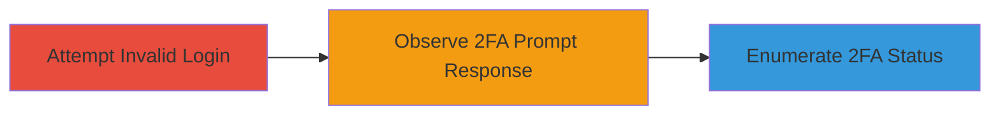

---
tags:
  - 2fa-enumeration
  - business-logic-error
  - user-enumeration
type: attack_chain
tools: []
tactics:
  - '[[Discovery]]'
verified: false
platforms:
  - Web
submitted: true
complexity: medium
created_at: '2023-10-01T00:00:00Z'
procedures:
  - '[[procedures/Enumerate-2FA-Enabled-Users-via-Login]]'
step_count: 2
techniques:
  - '[[Account Discovery]]'
updated_at: '2025-12-14T17:24:47.425Z'
description: >-
  Attack chain exploiting a business logic error in the login process to
  enumerate users with 2FA enabled by observing prompts after invalid password
  attempts.
skill_level: intermediate
impact_level: medium
id: 859c794b-5bb9-41a5-9409-284d6df5332f
validated: true
mitre_tactics:
  - '[[Discovery]]'
mitre_techniques:
  - '[[Account Discovery]]'
---
# 2FA User Enumeration via Login Business Logic Flaw

Multi-stage attack chain demonstrating a complete attack workflow for enumerating 2FA-enabled accounts through flawed login logic.

## Chain Metrics Dashboard

| Metric | Value |
|--------|-------|
| Chain Status | Unverified |
| Total Steps | 2 |
| Execution Time | ~5 minutes |
| Skill Level | Intermediate |
| Complexity | Medium |
| Impact Level | Medium |

## Attack Flow Visualization



## Prerequisites & Requirements

### Required Tools

- None (manual or curl-based interaction)

### Target Environment

- Web application with login endpoint
- Rate-limiting on login attempts
- Knowledge of target usernames

### Initial Access Requirements

- Public access to login page
- List of potential usernames to test
- No prior credentials needed

## Detailed Attack Procedures

### Step 1: Attempt Invalid Login
procedure: [[procedures/Enumerate-2FA-Enabled-Users-via-Login]]

**Objective**: Submit an invalid password for a known username to trigger the login flow and check for 2FA prompt.

**Instructions**: Use [[commands/curl-attempt-invalid-login]] to simulate a login attempt with a wrong password. Assume a standard login endpoint like /login accepting POST requests with username and password fields.

```bash
curl -X POST -d "username=targetuser@example.com&password=wrongpass" https://target.com/login -c cookies.txt
```

**Expected Output**: For 2FA-enabled users, a response indicating a 2FA prompt (e.g., redirect to /2fa or JSON with 2FA challenge). For non-2FA users, an immediate rejection (e.g., 401 error or invalid credentials message).

**Success Indicators**:
- Response contains 2FA prompt elements (e.g., form for code input)
- No prompt indicates non-2FA account

### Step 2: Analyze Response for Enumeration
procedure: [[procedures/Enumerate-2FA-Enabled-Users-via-Login]]

**Objective**: Interpret the login response to determine 2FA status and compile a list of enumerated accounts.

**Instructions**: Review the output from the login attempt. If rate-limited, space attempts (e.g., 1 per minute). Manually note or script parsing for 2FA indicators like specific status codes or response bodies.

**Expected Output**: A log or list showing 2FA status for each tested username, e.g., "targetuser@example.com: 2FA Enabled".

**Success Indicators**:
- Consistent differentiation between 2FA and non-2FA responses
- Enumerated list of at least some 2FA-enabled accounts despite rate-limiting

## Attack Chain Summary

### Key Achievements

1. Successful distinction between 2FA-enabled and non-enabled users via login responses
2. Identification of high-security accounts for potential targeted phishing or further attacks
3. Demonstration of business logic flaw without requiring valid credentials

## Technique & Tactic Coverage

### MITRE ATT&CK Techniques

- [[Account Discovery]]

### MITRE ATT&CK Tactics

- [[Discovery]]

---
*Last updated: 2023-10-01T00:00:00Z*
