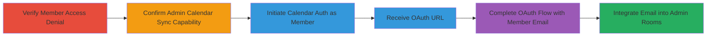

---
tags:
  - access-control-bypass
  - authorization-bypass
  - oauth-abuse
  - calendar-integration
  - 8x8
type: attack_chain
tools: []
tactics:
  - '[[Initial Access]]'
commands:
  - '[[commands/initiate-calendar-auth-bypass]]'
verified: false
platforms:
  - Web
submitted: true
complexity: medium
created_at: '2023-10-01T00:00:00Z'
procedures:
  - '[[procedures/Verify-Member-Access-Denial-to-Admin-Rooms]]'
  - '[[procedures/Initiate-Calendar-Auth-Bypass-as-Member]]'
  - '[[procedures/Complete-OAuth-Flow-for-Unauthorized-Integration]]'
step_count: 6
techniques:
  - '[[Valid Accounts]]'
  - '[[Exploit Public-Facing Application]]'
updated_at: '2025-12-14T17:30:18.098Z'
description: >-
  Multi-stage attack exploiting improper access control in the 8x8 admin panel,
  allowing unauthorized member users to integrate external calendars into the
  admin rooms management area via the calendar auth init endpoint.
skill_level: intermediate
impact_level: high
id: b609d2f4-b276-450a-a943-e99a94f7ec02
validated: true
mitre_tactics:
  - '[[Initial Access]]'
mitre_techniques:
  - '[[Valid Accounts]]'
  - '[[Exploit Public-Facing Application]]'
---
# 8x8 Admin Panel Access Control Bypass via Calendar Authentication Endpoint

Multi-stage attack chain demonstrating improper access control in the 8x8 admin panel, where member users can bypass role checks to integrate external calendars (e.g., Gmail via Cronofy OAuth) into the admin's rooms management section. This allows unauthorized data synchronization or manipulation in privileged areas.

## Chain Metrics Dashboard

| Metric | Value |
|--------|-------|
| Chain Status | Unverified |
| Total Steps | 6 |
| Execution Time | ~10 minutes |
| Skill Level | Intermediate |
| Complexity | Medium |
| Impact Level | High |

## Attack Flow Visualization



## Prerequisites & Requirements

### Required Tools

- Browser for manual verification
- [[commands/curl]] or similar for HTTP requests (no specialized tools required)

### Target Environment

- 8x8 admin panel at admin.8x8.vc
- Required services: Cronofy OAuth for calendar integration, Jitsi meeting services
- Tech stack: JWT authentication, OAuth 2.0
- Network access: Direct access to admin.8x8.vc (same-origin for requests)

### Initial Access Requirements

- Valid member user credentials (JWT token)
- Valid admin credentials for verification (separate session)
- No prior privileged access needed; exploits existing member session

## Detailed Attack Procedures

### Step 1: Verify Member Access Denial to Admin Rooms
procedure: [[procedures/Verify-Member-Access-Denial-to-Admin-Rooms]]

**Objective**: Confirm that member users lack permissions to access the admin rooms area, establishing the baseline for the bypass.

**Instructions**: Log in as a member user and attempt to navigate to the admin rooms section (e.g., https://admin.8x8.vc/#/rooms). Expect an access denied error.

**Expected Output**: HTTP 403 Forbidden or similar access denied message.

**Success Indicators**:
- Access denied error displayed
- No visibility into rooms management

### Step 2: Confirm Admin Calendar Sync Capability
procedure: [[procedures/Verify-Member-Access-Denial-to-Admin-Rooms]]

**Objective**: Verify that admins can normally integrate calendars from the rooms area, highlighting the privileged feature being bypassed.

**Instructions**: In a separate admin session, navigate to the rooms area (https://admin.8x8.vc/#/rooms) and initiate the email sync process for calendar integration.

**Expected Output**: Option to add email for calendar sync appears, leading to OAuth initiation.

**Success Indicators**:
- Calendar integration UI visible to admin
- OAuth flow initiable from rooms add page

### Step 3: Initiate Calendar Auth as Member
procedure: [[procedures/Initiate-Calendar-Auth-Bypass-as-Member]]

**Objective**: Use the member's JWT to request calendar auth init with a crafted redirect to the admin rooms page, bypassing role checks.

**Instructions**: From the member session, execute the following request using [[commands/initiate-calendar-auth-bypass]] or a tool like curl:

```bash
curl -X GET "https://admin.8x8.vc/meet-external/spot-roomkeeper/v1/calendar/auth/init?successRedirectUrl=https%3A%2F%2Fadmin.8x8.vc%2F%23%2Frooms%2Fadd" \
  -H "Authorization: Bearer <member-jwt-token>" \
  -H "User-Agent: Mozilla/5.0 (Windows NT 10.0; Win64; x64; rv:97.0) Gecko/20100101 Firefox/97.0" \
  -H "Accept: */*" \
  -H "Referer: https://admin.8x8.vc/"
```

**Expected Output**: JSON response with OAuth URL, e.g., {"url":"https://app.cronofy.com/oauth/authorize?..."}.

**Success Indicators**:
- OAuth URL returned without role validation error
- No permission denial on endpoint

### Step 4: Receive OAuth URL

**Objective**: Extract the Cronofy OAuth authorization URL from the response for the next step.

**Instructions**: Parse the JSON response from Step 3 to obtain the 'url' field, which points to the Cronofy OAuth endpoint with parameters like client_id, redirect_uri (https://api-vo.jitsi.net/rosy/sso/cronofy/callback), scope=read_only, and state.

**Expected Output**: Full OAuth URL ready for browser access.

**Success Indicators**:
- Valid Cronofy OAuth URL with delegated scopes
- avoid_linking=true parameter present

### Step 5: Complete OAuth Flow with Member Email
procedure: [[procedures/Complete-OAuth-Flow-for-Unauthorized-Integration]]

**Objective**: Authorize the OAuth flow using the member's external email (e.g., Gmail), linking it without admin validation.

**Instructions**: Open the OAuth URL in a browser, sign up or authorize with the member's email account (e.g., via Gmail), and complete the consent process. The flow redirects back via the callback URI.

**Expected Output**: Successful authorization code exchange, leading to integration completion.

**Success Indicators**:
- OAuth consent granted without admin role check
- Member email authorized for calendar access

### Step 6: Integrate Email into Admin Rooms
procedure: [[procedures/Complete-OAuth-Flow-for-Unauthorized-Integration]]

**Objective**: Confirm the unauthorized integration of the member's email into the admin rooms section post-OAuth.

**Instructions**: After OAuth completion, verify in the admin rooms area (https://admin.8x8.vc/#/rooms/add) that the member's email calendar is now linked, allowing potential data sync or manipulation.

**Expected Output**: Member's email appears in admin rooms calendar integrations.

**Success Indicators**:
- Email linked in admin section despite member role
- Potential for calendar data access/escalation

## Attack Chain Summary

### Key Achievements

1. Bypassed role checks on calendar auth endpoint using member JWT
2. Integrated unauthorized external calendar into admin rooms management
3. Enabled potential data exfiltration or manipulation in privileged areas via synced calendars

## Technique & Tactic Coverage

### MITRE ATT&CK Techniques

- [[Valid Accounts]] Valid Accounts (abusing member credentials for privileged actions)
- [[Exploit Public-Facing Application]] Exploit Public-Facing Application (exploiting web endpoint without auth checks)

### MITRE ATT&CK Tactics

- [[Initial Access]] Initial Access (gaining unauthorized access to admin features)

---

*Last updated: 2023-10-01T00:00:00Z*
