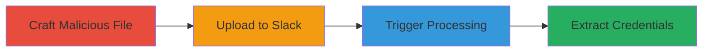

---
tags:
  - lfi
  - libreoffice
  - slack
  - aws
  - credentials
  - cve-2019-17400
  - file-upload
type: attack_chain
tools:
  - '[[tools/LibreOffice]]'
  - '[[tools/unoconv]]'
tactics:
  - '[[Initial Access]]'
  - '[[Discovery]]'
commands: []
platforms:
  - Web
  - Cloud (AWS)
complexity: medium
procedures:
  - '[[procedures/Craft-Malicious-Office-File-for-LibreOffice-LFI]]'
  - '[[procedures/Upload-Malicious-File-to-Slack]]'
  - '[[procedures/Trigger-LibreOffice-Thumbnail-Processing]]'
  - '[[procedures/Exploit-LFI-to-Extract-AWS-Credentials]]'
step_count: 4
techniques:
  - '[[Exploit Public-Facing Application]]'
  - '[[T1203.001]]'
  - '[[File and Directory Discovery]]'
description: >-
  Exploits a LibreOffice vulnerability in Slack's file preview processing to
  achieve local file inclusion and extract AWS credentials from the processing
  container.
skill_level: intermediate
impact_level: high
id: fdafcedb-8eb0-46c3-b318-122d32c746c0
created_at: '2025-12-14T03:46:14.565Z'
updated_at: '2025-12-14T03:46:14.565Z'
verified: false
validated: true
submitted: true
mitre_tactics:
  - '[[Initial Access]]'
  - '[[Discovery]]'
mitre_techniques:
  - '[[Exploit Public-Facing Application]]'
  - '[[T1203.001]]'
  - '[[File and Directory Discovery]]'
---
# AWS Credential Exposure via LibreOffice LFI in Slack File Previews

Researchers identified a critical vulnerability in LibreOffice, leveraged by Slack for Office file preview generation, allowing attackers to craft malicious files that enable local file inclusion (LFI) during thumbnail processing. By uploading such a file to Slack, the backend's use of LibreOffice and the unoconv library triggers the exploit, granting access to sensitive files within the AWS processing container, including internal credentials. Reported on August 12, 2019, under CVE-2019-17400, this led to potential compromise of AWS resources, though no customer data was affected and the issue was patched the following day.

## Chain Metrics Dashboard

| Metric | Value |
|--------|-------|
| Chain Status | Unverified |
| Total Steps | 4 |
| Execution Time | ~5 minutes |
| Skill Level | Intermediate |
| Complexity | Medium |
| Impact Level | High |

## Attack Flow Visualization

## Prerequisites & Requirements

### Required Tools

- Office file editing software (e.g., Microsoft Office or LibreOffice for crafting)
- Web browser for Slack upload

### Target Environment

- Slack workspace with file upload enabled
- Backend processing on AWS containers using LibreOffice for previews

### Initial Access Requirements

- Valid Slack account with upload permissions
- No special credentials beyond standard user access
- Knowledge of CVE-2019-17400 in LibreOffice/unoconv

## Detailed Attack Procedures

### Step 1: Craft Malicious Office File
procedure: [[procedures/Craft-Malicious-Office-File-for-LibreOffice-LFI]]

**Objective**: Create a specially crafted Office file that exploits the LibreOffice LFI vulnerability to enable arbitrary local file access during processing.

**Instructions**: Use an Office suite to embed malicious structures targeting the unoconv conversion path. Modify the file's internal elements to reference local paths via the vulnerability, such as injecting OLE objects or macro-like triggers that leverage CVE-2019-17400 for file read access.

**Expected Output**: A .docx or .xlsx file ready for upload, appearing benign but containing exploit payload.

**Success Indicators**:
- File validates as a standard Office document without errors
- Embedded exploit elements are present upon inspection with tools like oledump

### Step 2: Upload Malicious File to Slack
procedure: [[procedures/Upload-Malicious-File-to-Slack]]

**Objective**: Deliver the malicious file to Slack's backend for preview processing, initiating the exploit chain.

**Instructions**: Log into a Slack workspace and use the file upload feature in a channel or DM. Select the crafted Office file and submit it, triggering Slack's automatic thumbnail generation.

**Expected Output**: File uploads successfully, and Slack attempts to generate a preview thumbnail.

**Success Indicators**:
- Upload completes without rejection
- Preview processing is initiated (visible as loading or error in UI)

### Step 3: Trigger LibreOffice Thumbnail Processing
procedure: [[procedures/Trigger-LibreOffice-Thumbnail-Processing]]

**Objective**: Cause Slack's backend to process the file using LibreOffice, activating the vulnerability during conversion.

**Instructions**: The upload automatically queues the file for preview. Monitor the Slack interface for thumbnail generation attempts; the backend invokes LibreOffice via unoconv to convert the file, executing the malicious structure.

**Expected Output**: Backend logs (if accessible) show LibreOffice invocation; exploit triggers LFI during thumbnail creation.

**Success Indicators**:
- No immediate upload failure
- Potential delay or error in preview, indicating processing

### Step 4: Exploit LFI to Extract AWS Credentials
procedure: [[procedures/Exploit-LFI-to-Extract-AWS-Credentials]]

**Objective**: Leverage the LFI vulnerability to read sensitive files from the AWS container, exposing internal credentials.

**Instructions**: The crafted file's exploit, executed during processing, allows reading of local paths like AWS metadata endpoints (/latest/meta-data/iam/security-credentials/). The vulnerability in LibreOffice/unoconv permits arbitrary file access, dumping credentials to a reachable location or log.

**Expected Output**: Exposed AWS credentials, such as IAM role keys, from the container's environment.

**Success Indicators**:
- Credentials retrieved via the exploit output
- Confirmation of access to container files without further interaction

## Attack Chain Summary

### Key Achievements

1. Successful exploitation of CVE-2019-17400 for LFI in a cloud processing environment
2. Exposure of internal AWS credentials without accessing customer data
3. Demonstration of risks in third-party file processing libraries

## Technique & Tactic Coverage

### MITRE ATT&CK Techniques

- [[Exploit Public-Facing Application]]
- [[T1203.001]]
- [[File and Directory Discovery]]

### MITRE ATT&CK Tactics

- [[Initial Access]]
- [[Discovery]]

---
*Last updated: 2023-10-01*
