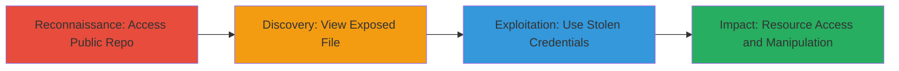

# AWS Credential Leakage from Public GitHub Repository Leading to Unauthorized Resource Access

Multi-stage attack chain demonstrating the discovery and exploitation of leaked AWS credentials in a public GitHub repository, resulting in unauthorized access to cloud resources.

## Chain Metrics Dashboard

| Metric | Value |
|--------|-------|
| Chain Status | Unverified |
| Total Steps | 3 |
| Execution Time | ~5 minutes |
| Skill Level | Beginner |
| Complexity | Low |
| Impact Level | High |

## Attack Flow Visualization

## Prerequisites & Requirements

### Required Tools

- Web browser for repository access

### Target Environment

- Public GitHub repository
- AWS cloud services (S3, EC2, Lambda)
- No specific ports required; internet access needed

### Initial Access Requirements

- Public internet access
- No prior credentials needed for discovery phase

## Detailed Attack Procedures

### Step 1: Reconnaissance - Access Public Repository
procedure: [[procedures/Discover-Leaked-AWS-Credentials-in-GitHub-Repository]]

**Objective**: Identify and access the public GitHub repository containing sensitive information.

**Instructions**: Navigate to the target repository URL using a web browser. Search for repositories associated with the target organization or use GitHub search features to find potentially exposed credentials.

**Expected Output**: Repository landing page loads, listing files and contents.

**Success Indicators**:
- Repository is publicly accessible without authentication
- File list visible

### Step 2: Discovery - Extract Credentials from Exposed File
procedure: [[procedures/Extract-Credentials-from-Exposed-File]]

**Objective**: Locate and copy the plain-text AWS Access Key and Secret Key from the exposed file.

**Instructions**: Open the specific file within the repository (e.g., a configuration or script file) and scan the content, typically in the middle section, for the AWS credentials. Copy the Access Key ID (starting with AKIA...) and Secret Access Key.

**Expected Output**: Credentials visible in plain text; screenshot or copy for later use.

**Success Indicators**:
- Keys identified without obfuscation
- No encryption or redaction present

### Step 3: Exploitation - Access AWS Resources with Stolen Credentials
procedure: [[procedures/Access-AWS-Resources-with-Stolen-Credentials]]

**Objective**: Authenticate to AWS using the leaked credentials to gain unauthorized access to resources.

**Instructions**: Configure the AWS CLI with the stolen keys using environment variables or config files, then query resources like S3 buckets or EC2 instances to confirm access. For example, list S3 buckets to verify permissions.

**Expected Output**: Successful authentication and listing of AWS resources.

**Success Indicators**:
- AWS CLI commands execute without errors
- Access to S3, EC2, or other services confirmed
- Potential for data exfiltration or modification

## Attack Chain Summary

### Key Achievements

1. Discovery of plain-text credentials in a public repository
2. Extraction of functional AWS keys
3. Unauthorized access to cloud resources, enabling data breaches or disruptions

## Technique & Tactic Coverage

### MITRE ATT&CK Techniques

- [[Valid Accounts]] Valid Accounts
- [[Unsecured Credentials]] Unprotected Storage of Credentials

### MITRE ATT&CK Tactics

- [[Initial Access]] Initial Access

---
*Last updated: 2023-10-01T00:00:00Z*
