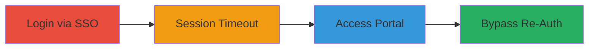

---
tags:
  - aws
  - sso
  - session-bypass
  - authentication-bypass
  - cloud
type: attack_chain
tools: []
tactics:
  - '[[Initial Access]]'
  - '[[Lateral Movement]]'
verified: false
platforms:
  - AWS
  - Cloud
submitted: true
complexity: low
created_at: '2023-10-01T00:00:00Z'
procedures:
  - '[[procedures/Login-to-AWS-Console-via-SSO]]'
  - '[[procedures/Wait-for-AWS-Session-Timeout]]'
  - '[[procedures/Access-AWS-Access-Portal-Post-Timeout]]'
  - '[[procedures/Bypass-Re-Authentication-on-AWS-Portal]]'
step_count: 4
techniques:
  - '[[Valid Accounts]]'
  - '[[Reversible Encryption]]'
updated_at: '2025-12-14T17:31:42.711Z'
description: >-
  Demonstrates bypassing re-authentication in AWS IAM Identity Center by
  exploiting inconsistent session expiration between the AWS Management Console
  and Access Portal, allowing unauthorized access post-timeout.
skill_level: intermediate
impact_level: high
id: 2c3d6e94-02dd-40b3-8b86-97a7e3c02255
validated: true
mitre_tactics:
  - '[[Initial Access]]'
  - '[[Lateral Movement]]'
mitre_techniques:
  - '[[Valid Accounts]]'
  - '[[Reversible Encryption]]'
---
# AWS SSO Session Expiration Bypass via Access Portal

Multi-stage attack chain demonstrating a complete attack workflow exploiting inconsistent session management in AWS IAM Identity Center (formerly AWS SSO). An attacker with initial access can maintain unauthorized entry to the AWS Access Portal even after the Management Console session expires, potentially leading to data breaches, account takeover, and compliance issues.

## Chain Metrics Dashboard

| Metric | Value |
|--------|-------|
| Chain Status | Unverified |
| Total Steps | 4 |
| Execution Time | ~15-30 minutes (depending on timeout policy) |
| Skill Level | Intermediate |
| Complexity | Low |
| Impact Level | High |

## Attack Flow Visualization

## Prerequisites & Requirements

### Required Tools

- Web browser (e.g., Chrome, Firefox)

### Target Environment

- AWS environment with IAM Identity Center (SSO) enabled
- Configured session timeout policy in AWS Management Console
- Access to AWS Access Portal URL

### Initial Access Requirements

- Valid AWS SSO credentials for initial login
- Network access to AWS console and portal
- No prior session hijacking needed; exploits legitimate session

## Detailed Attack Procedures

### Step 1: Login to AWS Management Console
procedure: [[procedures/Login-to-AWS-Console-via-SSO]]

**Objective**: Establish an initial authenticated session in the AWS Management Console using SSO to set up the exploitable state.

**Instructions**: Navigate to the AWS Management Console login page and authenticate using AWS SSO credentials. This creates a session governed by the console's timeout policy.

**Expected Output**: Successful login to the AWS Management Console dashboard.

**Success Indicators**:
- Dashboard loads with user permissions visible
- Session active indicator in browser

### Step 2: Wait for Session Timeout
procedure: [[procedures/Wait-for-AWS-Session-Timeout]]

**Objective**: Allow the configured session timeout to expire in the Management Console, simulating an unattended session.

**Instructions**: Leave the session idle until the timeout period elapses (typically 8-12 hours, but configurable). Attempt to interact with the console to confirm expiration.

**Expected Output**: Console prompts for re-authentication or logs out the user.

**Success Indicators**:
- Console session expires and requires re-login
- No active session in browser dev tools (check cookies)

### Step 3: Access AWS Access Portal Post-Timeout
procedure: [[procedures/Access-AWS-Access-Portal-Post-Timeout]]

**Objective**: Navigate to the AWS Access Portal after console timeout to test session validity across services.

**Instructions**: In the same browser session, open the AWS Access Portal URL (e.g., https://yourcompany.awsapps.com/start). Do not clear cookies or browser data.

**Expected Output**: Portal loads without immediate redirect to SSO login.

**Success Indicators**:
- Portal page accessible
- No SSO re-authentication prompt

### Step 4: Bypass Re-Authentication on Portal
procedure: [[procedures/Bypass-Re-Authentication-on-AWS-Portal]]

**Objective**: Confirm and exploit the bypass by gaining access to AWS resources via the portal without full re-authentication.

**Instructions**: Proceed with portal actions, such as selecting an account or application. Observe if access is granted using the expired session tokens.

**Expected Output**: Successful access to AWS accounts or apps without SSO prompt.

**Success Indicators**:
- Unauthorized access to sensitive AWS resources
- No interruption from authentication controls

## Attack Chain Summary

### Key Achievements

1. Bypassed session expiration enforcement between AWS services
2. Enabled potential unauthorized access to AWS environments
3. Highlighted risks of unattended sessions leading to account takeover

## Technique & Tactic Coverage

### MITRE ATT&CK Techniques

- [[Valid Accounts]] Valid Accounts
- [[Reversible Encryption]] Multi-Factor Authentication Instrument (for session token abuse)

### MITRE ATT&CK Tactics

- [[Initial Access]] Initial Access
- [[Lateral Movement]] Lateral Movement

---

*Last updated: 2023-10-01T00:00:00Z*
