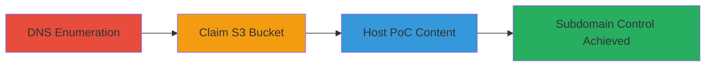

---
tags:
  - subdomain-takeover
  - aws
  - s3
  - dns
  - phishing
type: attack_chain
tools:
  - '[[tools/dig]]'
tactics:
  - '[[Reconnaissance]]'
  - '[[Initial Access]]'
commands:
  - '[[commands/dig-dns-lookup-for-subdomain]]'
platforms:
  - AWS
  - Cloud
  - Web
complexity: medium
procedures:
  - '[[procedures/DNS-Enumeration-for-Subdomain-Takeover]]'
  - '[[procedures/Claim-Unclaimed-AWS-S3-Bucket]]'
  - '[[procedures/Host-Proof-of-Concept-on-Taken-Over-Subdomain]]'
step_count: 3
techniques:
  - '[[Hardware]]'
  - '[[Exploit Public-Facing Application]]'
description: >-
  Multi-stage attack exploiting a dangling DNS CNAME record to claim an
  unclaimed AWS S3 bucket and take over a subdomain, enabling phishing, cookie
  theft, or SSRF bypass.
skill_level: intermediate
impact_level: high
id: d27a2aa4-6360-45d1-a700-ce883ec5fd69
created_at: '2025-12-14T05:32:31.176Z'
updated_at: '2025-12-14T05:32:31.176Z'
verified: false
validated: true
submitted: true
mitre_tactics:
  - '[[Reconnaissance]]'
  - '[[Initial Access]]'
mitre_techniques:
  - '[[Hardware]]'
  - '[[Exploit Public-Facing Application]]'
---
# AWS Subdomain Takeover via Dangling S3 Bucket CNAME

Multi-stage attack chain demonstrating a complete subdomain takeover workflow on an AWS-hosted subdomain by exploiting a dangling CNAME record to an unclaimed S3 bucket. This allows an attacker to gain control over the subdomain, host malicious content, and potentially steal cookies, enable phishing, bypass CSP/CORS, or exploit SSRF whitelisting.

## Chain Metrics Dashboard

| Metric | Value |
|--------|-------|
| Chain Status | Unverified |
| Total Steps | 3 |
| Execution Time | ~10 minutes |
| Skill Level | Intermediate |
| Complexity | Medium |
| Impact Level | High |

## Attack Flow Visualization



## Prerequisites & Requirements

### Required Tools

- [[tools/dig]]

### Target Environment

- AWS Cloud platform
- DNS services with CNAME records
- AWS S3 buckets

### Initial Access Requirements

- No credentials required initially; relies on public DNS queries
- Internet access for DNS resolution and S3 bucket claiming
- AWS account for claiming the bucket

## Detailed Attack Procedures

### Step 1: DNS Enumeration
procedure: [[procedures/DNS-Enumeration-for-Subdomain-Takeover]]

**Objective**: Identify dangling CNAME records pointing to unclaimed AWS S3 buckets via DNS lookup.

**Instructions**: Perform a DNS lookup on the target subdomain using [[commands/dig-dns-lookup-for-subdomain]] to reveal the CNAME record.

```bash
dig www.███████
```

**Expected Output**: DNS response showing a CNAME to an unclaimed AWS S3 bucket endpoint, such as `cname-to-bucket.s3.amazonaws.com`, along with NS and A records.

**Success Indicators**:
- CNAME record points to an S3 endpoint that is unclaimed
- No active ownership detected on the bucket

### Step 2: Claim S3 Bucket
procedure: [[procedures/Claim-Unclaimed-AWS-S3-Bucket]]

**Objective**: Register and claim the unclaimed S3 bucket associated with the dangling DNS record to gain control.

**Instructions**: Use your AWS account to create and claim the bucket via the AWS console or CLI. No specific command is needed beyond standard AWS S3 creation, but verify availability first.

**Expected Output**: Successful bucket creation confirmation in AWS console, with the bucket now under your control.

**Success Indicators**:
- Bucket claimed without errors
- DNS CNAME now resolves to your controlled bucket

### Step 3: Host Proof-of-Concept
procedure: [[procedures/Host-Proof-of-Concept-on-Taken-Over-Subdomain]]

**Objective**: Serve malicious or proof-of-concept content on the taken-over subdomain to demonstrate control and potential impacts like phishing or cookie theft.

**Instructions**: Upload static HTML files to the claimed S3 bucket and configure it for public access. Access the subdomain at `https://www.███████/poctest` (or punycode equivalent) to verify hosting.

**Expected Output**: Webpage loads from the subdomain, confirming control and serving the PoC content.

**Success Indicators**:
- Subdomain resolves to hosted content
- PoC page accessible, demonstrating risks like cookie theft or phishing

## Attack Chain Summary

### Key Achievements

1. Discovered dangling DNS record via enumeration
2. Claimed unclaimed S3 bucket to hijack subdomain
3. Hosted PoC to prove control and highlight impacts (e.g., bypassing CSP/CORS, SSRF whitelisting)

## Technique & Tactic Coverage

### MITRE ATT&CK Techniques

- [[Hardware]]
- [[Exploit Public-Facing Application]]

### MITRE ATT&CK Tactics

- [[Reconnaissance]]
- [[Initial Access]]

---
*Last updated: 2023-10-01*
