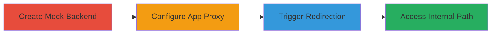

# Access Internal NGINX Locations via Shopify App Proxy X-Accel-Redirect Misconfiguration

Multi-stage attack chain demonstrating exploitation of Shopify's NGINX configuration vulnerability where the App Proxy does not ignore X-Accel-Redirect headers from upstream backends, allowing redirection to internal locations like /collections/all. This could lead to unauthorized access to sensitive internal services, though in practice, internal routes require authentication, limiting impact.

## Chain Metrics Dashboard

| Metric | Value |
|--------|-------|
| Chain Status | Unverified |
| Total Steps | 3 |
| Execution Time | ~10 minutes |
| Skill Level | Intermediate |
| Complexity | Medium |
| Impact Level | Medium |

## Attack Flow Visualization

## Prerequisites & Requirements

### Required Tools

- [[tools/mocky-io]]

### Target Environment

- Shopify store with admin access
- NGINX-based web platform
- App Proxy service enabled

### Initial Access Requirements

- Shopify Partners account with ability to create private apps
- Access to a development or test Shopify shop
- No prior network position needed; operates over public internet

## Detailed Attack Procedures

### Step 1: Create Mock Backend
procedure: [[procedures/Create-Mock-Server-with-X-Accel-Redirect-Header]]

**Objective**: Set up a controlled upstream server that returns an X-Accel-Redirect header to simulate redirection to an internal path.

**Instructions**: Use [[tools/mocky-io]] to generate a mock HTTP response with the X-Accel-Redirect header set to /collections/all. Design the response on the mocky.io designer page, add the header {"X-Accel-Redirect": "/collections/all"}, and generate the mock URL (e.g., https://run.mocky.io/v3/d7cdfcbc-6994-4f3b-a323-fe8377535507).

**Expected Output**: A unique mock URL that, when requested, returns a 200 OK with the specified header.

**Success Indicators**:
- Mock URL generated successfully
- Header verifiable via curl or browser dev tools

### Step 2: Configure App Proxy
procedure: [[procedures/Configure-Shopify-App-Proxy]]

**Objective**: Install a private app and set up the App Proxy to route requests to the mock backend.

**Instructions**: In Shopify Partners, create a new private application and install it on your target shop. Navigate to Extensions > Online Store > App Proxy, set Subpath prefix to 'a', Subpath to 'apps', and Proxy URL to the mock URL from Step 1.

**Expected Output**: App Proxy configured with a proxy URL like https://{shop}.myshopify.com/a/apps.

**Success Indicators**:
- Private app installed without errors
- App Proxy settings saved and visible in admin panel

### Step 3: Trigger Redirection
procedure: [[procedures/Access-App-Proxy-URL-to-Trigger-Redirection]]

**Objective**: Access the proxy URL to proxy the request to the mock server, triggering NGINX to follow the X-Accel-Redirect to an internal path.

**Instructions**: In a browser, navigate to https://{shop}.myshopify.com/a/apps, replacing {shop} with the actual shop name. The request proxies to the mock server, which returns the X-Accel-Redirect header, causing NGINX to serve content from /collections/all.

**Expected Output**: Browser displays content from the internal /collections/all path instead of the mock response.

**Success Indicators**:
- Internal path content loaded (e.g., Shopify collections page)
- Network inspection shows redirection via X-Accel-Redirect

## Attack Chain Summary

### Key Achievements

1. Simulated upstream control over App Proxy responses
2. Bypassed expected proxy isolation to access internal NGINX locations
3. Demonstrated potential for unauthorized internal service access, though mitigated by authentication

## Technique & Tactic Coverage

### MITRE ATT&CK Techniques

- [[Exploit Public-Facing Application]]

### MITRE ATT&CK Tactics

- [[Initial Access]]

---
*Last updated: 2023-10-01T12:00:00Z*
