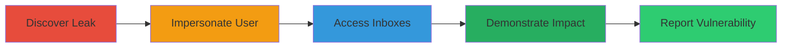

---
tags:
  - session-cookie-leak
  - account-takeover
  - bug-bounty
  - credential-theft
type: attack_chain
tools:
  - '[[tools/cURL]]'
  - '[[tools/Browser-Console]]'
tactics:
  - '[[Initial Access]]'
  - '[[Credential Access]]'
commands:
  - '[[commands/curl-with-session-cookie]]'
platforms:
  - Web
complexity: low
procedures:
  - '[[procedures/Discover-Leaked-Session-Cookie-in-Report]]'
  - '[[procedures/Impersonate-User-with-Stolen-Session-Cookie]]'
  - '[[procedures/Access-Sensitive-Inboxes-and-Reports]]'
  - '[[procedures/Assess-and-Demonstrate-Impact]]'
  - '[[procedures/Report-Vulnerability-Responsibly]]'
step_count: 5
techniques:
  - '[[Steal Web Session Cookie]]'
  - '[[Valid Accounts]]'
description: >-
  Multi-stage attack chain exploiting an accidentally leaked session cookie to
  gain unauthorized access to a security analyst's account and sensitive reports
  on a bug bounty platform.
skill_level: beginner
impact_level: high
id: ede6d05a-d0d3-40d6-9396-0452cf8292e0
created_at: '2025-12-11T06:10:40.576Z'
updated_at: '2025-12-11T06:10:40.576Z'
verified: false
validated: true
submitted: true
mitre_tactics:
  - '[[TA0001]]'
  - '[[TA0006]]'
mitre_techniques:
  - '[[T1539]]'
  - '[[T1078]]'
---
# Account Takeover via Accidental Session Cookie Leak in Bug Bounty Platform

## Overview

This attack chain demonstrates how a hacker exploited an accidentally leaked session cookie from a security analyst's report comment on the HackerOne platform. By discovering the leaked cookie in a vulnerability reproduction attempt, the hacker impersonated the analyst, accessed multiple sensitive inboxes containing report metadata and contents from various customer programs, and demonstrated the impact without malicious intent. The vulnerability was reported, leading to a $20,000 bounty and platform improvements. The chain highlights risks of insufficiently protected credentials and improper authentication.

## Chain Metrics Dashboard

| Metric | Value |
|--------|-------|
| Chain Status | Unverified |
| Total Steps | 5 |
| Execution Time | ~10 minutes |
| Skill Level | Beginner |
| Complexity | Low |
| Impact Level | High |

## Attack Flow Visualization



## Prerequisites & Requirements

### Required Tools

- [[tools/cURL]]
- [[tools/Browser-Console]]

### Target Environment

- Web-based bug bounty platform (e.g., HackerOne)
- No specific ports required; HTTP/HTTPS access
- Services: HackerOne Platform, HAS Inbox, Triage Inbox, Main Inbox, Report View

### Initial Access Requirements

- Access to the platform as a registered user
- Ability to view report comments where the leak occurred
- No prior credentials needed beyond platform access

## Detailed Attack Procedures

### Step 1: Discover Leaked Session Cookie - [[procedures/Discover-Leaked-Session-Cookie-in-Report]]

**Objective**: Identify the accidentally disclosed session cookie in the analyst's report comment.

**Instructions**: Review the report comments for any pasted cURL commands or console output that includes sensitive information like session cookies. Look for unredacted parts of HTTP requests copied from the browser console.

**Expected Output**: Extraction of the session cookie value from the comment.

**Success Indicators**:
- Session cookie string identified (e.g., 'session=eyJ...')
- Confirmation that the cookie is valid and not expired

### Step 2: Impersonate User with Stolen Session Cookie - [[procedures/Impersonate-User-with-Stolen-Session-Cookie]]

**Objective**: Use the leaked session cookie to authenticate as the security analyst without needing passwords or IP restrictions.

**Instructions**: Inject the leaked session cookie into your browser or use [[commands/curl-with-session-cookie]] to make authenticated requests:

```bash
curl -H 'Cookie: session=leaked_cookie_value' https://hackerone.com/some_endpoint
```

Verify access by navigating to protected areas of the platform.

**Expected Output**: Successful authentication and access to the analyst's dashboard.

**Success Indicators**:
- HTTP 200 responses from protected endpoints
- Ability to view analyst-specific features without login prompts

### Step 3: Access Sensitive Inboxes and Reports - [[procedures/Access-Sensitive-Inboxes-and-Reports]]

**Objective**: Navigate through the analyst's inboxes to view unauthorized report metadata and contents.

**Instructions**: Using the impersonated session, access the HAS Inbox (up to 25 reports), Triage Inbox (up to 100 reports), Main Inbox (up to 25 reports), and individual report views. Load metadata including titles, states, comments, and vulnerability details.

**Expected Output**: Retrieval of sensitive data from multiple customer programs.

**Success Indicators**:
- Successful loading of report lists and details
- No access denied errors

### Step 4: Assess and Demonstrate Impact - [[procedures/Assess-and-Demonstrate-Impact]]

**Objective**: Evaluate the extent of unauthorized access and gather evidence for responsible disclosure.

**Instructions**: Document accessed reports with redacted screenshots or logs, noting the potential exposure of confidential vulnerability information across programs.

**Expected Output**: Compiled evidence of impact without exfiltrating data.

**Success Indicators**:
- Evidence of access to at least 150 reports across inboxes
- Confirmation of no malicious actions taken

### Step 5: Report Vulnerability Responsibly - [[procedures/Report-Vulnerability-Responsibly]]

**Objective**: Submit a report detailing the vulnerability and impact to the platform's bug bounty program.

**Instructions**: Create a new report on HackerOne, including redacted evidence of the account takeover and accessed data, emphasizing the lack of IP binding on sessions.

**Expected Output**: Submission confirmation and eventual bounty award.

**Success Indicators**:
- Report triaged and bounty issued ($20,000 in this case)
- Platform improvements implemented

## Attack Chain Summary

### Key Achievements

1. Unauthorized access to a security analyst's account via leaked cookie
2. Exposure of sensitive reports from multiple customer programs
3. Responsible disclosure leading to security enhancements

## Technique & Tactic Coverage

### MITRE ATT&CK Techniques

- [[Steal Web Session Cookie]]
- [[Valid Accounts]]

### MITRE ATT&CK Tactics

- [[Initial Access]]
- [[Credential Access]]

*Last updated: 2023-10-01*
