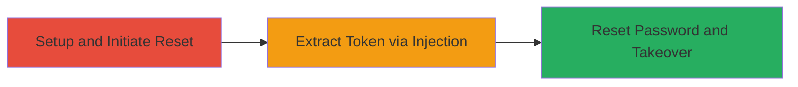

# Account Takeover via Blind MongoDB Injection in FlintCMS Password Reset

Multi-stage attack chain demonstrating exploitation of blind MongoDB injection in FlintCMS's password reset functionality to extract reset tokens and achieve admin account takeover, potentially leading to full site compromise.

## Chain Metrics Dashboard

| Metric | Value |
|--------|-------|
| Chain Status | Unverified |
| Total Steps | 3 |
| Execution Time | ~30 minutes |
| Skill Level | Intermediate |
| Complexity | Medium |
| Impact Level | High |

## Attack Flow Visualization

## Prerequisites & Requirements

### Required Tools

- [[tools/Python-Requests]]

### Target Environment

- Web platform running FlintCMS on Node.js
- MongoDB service
- Port 4000 open
- Localhost access for setup

### Initial Access Requirements

- No prior credentials needed; targets public-facing password reset endpoints
- Knowledge of target email (e.g., admin@localhost.com)
- Network access to http://localhost:4000

## Detailed Attack Procedures

### Step 1: Setup FlintCMS and Initiate Password Reset
procedure: [[procedures/Setup-FlintCMS-and-Initiate-Reset]]

**Objective**: Install FlintCMS, create an admin user, and trigger a password reset to generate a token for injection targeting.

**Instructions**: Follow the FlintCMS installation guide to set up on localhost:4000. Access http://localhost:4000/admin/install to create an admin account with email admin@localhost.com. Log out, then use the /admin/forgotpassword form to initiate reset for that email.

**Expected Output**: Password reset email simulation or token generation in the backend; no visible response but sets up for injection.

**Success Indicators**:
- Admin account created successfully
- Password reset initiated without errors

### Step 2: Extract Password Reset Token via Blind Injection
procedure: [[procedures/Extract-Reset-Token-via-Blind-Injection]]

**Objective**: Use blind MongoDB injection on /admin/verify?t= to guess the reset token character-by-character via $regex operator, observing response differences.

**Instructions**: Run a Python script using [[commands/blind-mongodb-injection-script]] to send payloads like t[$regex]=^a to /admin/verify?t=, iterating through possible characters (a-z, 0-9) and noting redirects (e.g., to /admin/sp/{token}) for matches.

**Expected Output**: Full token extracted, e.g., a sample 32-character hex string.

**Success Indicators**:
- Consistent redirects indicating character matches
- Complete token reconstructed

### Step 3: Reset Password and Achieve Account Takeover
procedure: [[procedures/Reset-Password-and-Takeover-Account]]

**Objective**: Use the extracted token to access the reset page and overwrite the admin password, then log in with new credentials.

**Instructions**: Visit http://localhost:4000/admin/sp/{extracted_token} and submit a new password via the form. Then log in at /admin/login with the new credentials.

**Expected Output**: Successful login to admin dashboard.

**Success Indicators**:
- Password reset form accessible
- Admin login succeeds with new password
- Full access to site administration

## Attack Chain Summary

### Key Achievements

1. Bypassed authentication via blind token extraction
2. Achieved unauthorized password reset for any known-email user
3. Gained persistent admin access for potential data manipulation or deletion

## Technique & Tactic Coverage

### MITRE ATT&CK Techniques

- [[Exploit Public-Facing Application]]
- [[Credentials In Files]]

### MITRE ATT&CK Tactics

- [[Initial Access]]
- [[Credential Access]]

---
*Last updated: 2023-10-01T00:00:00Z*
