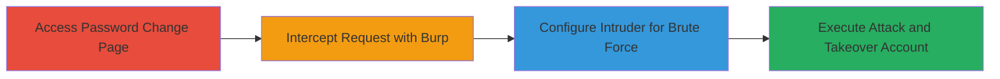

---
tags:
  - brute-force
  - account-takeover
  - rate-limit-bypass
  - web-auth
type: attack_chain
tools:
  - '[[tools/Burp-Suite]]'
tactics:
  - '[[Credential Access]]'
commands: []
platforms:
  - Web
complexity: medium
procedures:
  - '[[procedures/Brute-Force-Current-Password-Field-Using-Burp-Suite]]'
step_count: 4
techniques:
  - '[[Brute Force]]'
description: >-
  Multi-stage brute force attack exploiting the lack of rate limiting on the
  current password field in Acronis web application's password change process,
  enabling account takeover.
skill_level: intermediate
impact_level: high
id: bed18b70-b7bb-4ab8-95d0-87a7ca189851
created_at: '2025-12-14T17:33:24.335Z'
updated_at: '2025-12-14T17:33:24.335Z'
verified: false
validated: true
submitted: true
mitre_tactics:
  - '[[Credential Access]]'
mitre_techniques:
  - '[[Brute Force]]'
---
# Account Takeover via Brute Force on Missing Rate Limit in Acronis Password Change

## Overview

This attack chain exploits a missing rate limit on the 'current password' field in the Acronis web application's password change functionality. An attacker with access to a logged-in session can brute force the current password without restrictions, allowing them to guess the user's password, confirm it, and change it to a new one, resulting in full account takeover. This is particularly dangerous in scenarios like shared or public computers where a user might forget to log out. The attack uses Burp Suite to intercept and automate the brute force attempts on the password change endpoint.

## Chain Metrics Dashboard

| Metric | Value |
|--------|-------|
| Chain Status | Unverified |
| Total Steps | 4 |
| Execution Time | ~5-10 minutes |
| Skill Level | Intermediate |
| Complexity | Medium |
| Impact Level | High |

## Attack Flow Visualization

## Prerequisites & Requirements

### Required Tools

- [[tools/Burp-Suite]]

### Target Environment

- Acronis web application (Profile > Password section)
- Logged-in session to the target account
- No additional services or ports required beyond standard HTTPS access

### Initial Access Requirements

- Valid session cookie or authentication token for the target user account
- Network access to the Acronis web interface
- Prior knowledge of potential password candidates (e.g., common passwords wordlist)

## Detailed Attack Procedures

### Step 1: Navigate to Password Change Page
procedure: [[procedures/Brute-Force-Current-Password-Field-Using-Burp-Suite]]

**Objective**: Access the password change endpoint and prepare for request interception by submitting an initial invalid password attempt.

**Instructions**: Log in to the Acronis web application, navigate to Profile > Password, and enter an arbitrary incorrect password in the 'current password' field along with a placeholder new password. Submit the form to trigger the HTTP request.

**Expected Output**: The request is sent to the server, and an error response is received indicating invalid current password.

**Success Indicators**:
- Password change form is accessible
- Initial request with invalid password is generated

### Step 2: Intercept and Capture Request with Burp Suite
procedure: [[procedures/Brute-Force-Current-Password-Field-Using-Burp-Suite]]

**Objective**: Capture the outgoing HTTP POST request for the password change to enable modification and automation.

**Instructions**: With Burp Suite's Intercept feature enabled (Proxy > Intercept > Intercept is on), enter a new password in the form and submit. The request will be captured in Burp. Review the request, noting the parameters for current_password, new_password, and any session tokens.

**Expected Output**: Captured HTTP request showing form data, including the current_password parameter.

**Success Indicators**:
- Request intercepted successfully
- Parameters like current_password are visible and editable

### Step 3: Send Request to Intruder and Mark Payload Position
procedure: [[procedures/Brute-Force-Current-Password-Field-Using-Burp-Suite]]

**Objective**: Prepare the captured request for automated brute force by marking the current_password field as the payload position.

**Instructions**: Right-click the captured request in Burp Proxy and select 'Send to Intruder'. In the Intruder tab, go to Positions and clear default positions, then add a payload marker (§) around the value of the current_password parameter (e.g., current_password=§wrongpass§). Ensure the new_password and other fields remain static.

**Expected Output**: Intruder configuration with a single payload position on the current_password field.

**Success Indicators**:
- Payload marker correctly placed
- Request template ready for payload injection

### Step 4: Configure Payloads and Launch Brute Force Attack
procedure: [[procedures/Brute-Force-Current-Password-Field-Using-Burp-Suite]]

**Objective**: Load a wordlist of potential passwords and execute multiple attempts to identify the correct current password, then change it.

**Instructions**: In Burp Intruder > Payloads, load a wordlist (e.g., a file with 100+ common passwords like rockyou.txt subset). Set payload options to simple list. Start the attack. Monitor responses for success indicators, such as a 200 OK or password change confirmation (e.g., no error on current password). Once the correct password is found (identified by response differences like absence of 'invalid current password' error), resubmit the request with the correct current password and a new desired password to complete the takeover.

**Expected Output**: Series of responses; successful brute force shows a distinct response (e.g., password updated message) when the correct password is hit.

**Success Indicators**:
- Correct password identified via response analysis
- Password successfully changed, confirming account takeover

## Attack Chain Summary

### Key Achievements

1. Bypassed lack of rate limiting to perform unlimited brute force attempts
2. Discovered the user's current password through automated testing
3. Achieved full account takeover by changing the password

## Technique & Tactic Coverage

### MITRE ATT&CK Techniques

- [[Brute Force]] Brute Force

### MITRE ATT&CK Tactics

- [[Credential Access]] Credential Access

---
*Last updated: 2023-10-01T00:00:00Z*
