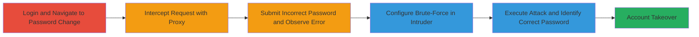

---
tags:
  - brute-force
  - account-takeover
  - rate-limiting-bypass
  - web-vulnerability
type: attack_chain
tools:
  - '[[tools/Burp-Suite]]'
tactics:
  - '[[Credential Access]]'
verified: false
platforms:
  - Web
submitted: true
complexity: medium
created_at: '2023-10-01T00:00:00Z'
procedures:
  - '[[procedures/Intercept-and-Brute-Force-Password-Change-Request]]'
step_count: 8
techniques:
  - '[[Brute Force]]'
updated_at: '2025-12-14T17:33:06.421Z'
description: >-
  Multi-stage attack exploiting the absence of rate limiting on Reddit's
  password change endpoint to brute-force the current password and achieve full
  account takeover.
skill_level: intermediate
impact_level: high
id: 88e30356-257d-4ec3-8903-96a22fe127c6
validated: true
mitre_tactics:
  - '[[Credential Access]]'
mitre_techniques:
  - '[[Brute Force]]'
---
# Account Takeover via Brute-Force on Unprotected Password Change Endpoint

Multi-stage attack chain demonstrating exploitation of missing rate limiting on the current password verification during password changes on reddit.com and vip.reddit.com, enabling rapid brute-force attempts to guess the current password and takeover the account.

## Chain Metrics Dashboard

| Metric | Value |
|--------|-------|
| Chain Status | Unverified |
| Total Steps | 8 |
| Execution Time | ~5 minutes |
| Skill Level | Intermediate |
| Complexity | Medium |
| Impact Level | High |

## Attack Flow Visualization

## Prerequisites & Requirements

### Required Tools

- [[tools/Burp-Suite]]

### Target Environment

- Web platform (reddit.com or vip.reddit.com)
- No specific ports or services required beyond standard HTTPS (443)
- Network access to the target site

### Initial Access Requirements

- Valid login credentials for a test account (for demonstration; in real attack, assumes ability to submit requests in context of target account session)
- Burp Suite configured as proxy
- Wordlist of potential passwords (e.g., 100 common passwords)

## Detailed Attack Procedures

### Step 1: Login to reddit.com

**Objective**: Authenticate to the target platform to access user settings.

**Instructions**: Use the standard login procedure on reddit.com to sign into an account. This establishes a session cookie necessary for accessing the password change functionality.

**Expected Output**: Successful login, redirect to user dashboard.

**Success Indicators**:
- Session established (visible in browser cookies or developer tools)
- Access to user preferences/settings

### Step 2: Navigate to user settings > Change password

**Objective**: Reach the password change interface to prepare for request interception.

**Instructions**: From the user dashboard, click on preferences or settings, then select the password change option. This loads the form at https://www.reddit.com/change_password.

**Expected Output**: Password change form displayed with fields for current password, new password, and confirm new password.

**Success Indicators**:
- Form fields visible
- URL matches /change_password

### Step 3: Enter incorrect password in old password field and matching new passwords in the other fields
procedure: [[procedures/Intercept-and-Brute-Force-Password-Change-Request]]

**Objective**: Prepare and submit an initial request with an incorrect current password to trigger the verification endpoint.

**Instructions**: Fill the current_password field with a known incorrect value (e.g., "wrongpass"), enter matching new passwords (e.g., "newpass1" in both new fields), and prepare to submit while proxy is active.

**Expected Output**: Form submission intercepted if proxy is on.

**Success Indicators**:
- Request body contains current_password=wrongpass&new_password=newpass1&confirm_password=newpass1
- No immediate error if not submitted yet

### Step 4: Turn on Burp Suite proxy and click save
procedure: [[procedures/Intercept-and-Brute-Force-Password-Change-Request]]

**Objective**: Intercept the HTTP POST request to the password change endpoint.

**Instructions**: Ensure Burp Suite proxy is enabled and browser traffic is routed through it (e.g., via FoxyProxy or manual settings). Click the save/submit button on the form.

**Expected Output**: Request captured in Burp Proxy tab, targeting POST https://www.reddit.com/change_password.

**Success Indicators**:
- Intercepted request visible with form data
- Response not forwarded yet

### Step 5: Observe the 'Incorrect password' error
procedure: [[procedures/Intercept-and-Brute-Force-Password-Change-Request]]

**Objective**: Confirm the verification response without rate limiting.

**Instructions**: Forward the intercepted request in Burp and observe the server response.

**Expected Output**: HTTP response with error message like "Incorrect password" and status 200 or 400.

**Success Indicators**:
- Error confirms verification endpoint is active
- No CAPTCHA or lockout triggered

### Step 6: Send the request to Burp Suite Intruder for brute force
procedure: [[procedures/Intercept-and-Brute-Force-Password-Change-Request]]

**Objective**: Prepare the request for automated payload injection.

**Instructions**: Right-click the intercepted request in Burp Proxy and select "Send to Intruder".

**Expected Output**: Request loaded into Intruder module.

**Success Indicators**:
- Intruder tab opens with the request populated
- Ready for payload configuration

### Step 7: Add payload position to the current_password parameter
procedure: [[procedures/Intercept-and-Brute-Force-Password-Change-Request]]

**Objective**: Mark the parameter for brute-force substitution.

**Instructions**: In Intruder, highlight the value of current_password in the request body (e.g., §wrongpass§) and click "Add §" to set it as the payload position.

**Expected Output**: Parameter marked with § delimiters for replacement.

**Success Indicators**:
- Single payload position set on current_password
- Other parameters (new_password, etc.) unchanged

### Step 8: Select a list of passwords (e.g., 100 lines) and start the attack
procedure: [[procedures/Intercept-and-Brute-Force-Password-Change-Request]]

**Objective**: Launch the brute-force attack to identify the correct current password.

**Instructions**: In Intruder, set payload type to "Simple list", load a wordlist (e.g., 100 common passwords), and click "Start attack". Monitor responses for differences (e.g., success vs. error).

**Expected Output**: Intruder runs multiple requests, with one succeeding (e.g., no error, password changed).

**Success Indicators**:
- Successful guess in ~101 attempts (as demonstrated)
- Account password updated, confirming takeover

## Attack Chain Summary

### Key Achievements

1. Bypassed rate limiting to perform unlimited brute-force attempts on password verification.
2. Demonstrated account takeover by guessing current password and changing it.
3. Highlighted vulnerability on both www.reddit.com and vip.reddit.com endpoints.

## Technique & Tactic Coverage

### MITRE ATT&CK Techniques

- [[Brute Force]]

### MITRE ATT&CK Tactics

- [[Credential Access]]

---

*Last updated: 2023-10-01T00:00:00Z*
