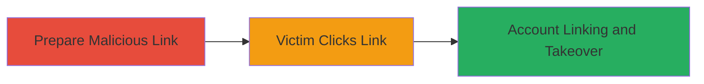

---
tags:
  - csrf
  - account-takeover
  - web-vulnerability
type: attack_chain
tools: []
tactics:
  - '[[Initial Access]]'
commands: []
platforms:
  - Web
complexity: medium
procedures:
  - '[[procedures/Craft-Malicious-CSRF-Link-for-Account-Linking]]'
  - '[[procedures/Induce-Victim-Interaction-with-Link]]'
  - '[[procedures/Complete-Account-Takeover-via-Linked-Accounts]]'
step_count: 3
techniques:
  - '[[Drive-by Compromise]]'
  - '[[Exploit Public-Facing Application]]'
description: >-
  A multi-stage attack exploiting the lack of CSRF protection in the third-party
  account linking process of Rockstar Games' Social Club, allowing an attacker
  to link a victim's account to their own via a malicious link, resulting in
  full account takeover.
skill_level: intermediate
impact_level: high
id: 93458617-5298-494d-a1a6-ee481676a52a
created_at: '2025-12-14T17:33:34.312Z'
updated_at: '2025-12-14T17:33:34.312Z'
verified: false
validated: true
submitted: true
mitre_tactics:
  - '[[Initial Access]]'
mitre_techniques:
  - '[[Drive-by Compromise]]'
  - '[[Exploit Public-Facing Application]]'
---
# Account Takeover via CSRF in Rockstar Social Club Third-Party Account Linking

Multi-stage attack chain demonstrating a complete attack workflow exploiting the absence of CSRF tokens in the account linking endpoint, enabling unauthorized linking of victim accounts to attacker-controlled third-party services.

## Chain Metrics Dashboard

| Metric | Value |
|--------|-------|
| Chain Status | Unverified |
| Total Steps | 3 |
| Execution Time | ~5 minutes |
| Skill Level | Intermediate |
| Complexity | Medium |
| Impact Level | High |

## Attack Flow Visualization

## Prerequisites & Requirements

### Required Tools

- Web browser for link construction and testing

### Target Environment

- Web platform
- Rockstar Social Club service
- Access to a third-party account linking service (e.g., external OAuth provider)

### Initial Access Requirements

- Attacker must have a valid third-party account
- Victim must be authenticated in Social Club and visit the link while logged in
- No special network access beyond internet connectivity

## Detailed Attack Procedures

### Step 1: Prepare Malicious Link
procedure: [[procedures/Craft-Malicious-CSRF-Link-for-Account-Linking]]

**Objective**: Construct a specially crafted URL that targets the vulnerable account linking endpoint without CSRF validation, forcing the victim's browser to perform the linking action on their behalf.

**Instructions**: Identify the account linking URL in Social Club, typically something like `https://socialclub.rockstargames.com/connect/thirdparty?provider=external&token=attacker_token`. Modify it to point to the attacker's third-party account identifier. Host or share this link via phishing or social engineering.

**Expected Output**: A clickable URL that, when visited by an authenticated victim, initiates the linking process.

**Success Indicators**:
- Link is generated and testable in a browser
- No CSRF token is required in the request

### Step 2: Induce Victim Interaction
procedure: [[procedures/Induce-Victim-Interaction-with-Link]]

**Objective**: Trick the victim into clicking the malicious link while they are authenticated in their browser session with Social Club, triggering the cross-site request.

**Instructions**: Distribute the link through email, social media, or messaging, disguised as a legitimate invitation or update from Rockstar Games. Ensure the victim is logged into Social Club in the same browser session.

**Expected Output**: Victim's browser automatically submits the linking request due to lack of CSRF protection.

**Success Indicators**:
- Victim reports clicking the link or unusual account activity
- Attacker observes the linking attempt in their third-party account dashboard

### Step 3: Complete Account Takeover
procedure: [[procedures/Complete-Account-Takeover-via-Linked-Accounts]]

**Objective**: Once linked, use the third-party connection to assume control of the victim's Social Club account, accessing games, purchases, and personal data.

**Instructions**: After the victim clicks the link, log into the attacker's third-party account and initiate a reverse link or session hijack through the now-connected services. Access the victim's Social Club profile via the linked credentials.

**Expected Output**: Full unauthorized access to the victim's account, including profile modification and data exfiltration.

**Success Indicators**:
- Attacker gains login access to victim's Social Club
- Victim's account shows linked third-party service

## Attack Chain Summary

### Key Achievements

1. Bypassed CSRF protection to force unauthorized account linking
2. Achieved complete account takeover without direct credentials
3. Gained access to sensitive gaming data and services

## Technique & Tactic Coverage

### MITRE ATT&CK Techniques

- [[Drive-by Compromise]]
- [[Exploit Public-Facing Application]]

### MITRE ATT&CK Tactics

- [[Initial Access]]

---
*Last updated: 2023-10-01*
