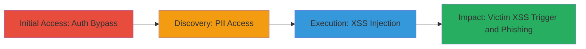

# Account Takeover via Email-Only Authentication Chained with Stored XSS for PII Exposure and Phishing

Multi-stage attack chain demonstrating a complete attack workflow on the U.S. General Services Administration's Vehicle Standards website, exploiting weak authentication to takeover accounts, steal PII, and chain into stored XSS for phishing.

## Chain Metrics Dashboard

| Metric | Value |
|--------|-------|
| Chain Status | Unverified |
| Total Steps | 5 |
| Execution Time | ~5 minutes |
| Skill Level | Intermediate |
| Complexity | Medium |
| Impact Level | High |

## Attack Flow Visualization

## Prerequisites & Requirements

### Required Tools

- Web browser (e.g., Chrome, Firefox)

### Target Environment

- Web platform
- Access to https://vehiclestd.fas.gsa.gov/
- Knowledge of a registered user's email address

### Initial Access Requirements

- No credentials needed beyond target email
- Direct internet access to the site
- No prior access required

## Detailed Attack Procedures

### Step 1: Authentication Bypass
procedure: [[procedures/Email-Only-Authentication-Bypass]]

**Objective**: Gain unauthorized access to a user's account by exploiting the lack of password requirement.

**Instructions**: Navigate to the sign-in page and enter any registered email address to log in without a password.

**Expected Output**: Successful login redirect to the user dashboard.

**Success Indicators**:
- Dashboard loads with user session active
- No authentication errors

### Step 2: Access User Profile PII
procedure: [[procedures/Access-User-Profile-PII]]

**Objective**: View sensitive personally identifiable information in the compromised account's profile.

**Instructions**: After login, navigate to the profile section to inspect fields containing PII like phone numbers and addresses.

**Expected Output**: Profile page displays unredacted PII.

**Success Indicators**:
- PII such as phone numbers visible
- No access restrictions encountered

### Step 3: Inject Stored XSS Payload
procedure: [[procedures/Inject-Stored-XSS-into-Profile]]

**Objective**: Insert a malicious JavaScript payload into profile fields that will execute when viewed.

**Instructions**: Edit the profile's first name field with an XSS payload like `` or `ant" autofocus onfocus=prompt(1) x="`, then save changes.

**Expected Output**: Profile updates successfully with the payload stored.

**Success Indicators**:
- Payload saves without validation errors
- Profile edit confirmation

### Step 4: Trigger XSS on Victim View
procedure: [[procedures/Trigger-XSS-on-Victim-Profile-View]]

**Objective**: Cause JavaScript execution in the victim's browser to enable phishing or data theft.

**Instructions**: Log out and have the victim log in and view their profile, triggering the stored payload to run (e.g., redirect to evil.com).

**Expected Output**: JavaScript alert, prompt, or redirect activates in victim's session.

**Success Indicators**:
- Victim reports unexpected browser behavior
- Attacker observes phishing success (e.g., stolen credentials)

## Attack Chain Summary

### Key Achievements

1. Unauthorized account access without passwords
2. Exposure of sensitive PII like phone numbers
3. Persistent XSS for remote code execution on victims
4. Chained phishing to steal additional credentials

## Technique & Tactic Coverage

### MITRE ATT&CK Techniques

- [[Valid Accounts]] Valid Accounts
- [[JavaScript]] JavaScript

### MITRE ATT&CK Tactics

- [[Initial Access]] Initial Access
- [[Execution]] Execution
- [[Collection]] Collection

---
*Last updated: 2023-10-01T00:00:00Z*
