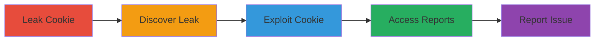

---
tags:
  - session-hijacking
  - cookie-leak
  - account-takeover
  - bug-bounty
type: attack_chain
tools:
  - '[[tools/cURL]]'
  - '[[tools/Browser-Console]]'
  - '[[tools/Browser]]'
tactics:
  - '[[Initial Access]]'
  - '[[Persistence]]'
  - '[[Discovery]]'
commands: []
platforms:
  - Web
complexity: low
procedures:
  - '[[procedures/Leak-Session-Cookie-via-Unsanitized-cURL-Paste]]'
  - '[[procedures/Discover-Leaked-Session-Cookie]]'
  - '[[procedures/Exploit-Leaked-Session-Cookie-for-Account-Access]]'
  - '[[procedures/Access-Sensitive-Inboxes-and-Reports]]'
  - '[[procedures/Report-Vulnerability-and-Trigger-Response]]'
step_count: 5
techniques:
  - '[[Valid Accounts]]'
  - '[[Steal Web Session Cookie]]'
  - '[[Account Discovery]]'
description: >-
  Multi-stage attack exploiting a leaked session cookie to gain unauthorized
  access to a security analyst's account and view sensitive reports
skill_level: intermediate
impact_level: high
id: 7ff8216d-2d5f-4439-9d39-0004073554ab
created_at: '2025-12-10T05:55:45.008Z'
updated_at: '2025-12-10T05:55:45.008Z'
verified: false
validated: true
submitted: true
mitre_tactics:
  - '[[TA0001]]'
  - '[[TA0003]]'
  - '[[TA0007]]'
mitre_techniques:
  - '[[T1078]]'
  - '[[T1539]]'
  - '[[T1087]]'
---
# Account Takeover via Leaked Session Cookie in Bug Bounty Platform

Multi-stage attack chain demonstrating how a leaked session cookie in a bug bounty report comment enables account takeover and access to sensitive vulnerability reports on a platform like HackerOne.

## Chain Metrics Dashboard

| Metric | Value |
|--------|-------|
| Chain Status | Unverified |
| Total Steps | 5 |
| Execution Time | ~10 minutes |
| Skill Level | Intermediate |
| Complexity | Low |
| Impact Level | High |

## Attack Flow Visualization



## Prerequisites & Requirements

### Required Tools

- [[tools/cURL]]
- [[tools/Browser-Console]]
- [[tools/Browser]]

### Target Environment

- Web-based bug bounty platform (e.g., HackerOne)
- No specific ports required; HTTP/HTTPS access
- Services: Report commenting system, session management

### Initial Access Requirements

- Access to the bug bounty platform as a participant
- No prior credentials needed beyond platform access

## Detailed Attack Procedures

### Step 1: Accidental Leak of Session Cookie 
procedure: [[procedures/Leak-Session-Cookie-via-Unsanitized-cURL-Paste]]

**Objective**: Cause or observe the accidental disclosure of a session cookie through unsanitized sharing of reproduction steps.

**Instructions**: In this step, a security analyst reproduces a vulnerability using [[commands/curl-reproduce-vulnerability]] from the browser console and pastes it into a report comment without removing sensitive data like the session cookie.

Use [[commands/curl-reproduce-vulnerability]] to simulate reproduction:

```bash
curl -H "Cookie: session=leaked_session_cookie_value" https://target.endpoint
```

Paste the command into a report comment without sanitization, leading to the leak.

**Expected Output**: The session cookie appears in plain text in the report comment.

**Success Indicators**:
- Cookie value is visible in the platform's report interface.
- No immediate detection of the leak.

### Step 2: Discovery of Leaked Session Cookie 
procedure: [[procedures/Discover-Leaked-Session-Cookie]]

**Objective**: Identify the disclosed session cookie in a public or accessible report comment.

**Instructions**: Monitor or interact with bug bounty reports on the platform. Review comments for any pasted commands or data that include sensitive information like session cookies.

No specific command is executed; this is observational via the browser interface.

**Expected Output**: Identification of a valid session cookie string in the report.

**Success Indicators**:
- Cookie string is extractable and appears valid (e.g., matches expected format).
- The report is accessible to the attacker.

### Step 3: Exploit Leaked Session Cookie for Account Access 
procedure: [[procedures/Exploit-Leaked-Session-Cookie-for-Account-Access]]

**Objective**: Use the leaked cookie to impersonate the analyst and gain unauthorized access to their account.

**Instructions**: Inject the leaked session cookie into your browser session using developer tools or a cookie editor extension.

For example, set the cookie in the browser:

1. Open browser developer tools (F12).
2. Navigate to Application > Cookies.
3. Add or edit the session cookie with the leaked value.

Refresh the page to assume the analyst's session.

**Expected Output**: Successful login as the analyst without credentials.

**Success Indicators**:
- Access to the analyst's dashboard and features.
- No IP or device restrictions block the access.

### Step 4: Access Sensitive Inboxes and Reports 
procedure: [[procedures/Access-Sensitive-Inboxes-and-Reports]]

**Objective**: Navigate through inboxes to view and assess sensitive report data.

**Instructions**: Once logged in, browse to various inboxes (e.g., HAS Inbox, Triage Inbox) and load reports via the platform's interface, which uses GraphQL queries in the background.

No direct commands; use the browser to click through interfaces and view up to 100 reports' metadata and contents.

**Expected Output**: Visibility into sensitive vulnerability reports and metadata.

**Success Indicators**:
- Successful loading of report data without errors.
- Ability to demonstrate impact by noting accessed information.

### Step 5: Report the Vulnerability 
procedure: [[procedures/Report-Vulnerability-and-Trigger-Response]]

**Objective**: Submit a bug report detailing the takeover to claim a bounty and trigger mitigations.

**Instructions**: Use the platform's reporting feature to submit details of the leak, takeover, and accessed data.

No specific commands; this is done via the web form.

**Expected Output**: Submission confirmation and eventual response from the platform team.

**Success Indicators**:
- Report is acknowledged.
- Session cookie is revoked, and mitigations are implemented.

## Attack Chain Summary

### Key Achievements

1. Unauthorized account access via leaked cookie.
2. Exposure of sensitive reports across multiple inboxes.
3. Bounty award and platform security improvements.

## Technique & Tactic Coverage

### MITRE ATT&CK Techniques

- [[Valid Accounts]]
- [[Steal Web Session Cookie]]
- [[Account Discovery]]

### MITRE ATT&CK Tactics

- [[Initial Access]]
- [[Persistence]]
- [[Discovery]]

*Last updated: 2023-10-01*
