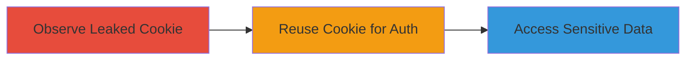

---
tags:
  - session-cookie-leak
  - account-takeover
  - credential-access
  - human-error
  - bug-bounty
type: attack_chain
tools: []
tactics:
  - '[[Initial Access]]'
  - '[[Credential Access]]'
  - '[[Collection]]'
verified: false
platforms:
  - Web
submitted: true
complexity: low
created_at: '2023-10-01T00:00:00Z'
procedures:
  - '[[procedures/Observe-Leaked-Session-Cookie]]'
  - '[[procedures/Reuse-Session-Cookie-for-Authentication]]'
  - '[[procedures/Access-Sensitive-Information-via-Inboxes]]'
step_count: 3
techniques:
  - '[[Valid Accounts]]'
  - '[[Unsecured Credentials]]'
  - '[[Steal Web Session Cookie]]'
updated_at: '2025-12-14T17:33:34.561Z'
description: >-
  An attack chain exploiting a human error where a security analyst leaked a
  valid session cookie in a bug bounty report comment, enabling unauthorized
  access to sensitive platform data.
skill_level: intermediate
impact_level: high
id: fca03b32-d0a9-4724-85fc-eaf4d1131067
validated: true
mitre_tactics:
  - '[[Initial Access]]'
  - '[[Credential Access]]'
  - '[[Collection]]'
mitre_techniques:
  - '[[Valid Accounts]]'
  - '[[Unsecured Credentials]]'
  - '[[Steal Web Session Cookie]]'
---
# Account Takeover via Leaked Session Cookie in Bug Bounty Report

Multi-stage attack chain demonstrating how a leaked session cookie from a bug bounty report comment enables unauthorized access to a security analyst's account on the HackerOne platform, exposing sensitive vulnerability reports and program data.

## Chain Metrics Dashboard

| Metric | Value |
|--------|-------|
| Chain Status | Unverified |
| Total Steps | 3 |
| Execution Time | ~120 minutes |
| Skill Level | Intermediate |
| Complexity | Low |
| Impact Level | High |

## Attack Flow Visualization



## Prerequisites & Requirements

### Required Tools

- Web browser or HTTP client (e.g., cURL)

### Target Environment

- Web platform: HackerOne bug bounty site (hackerone.com)
- Required services: Bug bounty report commenting system, session-based authentication
- Network access requirements: Internet access to hackerone.com

### Initial Access Requirements

- No prior credentials needed; relies on publicly visible leaked cookie in a report comment
- Network position: External attacker with read access to public bug bounty reports

## Detailed Attack Procedures

### Step 1: Observe Leaked Session Cookie
procedure: [[procedures/Observe-Leaked-Session-Cookie]]

**Objective**: Identify and extract a valid session cookie accidentally disclosed in a bug bounty report comment.

**Instructions**: Monitor or review public bug bounty reports on HackerOne for comments containing unredacted technical details, such as cURL commands copied from browser consoles. Look for session cookies embedded in HTTP headers within these comments.

**Expected Output**: Extraction of the session cookie value (e.g., a string like `__session=abc123...`).

**Success Indicators**:
- Cookie value identified and noted
- Cookie appears tied to hackerone.com domain

### Step 2: Reuse Session Cookie for Authentication
procedure: [[procedures/Reuse-Session-Cookie-for-Authentication]]

**Objective**: Impersonate the account owner by injecting the leaked session cookie into requests to gain unauthorized login.

**Instructions**: Use a new browser session or HTTP client to set the cookie. Execute [[commands/curl-reuse-session-cookie]] to test authentication by accessing a protected endpoint:

```bash
curl -H "Cookie: __session=leaked_cookie_value_here" https://hackerone.com/dashboard
```

If successful, the response will include authenticated content.

**Expected Output**: HTTP 200 response with dashboard or account-specific data.

**Success Indicators**:
- Access to analyst's dashboard granted
- No additional login prompts

### Step 3: Access Sensitive Information via Inboxes
procedure: [[procedures/Access-Sensitive-Information-via-Inboxes]]

**Objective**: Navigate authenticated sessions to view and extract sensitive report data from various inboxes and views.

**Instructions**: Once authenticated, browse to inboxes like HAS Inbox, Triage Inbox, and Report View. Use browser navigation or [[commands/curl-access-inbox]] to load reports:

```bash
curl -H "Cookie: __session=leaked_cookie_value_here" https://hackerone.com/inbox/has
```

Extract metadata, titles, descriptions, and comments from loaded reports via UI or GraphQL queries.

**Expected Output**: Lists of reports with details (up to 25-100 per inbox) including vulnerability info.

**Success Indicators**:
- Sensitive report data visible and exfiltrated
- Access to multiple customer programs confirmed

## Attack Chain Summary

### Key Achievements

1. Successful extraction of leaked session cookie from public report comment
2. Account takeover without IP or device restrictions, granting full platform access
3. Exposure of sensitive data from multiple inboxes, affecting various bug bounty programs

## Technique & Tactic Coverage

### MITRE ATT&CK Techniques

- [[Valid Accounts]] Valid Accounts
- [[Unsecured Credentials]] Unprotected Credentials
- [[Steal Web Session Cookie]] Steal Web Session Cookie

### MITRE ATT&CK Tactics

- [[Initial Access]] Initial Access
- [[Credential Access]] Credential Access
- [[Collection]] Collection

---
*Last updated: 2023-10-01T00:00:00Z*
