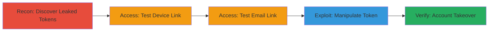

---
tags:
  - account-takeover
  - token-leak
  - auth-bypass
  - information-disclosure
  - google-dorking
type: attack_chain
tools:
  - '[[tools/Google-Search]]'
  - '[[tools/Web-Browser]]'
tactics:
  - '[[Initial Access]]'
  - '[[Discovery]]'
commands: []
platforms:
  - Web
complexity: medium
procedures:
  - '[[procedures/Discover-Leaked-Confirmation-Links-Using-Google-Dorking]]'
  - '[[procedures/Access-Leaked-Device-Confirmation-Link]]'
  - '[[procedures/Access-and-Observe-Expired-Email-Confirmation-Link]]'
  - '[[procedures/Manipulate-Token-to-Reuse-Expired-Confirmation-Link]]'
  - '[[procedures/Verify-Bypass-on-Self-Created-Account]]'
step_count: 5
techniques:
  - '[[Exploit Public-Facing Application]]'
  - '[[Valid Accounts]]'
  - '[[Unsecured Credentials]]'
description: >-
  Multi-stage attack exploiting leaked confirmation tokens indexed by Google and
  weak validation allowing token manipulation for unauthorized account access.
skill_level: intermediate
impact_level: high
id: b1ceabdb-ad08-49eb-8d23-ffd58d64e644
created_at: '2025-12-14T17:33:24.380Z'
updated_at: '2025-12-14T17:33:24.380Z'
verified: false
validated: true
submitted: true
mitre_tactics:
  - '[[Initial Access]]'
  - '[[Discovery]]'
mitre_techniques:
  - '[[Exploit Public-Facing Application]]'
  - '[[Valid Accounts]]'
  - '[[Unsecured Credentials]]'
---
# Account Takeover via Leaked and Manipulable Confirmation Tokens in Sorare

## Overview

This attack chain demonstrates how weak token validation in Sorare's email and device confirmation links enables account takeover. Confirmation links are leaked through Google indexing due to inadequate crawling protections, allowing attackers to discover them via dorking. Once accessed, expired links can be manipulated by altering specific numeric characters in the token (e.g., incrementing a digit after an underscore), bypassing reuse checks and granting unauthorized access to user profiles, PII, and account controls without credentials. The chain exploits information disclosure and authentication bypass vulnerabilities, leading to full account compromise.

## Chain Metrics Dashboard

| Metric | Value |
|--------|-------|
| Chain Status | Unverified |
| Total Steps | 5 |
| Execution Time | ~10 minutes |
| Skill Level | Intermediate |
| Complexity | Medium |
| Impact Level | High |

## Attack Flow Visualization



## Prerequisites & Requirements

### Required Tools

- [[tools/Google-Search]]
- [[tools/Web-Browser]]

### Target Environment

- Web platform (Sorare.com)
- Publicly accessible confirmation endpoints (/confirm_email, /confirm_device)
- No special services/ports required beyond standard HTTPS (443)

### Initial Access Requirements

- Internet access for Google searching and browsing
- No prior credentials needed
- Ability to create a test account for verification

## Detailed Attack Procedures

### Step 1: Discover Leaked Confirmation Links
procedure: [[procedures/Discover-Leaked-Confirmation-Links-Using-Google-Dorking]]

**Objective**: Identify publicly indexed confirmation links containing sensitive tokens for email and device verification.

**Instructions**: Use [[tools/Google-Search]] with a targeted dorking query to find leaked URLs on the target domain.

Open Google and search for:

```
site:sorare.com inurl:token
```

Review search results for URLs like https://sorare.com/confirm_email?token=... or https://sorare.com/confirm_device?token=....

**Expected Output**: List of indexed confirmation links with exposed tokens.

**Success Indicators**:
- Multiple confirmation URLs appear in search results
- Tokens visible in URL parameters

### Step 2: Access Leaked Device Confirmation Link
procedure: [[procedures/Access-Leaked-Device-Confirmation-Link]]

**Objective**: Test access to a leaked device confirmation link to observe unauthorized profile redirection.

**Instructions**: Use [[tools/Web-Browser]] to navigate to a discovered device confirmation URL, such as https://sorare.com/confirm_device?token=N04J3Zczv1GaFrniJisN1QgsisoJHQ.

Load the URL directly in the browser address bar and observe the response.

**Expected Output**: Redirect to a random user's profile settings (e.g., JACK3422) despite the link appearing invalid.

**Success Indicators**:
- Successful redirect to user profile without authentication
- Access to settings page indicating partial validation bypass

### Step 3: Access and Observe Expired Email Confirmation Link
procedure: [[procedures/Access-and-Observe-Expired-Email-Confirmation-Link]]

**Objective**: Verify the behavior of an expired email confirmation link to identify bypass opportunities.

**Instructions**: Ensure logged out state, then use [[tools/Web-Browser]] to open a leaked email confirmation URL, such as https://sorare.com/confirm_email?token=Jt7S7WS_4EphEyiDn6z_&redirectUrl=https%3A%2F%2Fsorare.com%2F.

Load the URL and note the error message.

**Expected Output**: Error indicating "was already confirmed, please try signing in."

**Success Indicators**:
- Clear error message confirming expiration or prior use
- Token structure visible for manipulation (e.g., underscores separating segments)

### Step 4: Manipulate Token to Reuse Expired Confirmation Link
procedure: [[procedures/Manipulate-Token-to-Reuse-Expired-Confirmation-Link]]

**Objective**: Alter the token in the URL to bypass the confirmation check and gain account access.

**Instructions**: In the browser address bar, modify the token by incrementing an isolated numeric character after an underscore. For example, change 'Jt7S7WS_4EphEyiDn6z_' to 'Jt7S7WS_6EphEyiDn6z_' by changing '4' to '6', then reload the URL.

**Expected Output**: Successful confirmation without errors, granting access to the account.

**Success Indicators**:
- No error on reload; redirect to account dashboard
- Ability to view or modify profile details

### Step 5: Verify Bypass on Self-Created Account
procedure: [[procedures/Verify-Bypass-on-Self-Created-Account]]

**Objective**: Confirm the exploit's reliability by testing on a controlled account.

**Instructions**: Create a new Sorare account to obtain a fresh confirmation link, e.g., https://sorare.com/confirm_email?redirectUrl=https%3A%2F%2Fsorare.com%2F&token=qvQfgPqvWV-2FiM5k2f7. Then, manipulate the token by changing '2' to '5' (to 'qvQfgPqvWV-5FiM5k2f7') and access without password.

**Expected Output**: Unauthorized access to the newly created account.

**Success Indicators**:
- Full account control without entering credentials
- Confirmation of PII exposure and modification capabilities

## Attack Chain Summary

### Key Achievements

1. Discovery of hundreds of leaked tokens via public search indexing
2. Bypass of single-use token checks through predictable numeric manipulation
3. Complete account takeover enabling impersonation and data exposure

## Technique & Tactic Coverage

### MITRE ATT&CK Techniques

- [[Exploit Public-Facing Application]]
- [[Valid Accounts]]
- [[Unsecured Credentials]]

### MITRE ATT&CK Tactics

- [[Initial Access]]
- [[Discovery]]

---
*Last updated: 2023-10-01*
