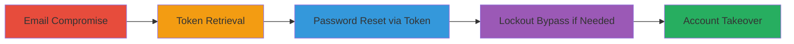

---
tags:
  - auth-bypass
  - 2fa-bypass
  - account-takeover
  - token-reuse
  - rails
type: attack_chain
tools: []
tactics:
  - '[[Initial Access]]'
  - '[[Lateral Movement]]'
commands:
  - '[[commands/post-manage-password-bypass-lockout]]'
platforms:
  - Web
complexity: medium
procedures:
  - '[[procedures/Compromise-Victims-Email-Account]]'
  - '[[procedures/Retrieve-Non-Expiring-Confirmation-Token]]'
  - '[[procedures/Use-Token-to-Bypass-2FA-and-Reset-Password]]'
  - '[[procedures/Bypass-Account-Lockout-with-Old-Authenticity-Token]]'
step_count: 4
techniques:
  - '[[Valid Accounts]]'
  - '[[Account Manipulation]]'
  - '[[Exploit Public-Facing Application]]'
description: >-
  Multi-stage attack exploiting non-expiring confirmation tokens in login.gov to
  bypass 2FA and achieve account takeover by resetting passwords without time
  limits or lockouts.
skill_level: intermediate
impact_level: high
id: 8cf7f2f2-9d99-4c09-aae6-220e91398ac2
created_at: '2025-12-14T17:24:45.504Z'
updated_at: '2025-12-14T17:24:45.504Z'
verified: false
validated: true
submitted: true
mitre_tactics:
  - '[[Initial Access]]'
  - '[[Lateral Movement]]'
mitre_techniques:
  - '[[Valid Accounts]]'
  - '[[Account Manipulation]]'
  - '[[Exploit Public-Facing Application]]'
---
# Account Takeover via Non-Expiring Confirmation Tokens in login.gov

## Overview

This attack chain demonstrates how an attacker with access to a victim's email can exploit the non-expiration of confirmation tokens in login.gov's staging environment to bypass two-factor authentication (2FA), reset the victim's password, and achieve full account takeover. The vulnerability stems from confirmation tokens that are advertised to expire after 24 hours but remain valid indefinitely, allowing reuse even after 48 hours. This bypasses both 2FA requirements and account lockouts triggered by failed login attempts, enabling unauthorized access to sensitive government services.

## Chain Metrics Dashboard

| Metric | Value |
|--------|-------|
| Chain Status | Unverified |
| Total Steps | 4 |
| Execution Time | ~5 minutes |
| Skill Level | Intermediate |
| Complexity | Medium |
| Impact Level | High |

## Attack Flow Visualization



## Prerequisites & Requirements

### Required Tools

- None (relies on email access and HTTP client like curl or browser)

### Target Environment

- Web platform (login.gov staging: https://idp.staging.login.gov)
- Ruby on Rails backend
- No specific ports or services beyond standard HTTPS (443)

### Initial Access Requirements

- Compromised access to victim's email account
- Knowledge of victim's registration flow (e.g., sign-up confirmation email)
- Network access to login.gov (public-facing)

## Detailed Attack Procedures

### Step 1: Email Compromise
procedure: [[procedures/Compromise-Victims-Email-Account]]

**Objective**: Gain access to the victim's email to intercept confirmation tokens.

**Instructions**: Assume prior compromise via phishing, credential stuffing, or malware. Log in to the email provider and search for emails from login.gov containing confirmation links.

**Expected Output**: Access to the activation email with the token URL.

**Success Indicators**:
- Email inbox accessible
- Confirmation email located

### Step 2: Token Retrieval
procedure: [[procedures/Retrieve-Non-Expiring-Confirmation-Token]]

**Objective**: Extract the reusable confirmation token from the email.

**Instructions**: Open the activation email and copy the token from the URL, e.g., https://idp.staging.login.gov/sign_up/email/confirm?confirmation_token=1wzjBaAyfcVnS5iWgmxq.

**Expected Output**: Valid token string (e.g., 1wzjBaAyfcVnS5iWgmxq).

**Success Indicators**:
- Token copied successfully
- Token format matches expected base64-like string

### Step 3: Password Reset via Token
procedure: [[procedures/Use-Token-to-Bypass-2FA-and-Reset-Password]]

**Objective**: Use the token to access the password entry page, bypassing 2FA.

**Instructions**: Navigate to the password entry URL using the token: https://idp.staging.login.gov/sign_up/enter_password?confirmation_token=1wzjBaAyfcVnS5iWgmxq&request_id=. Enter a new password and submit to complete activation and login.

**Expected Output**: Successful password set; ability to log in without 2FA.

**Success Indicators**:
- Access to password form granted
- Login successful post-reset

### Step 4: Lockout Bypass if Needed
procedure: [[procedures/Bypass-Account-Lockout-with-Old-Authenticity-Token]]

**Objective**: If the account is locked (e.g., after failed logins), bypass the lockout using a reused authenticity token.

**Instructions**: After triggering a lockout, capture an old authenticity_token from a prior session or form. Execute [[commands/post-manage-password-bypass-lockout]] to update the password via POST to /manage/password.

```bash
# See linked command for full details
```

**Expected Output**: Password updated without enforcing the 10-minute lockout.

**Success Indicators**:
- Lockout ignored
- New password applied successfully

## Attack Chain Summary

### Key Achievements

1. Bypassed 2FA using indefinite token validity
2. Achieved password reset without victim interaction
3. Overcame account lockouts via token reuse
4. Full account takeover for sensitive access

## Technique & Tactic Coverage

### MITRE ATT&CK Techniques

- [[Valid Accounts]] Valid Accounts
- [[Account Manipulation]] Account Manipulation
- [[Exploit Public-Facing Application]] Exploit Public-Facing Application

### MITRE ATT&CK Tactics

- [[Initial Access]] Initial Access
- [[Lateral Movement]] Lateral Movement


*Last updated: 2023-10-01*
