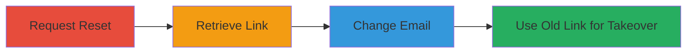

# Account Takeover via Non-Expiring Password Reset Link After Email Change

Multi-stage attack chain demonstrating a complete attack workflow exploiting NordVPN's password reset mechanism where tokens are not invalidated after email changes via support, leading to full account takeover.

## Chain Metrics Dashboard

| Metric | Value |
|--------|-------|
| Chain Status | Unverified |
| Total Steps | 4 |
| Execution Time | ~10 minutes |
| Skill Level | Intermediate |
| Complexity | Medium |
| Impact Level | High |

## Attack Flow Visualization

## Prerequisites & Requirements

### Required Tools

- Web browser
- Access to target email (main@main.com)
- Support chat access

### Target Environment

- Web platform (https://ucp.nordvpn.com)
- Email service
- Support chat service

### Initial Access Requirements

- Knowledge of target account email
- Ability to receive emails at original address
- Legitimate support interaction capability

## Detailed Attack Procedures

### Step 1: Request Password Reset
procedure: [[procedures/Request-Password-Reset]]

**Objective**: Initiate the password reset process to generate a reset token sent to the original email.

**Instructions**: Navigate to the lost password page and submit the target account's email address.

**Expected Output**: A password reset email is sent to the original email address.

**Success Indicators**:
- Confirmation message on the web page
- Email received in inbox

### Step 2: Retrieve Password Reset Link
procedure: [[procedures/Retrieve-Password-Reset-Link]]

**Objective**: Obtain the reset link from the email for later use.

**Instructions**: Check the email inbox and copy the reset URL provided in the message.

**Expected Output**: A valid reset link URL copied to clipboard.

**Success Indicators**:
- Link present in email body
- Link format matches expected pattern (e.g., contains token)

### Step 3: Change Account Email via Support
procedure: [[procedures/Change-Account-Email-via-Support]]

**Objective**: Update the account's email address to one controlled by the attacker, without invalidating the existing reset token.

**Instructions**: Initiate a support chat and request the email change from the original to a new controlled address.

**Expected Output**: Confirmation from support that the email has been updated.

**Success Indicators**:
- Support agents (e.g., Claudia and Marcus) process the request
- New email receives any subsequent notifications

### Step 4: Reset Password Using Old Link
procedure: [[procedures/Reset-Password-Using-Old-Link]]

**Objective**: Exploit the non-expiring reset link to set a new password and achieve account takeover.

**Instructions**: Open the original reset link in a browser and submit a new password.

**Expected Output**: Password successfully updated, allowing login with new credentials.

**Success Indicators**:
- Password change confirmation
- Ability to log in to the account with the new password

## Attack Chain Summary

### Key Achievements

1. Generated a password reset token via the original email.
2. Changed the account email without invalidating the token.
3. Used the old token to takeover the account.

## Technique & Tactic Coverage

### MITRE ATT&CK Techniques

- [[Valid Accounts]]

### MITRE ATT&CK Tactics

- [[Initial Access]]

---
*Last updated: 2024-10-01T00:00:00Z*
