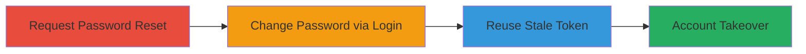

---
tags:
  - broken-authentication
  - account-takeover
  - password-reset
  - token-reuse
type: attack_chain
tools: []
tactics:
  - '[[Initial Access]]'
verified: false
platforms:
  - Web
submitted: true
complexity: medium
created_at: '2023-10-01T00:00:00Z'
procedures:
  - '[[procedures/Request-Password-Reset-Token]]'
  - '[[procedures/Change-Password-via-Normal-Login]]'
  - '[[procedures/Reuse-Stale-Reset-Token-for-Takeover]]'
step_count: 3
techniques:
  - '[[Valid Accounts]]'
  - '[[Use Alternate Authentication Material]]'
updated_at: '2025-12-14T17:31:52.120Z'
description: >-
  Demonstrates exploitation of broken authentication where password reset tokens
  remain valid after a password change via normal login, enabling account
  takeover on shared devices.
skill_level: intermediate
impact_level: high
id: ffbe3503-0dae-4e16-8b72-9d0225d4de2a
validated: true
mitre_tactics:
  - '[[Initial Access]]'
mitre_techniques:
  - '[[Valid Accounts]]'
  - '[[Use Alternate Authentication Material]]'
---
---

# Account Takeover via Non-Expiring Password Reset Tokens in Courier

Multi-stage attack chain demonstrating a complete attack workflow.

## Chain Metrics Dashboard

| Metric | Value |
|--------|-------|
| Chain Status | Unverified |
| Total Steps | 3 |
| Execution Time | ~5 minutes |
| Skill Level | Intermediate |
| Complexity | Medium |
| Impact Level | High |

## Attack Flow Visualization

## Prerequisites & Requirements

### Required Tools

- Web browser (e.g., Chrome or Firefox)
- Access to email associated with the target account

### Target Environment

- Web application: https://www.trycourier.app
- Services: Email for password resets

### Initial Access Requirements

- Valid account credentials or ability to create a test account
- Access to the victim's email (e.g., on a shared device like a cybercafe)
- No prior network position required; public-facing web app

## Detailed Attack Procedures

### Step 1: Request Password Reset Token
procedure: [[procedures/Request-Password-Reset-Token]]

**Objective**: Obtain a password reset token without using it immediately, setting up for token reuse.

**Instructions**: Create or log in to an account on the target site, then log out and request a password reset to receive a code via email. Do not apply the code yet.

**Expected Output**: Email containing the reset code arrives in the inbox.

**Success Indicators**:
- Reset code received in email
- Account is logged out

### Step 2: Change Password via Normal Login
procedure: [[procedures/Change-Password-via-Normal-Login]]

**Objective**: Alter the password through a standard logged-in session without invalidating the pending reset token.

**Instructions**: In a new browser tab or incognito window, log back in using existing credentials. Navigate to account settings and update the password.

**Expected Output**: Password successfully changed, and user remains logged in with new password.

**Success Indicators**:
- Password update confirms in account settings
- Login session persists with new password

### Step 3: Reuse Stale Reset Token for Takeover
procedure: [[procedures/Reuse-Stale-Reset-Token-for-Takeover]]

**Objective**: Demonstrate the vulnerability by using the old reset token to change the password again, simulating attacker takeover.

**Instructions**: Retrieve the original reset code from email and use it to initiate a new password reset, completing the change.

**Expected Output**: Password successfully reset using the stale token, overriding the previous change.

**Success Indicators**:
- Old token accepted and password changed
- Account now controlled with attacker's chosen password

## Attack Chain Summary

### Key Achievements

1. Obtained a persistent password reset token that survives normal password changes
2. Simulated shared device access to victim's email for token interception
3. Achieved full account takeover without additional credentials

## Technique & Tactic Coverage

### MITRE ATT&CK Techniques

- [[Valid Accounts]] Valid Accounts
- [[Use Alternate Authentication Material]] Use Alternate Authentication Material

### MITRE ATT&CK Tactics

- [[Initial Access]] Initial Access

---

*Last updated: 2023-10-01T00:00:00Z*
