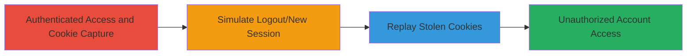

---
tags:
  - broken-auth
  - session-hijacking
  - cookie-reuse
  - owasp-a2
  - account-takeover
type: attack_chain
tools:
  - '[[tools/Burp-Proxy]]'
  - '[[tools/Burp-Repeater]]'
tactics:
  - '[[Initial Access]]'
verified: false
platforms:
  - Web
submitted: true
complexity: medium
created_at: '2023-10-01T00:00:00Z'
procedures:
  - '[[procedures/Access-Admin-Page-and-Capture-Cookies]]'
  - '[[procedures/Simulate-Unauthenticated-Session]]'
  - '[[procedures/Replay-Cookies-to-Bypass-Authentication]]'
  - '[[procedures/Achieve-Unauthorized-Account-Access]]'
step_count: 4
techniques:
  - '[[Valid Accounts]]'
  - '[[Pass the Hash]]'
updated_at: '2025-12-14T17:31:30.810Z'
description: >-
  Demonstrates exploitation of broken session management where cookies and CSRF
  tokens are not invalidated on logout, enabling session hijacking and
  unauthorized account access.
skill_level: intermediate
impact_level: high
id: 31dc5906-86ba-482b-ad78-e7c7a9c91fcd
validated: true
mitre_tactics:
  - '[[Initial Access]]'
mitre_techniques:
  - '[[Valid Accounts]]'
  - '[[Pass the Hash]]'
---
# Account Takeover via Reused Session Cookies Due to Broken Invalidation

Multi-stage attack chain demonstrating exploitation of broken authentication and session management (OWASP A2) in a web application, where session cookies (__cfduid, csrf_token, session) and CSRF tokens are not invalidated upon logout. This allows an attacker with stolen cookies to impersonate the victim, leading to unauthorized access and account modifications such as editing username, email, or password.

## Chain Metrics Dashboard

| Metric | Value |
|--------|-------|
| Chain Status | Unverified |
| Total Steps | 4 |
| Execution Time | ~5 minutes |
| Skill Level | Intermediate |
| Complexity | Medium |
| Impact Level | High |

## Attack Flow Visualization

## Prerequisites & Requirements

### Required Tools

- [[tools/Burp-Proxy]]
- [[tools/Burp-Repeater]]

### Target Environment

- Web application with admin endpoints (e.g., /admin.*.*/edit/*)
- No specific ports or services beyond standard HTTPS (443)
- Network access to the target site

### Initial Access Requirements

- Valid authenticated session to the target account
- Attacker must obtain cookies (e.g., via interception or theft)
- Browser or proxy tool for session manipulation

## Detailed Attack Procedures

### Step 1: Authenticated Access and Cookie Capture
procedure: [[procedures/Access-Admin-Page-and-Capture-Cookies]]

**Objective**: Gain initial authenticated access to a sensitive admin page and capture the session cookies for later reuse.

**Instructions**: Navigate to the admin edit page in a logged-in session, such as https://target.com/admin.101/edit/username. Use [[tools/Burp-Proxy]] to intercept the request and extract cookies.

**Expected Output**: Captured cookies including __cfduid, csrf_token, and session values copied for replay.

**Success Indicators**:
- Page loads successfully in authenticated session
- Cookies are intercepted and noted

### Step 2: Simulate Unauthenticated Session
procedure: [[procedures/Simulate-Unauthenticated-Session]]

**Objective**: Create a new, unauthenticated browser session to simulate post-logout conditions.

**Instructions**: Clear browser cookies, log out, or open an incognito/private window. Attempt to access the same admin page, which should prompt for login.

**Expected Output**: Access denied or login prompt on the admin page.

**Success Indicators**:
- No active session cookies present
- Page requires authentication

### Step 3: Replay Cookies to Bypass Authentication
procedure: [[procedures/Replay-Cookies-to-Bypass-Authentication]]

**Objective**: Inject the original captured cookies into the new session request to impersonate the victim.

**Instructions**: In the new session, navigate to the admin page, intercept the request with [[tools/Burp-Proxy]], forward to [[tools/Burp-Repeater]], and paste the original cookies. Forward the modified request.

**Expected Output**: Request succeeds without prompting for credentials.

**Success Indicators**:
- Intercepted request modified with old cookies
- Response grants access to the page

### Step 4: Achieve Unauthorized Account Access
procedure: [[procedures/Achieve-Unauthorized-Account-Access]]

**Objective**: Perform unauthorized actions in the victim's account, such as editing profile details.

**Instructions**: With the replayed session active, edit sensitive information like username, email, or password.

**Expected Output**: Changes saved successfully without re-authentication.

**Success Indicators**:
- Account modifications applied
- Full control over the victim's session

## Attack Chain Summary

### Key Achievements

1. Successful capture of reusable session artifacts
2. Bypass of logout mechanism via cookie replay
3. Complete account takeover enabling data modification

## Technique & Tactic Coverage

### MITRE ATT&CK Techniques

- [[Valid Accounts]] Valid Accounts
- [[Pass the Hash]] Pass the Ticket

### MITRE ATT&CK Tactics

- [[Initial Access]] Initial Access

---

*Last updated: 2023-10-01T00:00:00Z*
