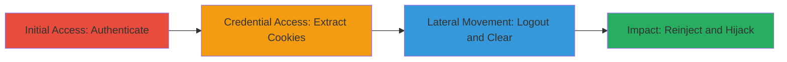

---
tags:
  - session-hijacking
  - account-takeover
  - cookies
  - oauth
  - web-vulnerability
type: attack_chain
tools:
  - '[[tools/Burp-Suite]]'
  - '[[tools/EditThisCookie]]'
  - '[[tools/Cookies-Manager-Plus]]'
tactics:
  - '[[Credential Access]]'
  - '[[Initial Access]]'
verified: false
platforms:
  - Web
submitted: true
complexity: medium
created_at: '2023-10-01T00:00:00Z'
procedures:
  - '[[procedures/Visit-and-Authenticate-to-Target-Site]]'
  - '[[procedures/Extract-Session-Cookies]]'
  - '[[procedures/Logout-and-Clear-Local-Cookies]]'
  - '[[procedures/Reinject-Cookies-and-Verify-Hijack]]'
step_count: 4
techniques:
  - '[[Steal Web Session Cookie]]'
  - '[[Valid Accounts]]'
updated_at: '2025-12-14T17:33:12.466Z'
description: >-
  Demonstrates improper session management vulnerability allowing reuse of
  stolen session cookies for unauthorized account access on the MicroPurchase
  platform using GitHub OAuth.
skill_level: intermediate
impact_level: high
id: aff124b4-b574-42fd-871b-1fcd8debce1b
validated: true
mitre_tactics:
  - '[[Credential Access]]'
  - '[[Initial Access]]'
mitre_techniques:
  - '[[Steal Web Session Cookie]]'
  - '[[Valid Accounts]]'
---
# Account Takeover via Session Cookie Hijacking After Logout

Multi-stage attack chain exploiting insufficient session expiration on https://micropurchase.18f.gov/, where session cookies from GitHub OAuth integration remain valid post-logout, enabling attackers to steal and reuse cookies for full account takeover. This allows impersonation of victims, potentially leading to unauthorized purchases or data access.

## Chain Metrics Dashboard

| Metric | Value |
|--------|-------|
| Chain Status | Unverified |
| Total Steps | 4 |
| Execution Time | ~5 minutes |
| Skill Level | Intermediate |
| Complexity | Medium |
| Impact Level | High |

## Attack Flow Visualization

## Prerequisites & Requirements

### Required Tools

- [[tools/Burp-Suite]]
- [[tools/EditThisCookie]]
- [[tools/Cookies-Manager-Plus]]

### Target Environment

- Web platform: https://micropurchase.18f.gov/
- Services: GitHub OAuth integration
- No specific ports required; standard HTTPS (443)

### Initial Access Requirements

- Valid GitHub account for initial authentication
- Browser with extensions (Chrome recommended)
- Attacker must obtain cookies via interception, theft, or social engineering
- Local network access to the target site

## Detailed Attack Procedures

### Step 1: Visit and Authenticate to Target Site
procedure: [[procedures/Visit-and-Authenticate-to-Target-Site]]

**Objective**: Establish an initial legitimate session on the target platform via GitHub OAuth to generate valid session cookies.

**Instructions**: Navigate to the target website and sign in using GitHub to create an active session.

**Expected Output**: Successful login, displaying user account dashboard.

**Success Indicators**:
- Login prompt appears and authentication succeeds
- Session cookies are set in the browser

### Step 2: Extract Session Cookies
procedure: [[procedures/Extract-Session-Cookies]]

**Objective**: Capture the active session cookies for later reuse, simulating theft in a real attack.

**Instructions**: Use interception tools to view and export the cookies associated with the session.

**Expected Output**: List of session cookies (e.g., _session_id, auth_token) exported to a file or clipboard.

**Success Indicators**:
- Cookies visible in tool interface
- Cookies can be copied without errors

### Step 3: Logout and Clear Local Cookies
procedure: [[procedures/Logout-and-Clear-Local-Cookies]]

**Objective**: Invalidate the local session while demonstrating that server-side expiration does not occur, preparing for hijacking simulation.

**Instructions**: Perform logout and manually clear browser cookies to end the legitimate session.

**Expected Output**: Account logged out; no session data remains in browser.

**Success Indicators**:
- Logout confirmation on site
- Browser shows no active cookies for the domain

### Step 4: Reinject Cookies and Verify Hijack
procedure: [[procedures/Reinject-Cookies-and-Verify-Hijack]]

**Objective**: Reuse the stolen cookies to bypass authentication and regain access to the victim's account.

**Instructions**: Import the previously extracted cookies back into the browser and refresh the site to test session validity.

**Expected Output**: Site loads with victim's account details and logout option visible, confirming active session.

**Success Indicators**:
- Account dashboard accessible without re-authentication
- Impersonation confirmed via user-specific content

## Attack Chain Summary

### Key Achievements

1. Successful extraction of persistent session cookies post-authentication
2. Demonstration of session reuse after logout, bypassing security controls
3. Full account takeover enabling unauthorized actions on the platform

## Technique & Tactic Coverage

### MITRE ATT&CK Techniques

- [[Steal Web Session Cookie]] Steal Web Session Cookie
- [[Valid Accounts]] Valid Accounts

### MITRE ATT&CK Tactics

- [[Credential Access]] Credential Access
- [[Initial Access]] Initial Access

---

*Last updated: 2023-10-01T00:00:00Z*
