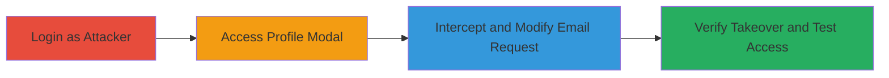

# Account Takeover via Unverified Email Change in Acronis File Sync & Share

Multi-stage attack chain demonstrating a complete workflow to takeover an unverified account in Acronis File Sync & Share by exploiting the name change API endpoint, which allows unauthorized email modifications without verification.

## Chain Metrics Dashboard

| Metric | Value |
|--------|-------|
| Chain Status | Unverified |
| Total Steps | 4 |
| Execution Time | ~5 minutes |
| Skill Level | Intermediate |
| Complexity | Medium |
| Impact Level | High |

## Attack Flow Visualization

## Prerequisites & Requirements

### Required Tools

- [[tools/Burp-Suite]]

### Target Environment

- Web platform
- Acronis File Sync & Share service
- Access to https://mc-beta-cloud.acronis.com

### Initial Access Requirements

- Attacker's valid credentials for Acronis File Sync & Share
- Network access to the target application
- Proxy tool configured for traffic interception

## Detailed Attack Procedures

### Step 1: Login to Acronis File Sync & Share
procedure: [[procedures/Login-to-Acronis-File-Sync-and-Share]]

**Objective**: Authenticate as the attacker to gain initial access to the application.

**Instructions**: Navigate to the login page and enter credentials.

**Expected Output**: Successful login redirecting to the dashboard.

**Success Indicators**:
- Dashboard loads at https://mc-beta-cloud.acronis.com/fc/access#/nodes
- Profile button visible in top right

### Step 2: Access Profile Name Change Modal
procedure: [[procedures/Access-Profile-Name-Change-Modal]]

**Objective**: Open the interface that triggers the vulnerable API call for account updates.

**Instructions**: From the dashboard, click the profile button and select name edit option.

**Expected Output**: Modal opens for editing name and email.

**Success Indicators**:
- Modal displays current name and email fields
- Save button available

### Step 3: Intercept and Modify Email Change Request
procedure: [[procedures/Intercept-and-Modify-Email-Change-Request]]

**Objective**: Capture the API request during save and alter the email to target an unverified address for takeover.

**Instructions**: Use [[tools/Burp-Suite]] to intercept the PUT request. Modify the JSON body with a new unverified email, then forward.

**Expected Output**: 204 No Content response indicating success.

**Success Indicators**:
- Response code 204
- No error about email being taken

### Step 4: Verify Email Change and Test Takeover
procedure: [[procedures/Verify-Email-Change-and-Test-Takeover]]

**Objective**: Confirm the email update and demonstrate control over the account, including sharing features.

**Instructions**: Check logs for the change and test sharing invites to the new email.

**Expected Output**: Logs show new email; invites route to attacker-controlled email.

**Success Indicators**:
- Account logs reflect new email
- Original email cannot receive invites; new one can
- Victim attempting verification sees account creation error

## Attack Chain Summary

### Key Achievements

1. Unauthorized email change to unverified address
2. Full account takeover enabling impersonation and file access
3. Stealthy persistence undetected in main profiles or admin dashboards
4. Exploitation of sharing features for data exfiltration

## Technique & Tactic Coverage

### MITRE ATT&CK Techniques

- [[Account Manipulation]] Account Manipulation
- [[Valid Accounts]] Valid Accounts

### MITRE ATT&CK Tactics

- [[Initial Access]] Initial Access
- [[Persistence]] Persistence

---

*Last updated: 2023-10-01T00:00:00Z*
