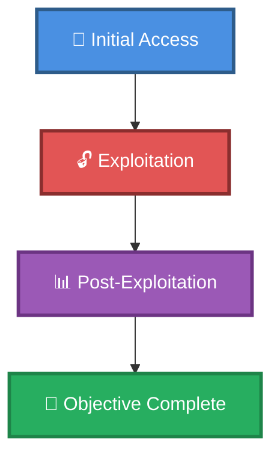

# 🎯 Active Directory ASREPRoast to Kerberoast (have username)

> **Enhanced Attack Chain Dashboard**

---

## 📊 Chain Metrics Dashboard

| Metric | Value |
|--------|-------|
| **Chain Status** | ⚠️ **UNVERIFIED** |
| **Total Steps** | `4` |
| **Execution Time** | ~1-2 hours |
| **Skill Level** | 🟢 Beginner-Intermediate |
| **Complexity** | Medium |
| **Impact Level** | 🟡 **MEDIUM** |

---

## 🎭 Attack Flow Visualization



---

## 🛠️ Prerequisites & Requirements

### Required Tools
```bash path=null start=null
kerberos             # AS-REP roasting
```

### Target Environment
- ✅ Network connectivity to target

### Initial Access Requirements
- 🔓 Requirements based on first step of chain
- 🔓 See detailed procedures below

---

## 🔬 Detailed Attack Procedures

### **[Step 1]** Brute Force Users with "Do Not Require Kerberos Preauth." Set

**Progress:** `██░░░░░░░░` 25% | **Risk:** 🟢 Low

**Procedure:** [[Brute Force Users with "Do Not Require Kerberos Preauth." Set]]

> 📝 **Objective:** Users with "Do not require Kerberos preauthentication" will disclose their TGT without authenticating with a valid password, as long as the username is correct. This allows attackers to build a wordlist and brute force valid users with GetNPUsers.py, also retreiving their TGT.

**Expected Output:**
- Refer to procedure documentation for details

**Success Indicators:** ✅ Objective achieved

---

### **[Step 2]** ASREPRoast SPN without pre-auth (have username)

**Progress:** `█████░░░░░` 50% | **Risk:** 🟢 Low

**Procedure:** [[ASREPRoast SPN without pre-auth (have username)]]

> 📝 **Objective:** Active Directory try to get hash from username. Looking user without pre-auth attribute on Kerberos. Send AS_REQ to DC to receive encrypted user key to crack. Can achieve without domain account, just a username.

**Expected Output:**
- Refer to procedure documentation for details

**Success Indicators:** ✅ Objective achieved

---

### **[Step 3]** Crack asrep hash

**Progress:** `███████░░░` 75% | **Risk:** 🔴 High

**Procedure:** [[Crack asrep hash]]

> 📝 **Objective:** Using hashcat to crack asrep hash obtained from impacket or rubeus tools on DC.

**Expected Output:**
- Refer to procedure documentation for details

**Success Indicators:** ✅ Objective achieved

---

### **[Step 4]** Query Domain for SPN and Attempt to Kerberoast (Authenticated)

**Progress:** `██████████` 100% | **Risk:** 🟡 Medium

**Procedure:** [[Query Domain for SPN and Attempt to Kerberoast (Authenticated)]]

> 📝 **Objective:** Sevrice principal names (SPN) are unique identifiers used by Kerberos authentication. Due to how Kerberos handles service tickets, attackers may be able to query a domain controller with valid credentials, make a request to the ticket granting service (TGT), and receive the hash of other accounts.

**Expected Output:**
- Refer to procedure documentation for details

**Success Indicators:** ✅ Objective achieved

---

## 🎯 Attack Chain Summary

### Key Achievements
- ✅ ASREPRoast SPN without pre-auth (have username)
- ✅ Query Domain for SPN and Attempt to Kerberoast (Authenticated)
- ✅ Crack asrep hash
- ✅ Brute Force Users with "Do Not Require Kerberos Preauth." Set

---

## 📈 Technique & Tactic Coverage

---

**Last Updated:** 2023-05-29T16:48:53.162677+00:00 | **Chain Version:** 2.0 Enhanced | **Status:** ⚠️ Draft
