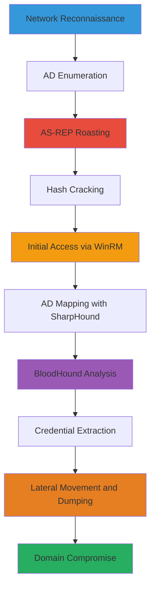

# Active-Directory-Compromise-via-Kerberos-AS-REP-Roasting-SharpHound-Enumeration-and-Secrets-Dumping

Multi-stage attack chain demonstrating a complete Active Directory compromise workflow, from initial reconnaissance to domain credential extraction and lateral movement.

## Chain Metrics Dashboard

| Metric | Value |
|--------|-------|
| Chain Status | Unverified |
| Total Steps | 12 |
| Execution Time | ~4-8 hours |
| Skill Level | Intermediate |
| Complexity | High |
| Impact Level | Critical |

## Attack Flow Visualization



## Prerequisites & Requirements

### Required Tools

- [[tools/Nmap]]
- [[tools/Impacket]]
- [[tools/Hashcat]]
- [[tools/Evil-WinRM]]
- [[tools/SharpHound]]
- [[tools/BloodHound]]

### Target Environment

- Windows Active Directory domain with domain controllers
- Network access to target IPs (ports 389/LDAP, 445/SMB, 5985/WinRM)
- Linux attacker machine with tools installed

### Initial Access Requirements

- Valid domain username/password for some steps (e.g., authenticated dumping)
- No initial credentials needed for anonymous enumeration
- Firewall allowing outbound connections from attacker to target

## Detailed Attack Procedures

### Step 1: Perform Basic Port Scan
procedure: [[procedures/Basic-Port-Scan-with-Service-Enumeration]]

**Objective**: Identify open ports and services on the target domain controller to discover attack surfaces like LDAP and RPC.

**Instructions**: Run an Nmap scan targeting common ports with service version detection using [[commands/nmap-port-scan-with-banner-enumeration]]:

```bash
nmap -sV -p 1-1024 $_TARGET_IP
```

Follow up by checking for RPC endpoints if port 135 is open.

**Expected Output**: List of open ports, e.g., 389/tcp open ldap, 445/tcp open microsoft-ds.

**Success Indicators**:
- LDAP (389) or RPC (135) ports identified as open
- Service versions revealed for further targeting

### Step 2: Enumerate LDAP Base DN
procedure: [[procedures/Query-LDAP-and-Enumerate-Base-DN-with-Nmap]]

**Objective**: Perform anonymous LDAP queries to extract base domain name and basic structure.

**Instructions**: Use Nmap's ldap-search script on the LDAP port with [[commands/nmap-ldap-enumeration-with-scripts]]:

```bash
nmap -p 389 --script ldap-search $_TARGET_IP
```

**Expected Output**: LDAP context details like dc=domain,dc=local, including OUs and basic objects.

**Success Indicators**:
- Base DN extracted (e.g., dc=example,dc=com)
- No authentication required for anonymous bind

### Step 3: Brute Force AS-REP Roasting Users
procedure: [[procedures/Brute-Force-Users-without-Kerberos-Preauth]]

**Objective**: Identify and request TGTs for users with UF_DONT_REQUIRE_PREAUTH set, enabling offline cracking.

**Instructions**: Prepare a username list and use Impacket's GetNPUsers.py with [[commands/getnpusers-brute-force-as-rep-users]]:

```bash
GetNPUsers.py $_DOMAIN/ -no-pass -usersfile $_USERS.txt -dc-ip $_TARGET_IP -request
```

Save output hashes for cracking.

**Expected Output**: AS-REP hashes in format user:$krb5asrep$...

**Success Indicators**:
- Valid users identified with TGT responses
- Hashes collected for offline brute force

### Step 4: Identify Hash Type
procedure: [[procedures/Identify-Password-Hash-Type-with-Hashcat]]

**Objective**: Determine the hash mode for cracking AS-REP tickets.

**Instructions**: Compare hash format against Hashcat's example hashes documentation. For AS-REP, mode is typically 18200.

**Expected Output**: Identified mode, e.g., Kerberos 5 AS-REP Pre-Auth etype 23.

**Success Indicators**:
- Hash mode confirmed (e.g., 18200 for AS-REP)
- Ready for cracking step

### Step 5: Crack AS-REP Hashes
procedure: [[procedures/Brute-Force-Password-Hashes-with-Hashcat]]

**Objective**: Offline crack the obtained AS-REP hashes to recover plaintext passwords.

**Instructions**: Run Hashcat in dictionary mode with [[commands/hashcat-brute-force-as-rep-hashes]]:

```bash
hashcat -m 18200 $_HASH_FILE.txt $_WORDLIST.txt
```

Monitor for cracks and use rules if needed.

**Expected Output**: Cracked passwords, e.g., user:password.

**Success Indicators**:
- At least one hash cracked
- Valid credentials for further access

### Step 6: Gain Initial Shell via WinRM
procedure: [[procedures/Spawn-Interactive-Shell-via-WinRM-from-Linux]]

**Objective**: Establish a remote PowerShell session using cracked credentials.

**Instructions**: Use Evil-WinRM with plaintext creds via [[commands/evil-winrm-connect-with-password]]:

```bash
evil-winrm -i $_TARGET_IP -u $_USER -p $_PASSWORD
```

**Expected Output**: Interactive PS prompt on target.

**Success Indicators**:
- Successful authentication and shell access
- Commands executable remotely

### Step 7: Map AD with SharpHound
procedure: [[procedures/Map-Active-Directory-with-SharpHound]]

**Objective**: Collect comprehensive AD data for analysis.

**Instructions**: Host SharpHound.exe on attacker HTTP server, download to target with [[commands/download-file-with-certutil]], then execute [[commands/sharphound-ingest-ad-data]]:

```bash
SharpHound.exe -c All -d $_DOMAIN --ldapusername $_USER --ldappassword $_PASSWORD
```
Exfil the ZIP file.

**Expected Output**: BloodHound-compatible ZIP with JSON data.

**Success Indicators**:
- Enumeration completes without errors
- ZIP file generated and exfiltrated

### Step 8: Analyze AD Paths in BloodHound
procedure: [[procedures/Analyze-BloodHound-Data-for-AD-Relationships]]

**Objective**: Identify privilege escalation paths and attack suggestions.

**Instructions**: Import ZIP into BloodHound UI, run pre-built queries like Shortest Paths to Domain Admins.

**Expected Output**: Graph visualizations of relationships and suggested attacks.

**Success Indicators**:
- Paths to high-value targets identified
- Abuse info for edges (e.g., ForceChangePassword)

### Step 9: Extract Autologon Credentials
procedure: [[procedures/List-Windows-Autologon-Credentials]]

**Objective**: Retrieve stored autologon creds from registry.

**Instructions**: From shell, query registry with [[commands/reg-query-autologon-creds]]:

```cmd
reg query "HKLM\SOFTWARE\Microsoft\Windows NT\CurrentVersion\Winlogon"
```

**Expected Output**: DefaultUserName, DefaultPassword values.

**Success Indicators**:
- Credentials exposed in plaintext
- Valid for lateral movement

### Step 10: Enumerate Local Users
procedure: [[procedures/List-Local-Users-on-Windows]]

**Objective**: List local accounts for potential weak creds or pivots.

**Instructions**: Run from shell with [[commands/net-user-list-local]]:

```cmd
net user
```

**Expected Output**: List of local users like Administrator, Guest.

**Success Indicators**:
- All local accounts enumerated
- Potential targets for further enum

### Step 11: Dump Remote Secrets
procedure: [[procedures/Dump-Secrets-from-Remote-Windows-System]]

**Objective**: Extract domain hashes using DCSync-like method.

**Instructions**: Use Impacket secretsdump with creds via [[commands/secretsdump-authenticated-dump]]:

```bash
secretsdump.py $_DOMAIN/$_USER:$_PASSWORD@$_TARGET_IP
```

**Expected Output**: NTLM hashes for domain users, including krbtgt.

**Success Indicators**:
- Hashes dumped successfully
- Admin-level access confirmed

### Step 12: Lateral Move with Pass-the-Hash
procedure: [[procedures/Connect-to-WinRM-from-Linux-with-Pass-the-Hash]]

**Objective**: Pivot to another host using dumped NTLM hash.

**Instructions**: Connect via Evil-WinRM with hash using [[commands/evil-winrm-connect-with-ntlm-hash]]:

```bash
evil-winrm -i $_TARGET_IP -u $_USER -H $_NTLM_HASH
```

**Expected Output**: Shell on new target.

**Success Indicators**:
- Authentication via hash succeeds
- Full domain compromise achieved

## Attack Chain Summary

### Key Achievements

- Network and AD reconnaissance completed
- AS-REP roasting and hash cracking for initial creds
- AD mapping and path analysis with SharpHound/BloodHound
- Credential extraction via registry and secretsdump
- Lateral movement to domain dominance

---

*Last updated: 2023-05-29T16:48:53.162677+00:00*
