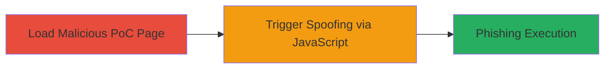

# Address Bar Spoofing in Brave for iOS Enabling Phishing Attacks

Multi-stage attack chain demonstrating address bar spoofing in Brave for iOS version 1.2.16, where JavaScript manipulates the address bar to show a legitimate URL like google.com:1234 while injecting and displaying malicious content. This tricks users into believing they are on a trusted site, enabling phishing attacks for credential theft or social engineering.

## Chain Metrics Dashboard

| Metric | Value |
|--------|-------|
| Chain Status | Unverified |
| Total Steps | 2 |
| Execution Time | ~1 minute |
| Skill Level | Beginner |
| Complexity | Low |
| Impact Level | High |

## Attack Flow Visualization

## Prerequisites & Requirements

### Required Tools

- None (uses basic HTML/JavaScript PoC)

### Target Environment

- Brave for iOS version 1.2.16 or vulnerable equivalents
- iOS mobile device with browser access
- No specific services or ports required beyond standard web access (uses port 1234 in spoofed URL)

### Initial Access Requirements

- User interaction: Victim must load the attacker's crafted HTML page in Brave
- Network position: Direct access to the malicious page via URL
- Prior access needed: None, but social engineering to lure victim to page

## Detailed Attack Procedures

### Step 1: Load Malicious PoC Page
procedure: [[procedures/Execute-Brave-iOS-Address-Bar-Spoofing-PoC]]

**Objective**: Deliver the spoofing payload by loading an HTML page containing the JavaScript exploit into Brave for iOS.

**Instructions**: Create or host an HTML file with the PoC JavaScript. The PoC defines a spoofing function using document.write() for content injection and location manipulation. Save it as a local file or host it on a web server, then open it in Brave for iOS via file URL or HTTP.

**Expected Output**: The page loads with a visible 'Spoof' button, ready for interaction. No immediate visual changes to the address bar.

**Success Indicators**:
- Page loads successfully in Brave without errors
- 'Spoof' button is present and clickable

### Step 2: Trigger Spoofing Execution
procedure: [[procedures/Execute-Brave-iOS-Address-Bar-Spoofing-PoC]]

**Objective**: Execute the JavaScript to inject malicious content and spoof the address bar, displaying a trusted domain while showing phishing material.

**Instructions**: Click the 'Spoof' button on the loaded page. This triggers the spoof() function, which injects 'This is not Google' via document.write(), sets document.location to 'https://google.com:1234', and uses setInterval() to reload every 9800ms. The rapid redirect and injection desynchronizes the address bar update, showing the spoofed URL.

**Expected Output**: Address bar displays 'https://google.com:1234' (appearing legitimate), but page content shows injected malicious text like 'This is not Google', enabling phishing overlays.

**Success Indicators**:
- Address bar shows trusted domain with non-standard port
- Malicious content loads without matching the URL
- No browser security warnings interrupt the spoof

## Attack Chain Summary

### Key Achievements

1. Successful manipulation of Brave's address bar to spoof trusted URLs
2. Injection of phishing content without user suspicion
3. Potential for credential theft via social engineering on the spoofed page

## Technique & Tactic Coverage

### MITRE ATT&CK Techniques

- [[Exploitation for Client Execution]] Exploitation for Client Execution
- [[Phishing]] Phishing

### MITRE ATT&CK Tactics

- [[Initial Access]] Initial Access

---
*Last updated: 2023-10-01T00:00:00Z*
