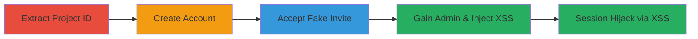

# Admin Access Bypass via Non-Existent Invite in ReadMe.io Leading to Stored XSS on Uber Developer Portal

Multi-stage attack chain demonstrating a complete attack workflow exploiting ReadMe.io's flawed invite system to gain admin access to Uber's project and inject malicious JavaScript for stored XSS on developer.uber.com.

## Chain Metrics Dashboard

| Metric | Value |
|--------|-------|
| Chain Status | Unverified |
| Total Steps | 4 |
| Execution Time | ~10 minutes |
| Skill Level | Intermediate |
| Complexity | Medium |
| Impact Level | High |

## Attack Flow Visualization



## Prerequisites & Requirements

### Required Tools

- Browser developer tools for source inspection
- cURL or similar HTTP client for POST requests

### Target Environment

- Web platform
- Access to public ReadMe.io pages (e.g., https://uber.readme.io/inactive)
- No special ports or services required beyond standard HTTPS (443)

### Initial Access Requirements

- No prior credentials needed
- Public internet access
- Ability to create a free ReadMe.io account

## Detailed Attack Procedures

### Step 1: Extract Project ID
procedure: [[procedures/Extract-Uber-Project-ID-from-Inactive-Page]]

**Objective**: Obtain the internal project ID for Uber's ReadMe.io instance from a publicly accessible inactive page to target the invite system.

**Instructions**: Load the inactive page in a browser and inspect the HTML source to locate the project ID embedded in a div element.

**Expected Output**: Project ID string, e.g., 578cd33dc27ce20e004e397b.

**Success Indicators**:
- Project ID successfully extracted from source code
- ID matches the format of a MongoDB ObjectID

### Step 2: Create Account
procedure: [[procedures/Create-and-Verify-ReadMe-io-Account]]

**Objective**: Establish an authenticated session on ReadMe.io to prepare for the invite bypass request.

**Instructions**: Sign up for a new account on readme.io, verify the email, and log in to capture session cookies and XSRF token.

**Expected Output**: Valid session cookies and X-XSRF-TOKEN for authenticated requests.

**Success Indicators**:
- Account verification email received and confirmed
- Successful login with dashboard access

### Step 3: Bypass Invite
procedure: [[procedures/Bypass-Invite-Validation-to-Gain-Admin-Access]]

**Objective**: Exploit the /api/accept-invite endpoint by submitting a non-existent invite ID, which incorrectly grants admin access to the target project.

**Instructions**: Use [[commands/post-accept-nonexistent-invite]] to send the crafted POST request with the extracted project ID context:

```bash
curl -X POST 'https://dash.readme.io/api/accept-invite/5617f98f7f74330d00dfd86d' \
  -H 'Host: dash.readme.io' \
  -H 'Connection: close' \
  -H 'Content-Length: 2' \
  -H 'Accept: application/json, text/plain, */*' \
  -H 'Origin: https://dash.readme.io' \
  -H 'X-XSRF-TOKEN: <your_token>' \
  -H 'User-Agent: Mozilla/5.0 (Windows NT 10.0; Win64; x64) AppleWebKit/537.36' \
  -H 'Referer: https://dash.readme.io/' \
  -H 'Cookie: <your_cookies>' \
  -d '{}'
```

**Expected Output**: Server response indicates 'Invite doesn't exist', but dashboard now shows admin privileges for the Uber project.

**Success Indicators**:
- Error response received, but admin access granted
- Users page in dashboard lists the attacker as admin for Uber project

### Step 4: Exploit for XSS
procedure: [[procedures/Exploit-Admin-Access-for-Stored-XSS-on-Uber-Developer-Portal]]

**Objective**: Leverage admin privileges to inject arbitrary JavaScript into documentation pages, resulting in stored XSS when rendered on developer.uber.com.

**Instructions**: Navigate to the Uber project dashboard, edit a documentation page to include a malicious script tag (e.g., <script>alert('XSS');</script> or cookie-stealing payload), save, and verify execution on developer.uber.com/docs.

**Expected Output**: Malicious JavaScript executes in the browser context of developer.uber.com, potentially stealing session cookies.

**Success Indicators**:
- Script injection successful without sanitization
- XSS payload triggers on embedded content from uber.readme.io
- Potential for session hijacking confirmed

## Attack Chain Summary

### Key Achievements

1. Bypassed access controls to gain unauthorized admin access to a high-value project
2. Demonstrated stored XSS via unsanitized embedding of third-party documentation
3. Enabled potential account takeover on Uber's developer portal through cookie theft

## Technique & Tactic Coverage

### MITRE ATT&CK Techniques

- [[Exploit Public-Facing Application]]
- [[Valid Accounts]]
- [[JavaScript]]

### MITRE ATT&CK Tactics

- [[Initial Access]]
- [[Lateral Movement]]
- [[Collection]]

---

*Last updated: 2023-10-01T00:00:00Z*
