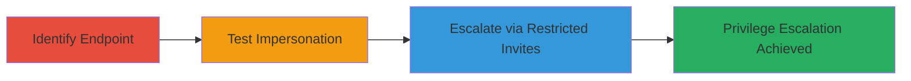

# Admin Invite Forgery via Improper Access Control in 8x8 Connect

Multi-stage attack chain demonstrating exploitation of improper access control in the 8x8 Connect platform, allowing an authenticated admin to impersonate another admin and send invites to restricted roles, leading to unauthorized privilege escalation.

## Chain Metrics Dashboard

| Metric | Value |
|--------|-------|
| Chain Status | Unverified |
| Total Steps | 3 |
| Execution Time | ~5 minutes |
| Skill Level | Intermediate |
| Complexity | Medium |
| Impact Level | High |

## Attack Flow Visualization



## Prerequisites & Requirements

### Required Tools

- None (uses standard HTTP client like curl)

### Target Environment

- 8x8 Connect platform (web-based SaaS)
- Required services/ports: HTTPS on port 443
- Network access requirements: Authenticated access to the API as an admin user

### Initial Access Requirements

- Valid admin credentials for the 8x8 Connect platform
- Network position: Direct access to connect.8x8.com
- Prior access needed: Admin-level authentication

## Detailed Attack Procedures

### Step 1: Identify the Invite Endpoint
procedure: [[procedures/Identify-Invite-Endpoint-in-8x8-Connect]]

**Objective**: Locate and examine the API endpoint responsible for sending user invites in the 8x8 Connect platform.

**Instructions**: Review the platform's API documentation or use browser developer tools to identify the POST /api/v1/users/<User ID>/invites endpoint. This endpoint allows specifying a User ID in the path to send invites.

**Expected Output**: Confirmation of the endpoint structure and its parameters for invite details.

**Success Indicators**:
- Endpoint identified with path including <User ID>
- API accessible via authenticated session

### Step 2: Test Sending Invites on Behalf of Another Admin
procedure: [[procedures/Test-Invite-Sending-on-Behalf-of-Another-Admin]]

**Objective**: Verify if an authenticated admin can send invites impersonating another admin by targeting a different User ID.

**Instructions**: Authenticate as an admin and use [[commands/curl-post-invite]] to send a POST request to /api/v1/users/<Other Admin ID>/invites with sample invite details (e.g., email and role). Observe if the request succeeds without authorization errors.

```bash
curl -X POST https://connect.8x8.com/api/v1/users/<Other Admin ID>/invites \
  -H "Authorization: Bearer <your-admin-token>" \
  -H "Content-Type: application/json" \
  -d '{"email": "test@example.com", "role": "admin"}'
```

**Expected Output**: Successful response (e.g., 200 OK) with invite sent confirmation, indicating bypass of restrictions.

**Success Indicators**:
- Invite sent without permission denied
- No validation of the acting user's ID against the target User ID

### Step 3: Exploit for Restricted Role Invites
procedure: [[procedures/Exploit-Endpoint-for-Restricted-Role-Invites]]

**Objective**: Extend the impersonation to invite users to restricted admin roles, such as 'User Management', enabling privilege escalation.

**Instructions**: Using the same endpoint, modify the invite payload to target restricted roles. Repeat the POST request with role set to 'User Management' admin.

```bash
curl -X POST https://connect.8x8.com/api/v1/users/<Other Admin ID>/invites \
  -H "Authorization: Bearer <your-admin-token>" \
  -H "Content-Type: application/json" \
  -d '{"email": "malicious@example.com", "role": "user-management-admin"}'
```

**Expected Output**: Invite successfully created for the restricted role, allowing the recipient unauthorized admin access.

**Success Indicators**:
- Restricted role invite processed
- Potential for new admin accounts with escalated privileges

## Attack Chain Summary

### Key Achievements

1. Identified vulnerable API endpoint for user invites.
2. Demonstrated admin impersonation via User ID manipulation.
3. Achieved unauthorized invites to restricted roles, enabling privilege escalation.

## Technique & Tactic Coverage

### MITRE ATT&CK Techniques

- [[Exploitation for Privilege Escalation]] Exploitation for Privilege Escalation
- [[T1078.004]] Cloud Accounts

### MITRE ATT&CK Tactics

- [[Privilege Escalation]] Privilege Escalation

---

*Last updated: 2024-10-01T00:00:00Z*
