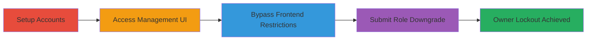

# Admin Role Downgrade Leading to Organization Owner Lockout in Stripo

Multi-stage attack chain demonstrating improper authorization in Stripo Inc's web application, where an admin bypasses frontend restrictions to downgrade the organization owner's role to admin, locking the owner out of their account.

## Chain Metrics Dashboard

| Metric | Value |
|--------|-------|
| Chain Status | Unverified |
| Total Steps | 4 |
| Execution Time | ~5 minutes |
| Skill Level | Intermediate |
| Complexity | Medium |
| Impact Level | High |

## Attack Flow Visualization



## Prerequisites & Requirements

### Required Tools

- [[tools/Browser-Developer-Tools]]

### Target Environment

- Web application: https://my.stripo.email
- Organization management UI at /cabinet/#/users/{orgId}
- Valid admin credentials in the target organization

### Initial Access Requirements

- Owner account to create organization and invite admin
- Admin account with access to users management page
- Browser with developer tools (e.g., Firefox)

## Detailed Attack Procedures

### Step 1: Setup Accounts and Organization
procedure: [[procedures/Bypass-Frontend-to-Downgrade-Owner-Role]]

**Objective**: Establish the necessary accounts and organization structure to enable the admin to access user management.

**Instructions**: Create an owner account (e.g., test@gmail.com) and use it to create a project/organization. Then, invite a second account (e.g., test2@gmail.com) as an admin to the organization.

**Expected Output**: Admin account receives invitation and can log in to the organization.

**Success Indicators**:
- Organization created with owner privileges
- Admin invited and able to access the dashboard

### Step 2: Access Users Management Page
procedure: [[procedures/Bypass-Frontend-to-Downgrade-Owner-Role]]

**Objective**: Log in as the admin and navigate to the organization users management interface.

**Instructions**: Log in with the admin account and go to https://my.stripo.email/cabinet/#/users/{orgId}, where {orgId} is the organization ID (e.g., 135428).

**Expected Output**: Users list page loads, showing the owner and admin roles.

**Success Indicators**:
- Page accessible without errors
- Owner's role displayed as 'owner' and input field disabled

### Step 3: Bypass Frontend Restrictions
procedure: [[procedures/Bypass-Frontend-to-Downgrade-Owner-Role]]

**Objective**: Use browser tools to enable the disabled role input field for the owner.

**Instructions**: Open browser developer tools (F12 in Firefox), inspect the owner's role input element, and remove the 'disabled' attribute to make it editable. Use [[tools/Browser-Developer-Tools]] for inspection.

**Expected Output**: Input field becomes editable in the UI.

**Success Indicators**:
- Disabled attribute removed
- Role dropdown or input now allows changes

### Step 4: Submit Role Downgrade
procedure: [[procedures/Bypass-Frontend-to-Downgrade-Owner-Role]]

**Objective**: Change the owner's role to 'admin' and submit, triggering the unauthorized API update.

**Instructions**: Select or enter 'admin' in the now-editable role field for the owner, then save the changes. This sends a PUT request using [[commands/PUT-Update-User-Role-to-Admin]] to /cabinet/stripeapi/v1/organizations/{orgId}/users.

```http
PUT /cabinet/stripeapi/v1/organizations/135428/users HTTP/1.1
Host: my.stripo.email
...
{"repository":{},"idField":"id","entityType":"USER","id":135628,"role":"admin","organizationId":135428,...}
```

**Expected Output**: HTTP 200 OK response with updated user JSON showing 'role': 'admin'.

**Success Indicators**:
- API response confirms role change
- Owner can no longer log in or access organization

## Attack Chain Summary

### Key Achievements

1. Bypassed frontend authorization to enable role modification
2. Successfully downgraded owner to admin via API
3. Achieved owner account lockout, denying access to the organization

## Technique & Tactic Coverage

### MITRE ATT&CK Techniques

- [[Valid Accounts]] Valid Accounts
- [[Exploit Public-Facing Application]] Exploit Public-Facing Application

### MITRE ATT&CK Tactics

- [[Initial Access]] Initial Access

---

*Last updated: 2023-10-01T00:00:00Z*
