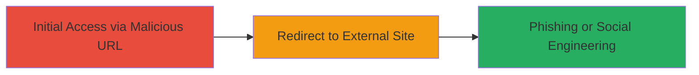

---

# Affirm Open Redirect via Triple Slash URL Manipulation

Multi-stage attack chain demonstrating a complete attack workflow.

## Chain Metrics Dashboard

| Metric | Value |
|--------|-------|
| Chain Status | Unverified |
| Total Steps | 1 |
| Execution Time | ~1 minute |
| Skill Level | Intermediate |
| Complexity | Low |
| Impact Level | Medium |

## Attack Flow Visualization



## Prerequisites & Requirements

### Required Tools

- Web browser or [[commands/curl-access-url]]

### Target Environment

- Web platform
- Access to https://www.affirm.com/
- No special services or ports required beyond HTTP/HTTPS

### Initial Access Requirements

- Public internet access
- No credentials needed
- Ability to craft and share URLs

## Detailed Attack Procedures

### Step 1: Craft and Trigger Malicious Redirect
procedure: [[procedures/Exploit-Affirm-Open-Redirect-with-Triple-Slashes]]

**Objective**: Manipulate the URL path on Affirm's website using triple slashes to bypass redirect restrictions and force a redirect to an arbitrary external domain, tricking users into visiting malicious sites.

**Instructions**: Construct a URL with triple slashes (///) after the domain to alter path validation. For example, use a payload like `http://www.affirm.com///google.com/?www.affirm.com/?category=interview&page=2`. Access this URL via a browser or [[commands/curl-access-url]] to verify the redirect:

```bash
curl -L "http://www.affirm.com///google.com/?www.affirm.com/?category=interview&page=2" -v
```

Share the crafted URL with a target via email or link to initiate phishing.

**Expected Output**: The server interprets 'google.com' as the redirect target, resulting in a 302 redirect to the external site without validation.

**Success Indicators**:
- Browser or curl output shows redirect to the arbitrary domain (e.g., google.com).
- No security warnings or blocks on the redirect.

## Attack Chain Summary

### Key Achievements

1. Bypassed URL path validation using triple slashes.
2. Enabled arbitrary redirects to external malicious sites.
3. Facilitated potential phishing or credential theft attacks.

## Technique & Tactic Coverage

### MITRE ATT&CK Techniques

- [[Phishing]] Phishing
- [[Exploit Public-Facing Application]] Exploit Public-Facing Application

### MITRE ATT&CK Tactics

- [[Initial Access]] Initial Access

---

*Last updated: 2023-10-01T00:00:00Z*
