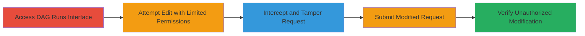

---
tags:
  - broken-access-control
  - airflow
  - dag-run
  - web-vulnerability
type: attack_chain
tools:
  - '[[tools/Burp-Suite]]'
tactics:
  - '[[Initial Access]]'
verified: false
platforms:
  - Web
  - Apache Airflow
submitted: true
complexity: medium
created_at: '2024-01-01T00:00:00Z'
procedures:
  - '[[procedures/Bypass-Airflow-DAG-Run-Edit-Permissions-via-Request-Tampering]]'
step_count: 5
techniques:
  - '[[Valid Accounts]]'
updated_at: '2025-12-14T17:29:56.893Z'
description: >-
  Authenticated users bypass client-side restrictions to modify DAG run
  configurations in Apache Airflow versions before 2.7.1, potentially disrupting
  automated workflows.
skill_level: intermediate
impact_level: high
id: 89484dc8-1473-4f87-b665-d4bd40e3e01b
validated: true
mitre_tactics:
  - '[[Initial Access]]'
mitre_techniques:
  - '[[Valid Accounts]]'
---
# Apache Airflow Broken Access Control Allowing Unauthorized DAG Run Configuration Modification

Multi-stage attack chain demonstrating a complete attack workflow exploiting Broken Access Control in Apache Airflow DAG Runs.

## Chain Metrics Dashboard

| Metric | Value |
|--------|-------|
| Chain Status | Unverified |
| Total Steps | 5 |
| Execution Time | ~5 minutes |
| Skill Level | Intermediate |
| Complexity | Medium |
| Impact Level | High |

## Attack Flow Visualization

## Prerequisites & Requirements

### Required Tools

- [[tools/Burp-Suite]]

### Target Environment

- Apache Airflow web interface (versions before 2.7.1)
- Authenticated user with DAG-view permissions
- Network access to the Airflow UI

### Initial Access Requirements

- Valid credentials for an authenticated user with at least DAG-view access
- Direct access to the web UI (no prior network compromise needed)

## Detailed Attack Procedures

### Step 1: Access DAG Runs Interface
procedure: [[procedures/Bypass-Airflow-DAG-Run-Edit-Permissions-via-Request-Tampering]]

**Objective**: Navigate to the DAG Runs list to identify target runs for modification.

**Instructions**: Log in to the Apache Airflow web UI and browse to the DAG Runs section.

**Expected Output**: A list of available DAG runs displayed in the interface.

**Success Indicators**:
- DAG Runs page loads successfully
- List of DAG runs is visible

### Step 2: Select and Attempt to Edit DAG Run
procedure: [[procedures/Bypass-Airflow-DAG-Run-Edit-Permissions-via-Request-Tampering]]

**Objective**: Open the edit view for a specific DAG run to observe client-side restrictions.

**Instructions**: Click on a DAG run from the list to enter the edit mode.

**Expected Output**: Edit interface opens, showing fields like Conf as grayed out.

**Success Indicators**:
- Edit view loads
- Conf field appears uneditable (disabled)

### Step 3: Observe Client-Side Restrictions
procedure: [[procedures/Bypass-Airflow-DAG-Run-Edit-Permissions-via-Request-Tampering]]

**Objective**: Confirm the presence of client-side controls limiting edits.

**Instructions**: Inspect the edit form to note that sensitive fields like Conf are disabled due to permission levels.

**Expected Output**: Visual indication (grayed-out textbox) that the user lacks edit permissions.

**Success Indicators**:
- Conf parameter is uneditable in the UI
- No errors on page load

### Step 4: Intercept and Modify Save Request
procedure: [[procedures/Bypass-Airflow-DAG-Run-Edit-Permissions-via-Request-Tampering]]

**Objective**: Use a proxy tool to tamper with the HTTP request and bypass restrictions.

**Instructions**: Configure [[tools/Burp-Suite]] as a proxy, click Save in the UI, intercept the POST request to the DAG run edit endpoint, and modify the 'conf' parameter to a test value like '1111111111111'.

**Expected Output**: Modified request body with altered 'conf' value ready for forwarding.

**Success Indicators**:
- Request intercepted successfully
- 'conf' parameter changed without UI errors

### Step 5: Submit and Verify Modification
procedure: [[procedures/Bypass-Airflow-DAG-Run-Edit-Permissions-via-Request-Tampering]]

**Objective**: Confirm the server accepts the unauthorized changes.

**Instructions**: Forward the tampered request through the proxy and refresh the DAG run details to check the updated Conf value.

**Expected Output**: DAG run details show the new Conf value ('1111111111111') applied.

**Success Indicators**:
- No server rejection (200 OK response)
- Modified Conf visible in the UI
- Workflow potentially altered if re-run

## Attack Chain Summary

### Key Achievements

1. Bypassed client-side edit restrictions on DAG run configurations
2. Unauthorized modification of sensitive parameters like Conf and start dates
3. Demonstrated potential for workflow disruption in automated pipelines

## Technique & Tactic Coverage

### MITRE ATT&CK Techniques

- [[Valid Accounts]]

### MITRE ATT&CK Tactics

- [[Initial Access]]

---

*Last updated: 2024-01-01T00:00:00Z*
